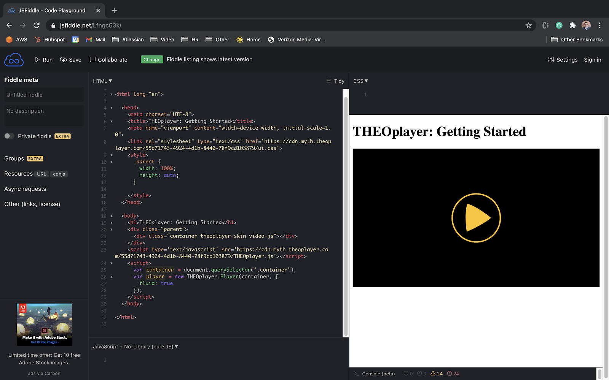

# Getting started on Web

import Link from '@docusaurus/Link';
import styles from './shared.module.css';

THEOplayer is the universal video player solution created by THEO Technologies.
The THEOplayer HTML5/Tizen/webOS SDK offers support for HLS, MPEG-DASH, advertisements, DRM and much more.

This article is your starting point if you are using THEOplayer for the first time.
It takes you through the required steps to achieve a basic manual implementation of the THEOplayer SDK on Web.
The outcome of this article is the template below.

```html
<!doctype html>
<html lang="en">
  <head>
    <meta charset="UTF-8" />
    <title>THEOplayer</title>
    <meta name="viewport" content="width=device-width, initial-scale=1.0" />
    <link rel="stylesheet" type="text/css" href="SDK-LIBRARY-LOCATION/ui.css" />
  </head>
  <body>
    <div class="theoplayer-container video-js theoplayer-skin vjs-16-9"></div>
    <script src="SDK-LIBRARY-LOCATION/THEOplayer.js"></script>
    <script>
      var element = document.querySelector(".theoplayer-container");
      var player = new THEOplayer.Player(element, {
        libraryLocation: "SDK-LIBRARY-LOCATION",
        license: "YOUR-LICENSE-STRING"
      });
      player.source = {
        sources: [
          {
            src: "//cdn.theoplayer.com/video/star_wars_episode_vii-the_force_awakens_official_comic-con_2015_reel_(2015)/index.m3u8",
            type: "application/x-mpegurl"
          }
        ]
      };
    </script>
  </body>
</html>
```

Note that copy-pasting the above code in a development environment won't give you a valid video player,
because its license (i.e. `'YOUR-LICENSE-STRING'`) and library location (i.e. `'SDK-LIBRARY-LOCATION'`) contain invalid placeholder values.

## Prerequisites

Before we can start using THEOplayer, you'll need a few things:

1. A web server and domain name to host your code and provide access to viewers.
2. A THEOplayer SDK and license to implement the THEOplayer library and access the THEOplayer API.
3. A video stream (e.g. an `.m3u8` or `.mpd` file) to show to your viewers through the THEOplayer API.

### Installing THEOplayer Web SDK

The THEOplayer Web SDK is available on npm: https://www.npmjs.com/package/theoplayer
Installation can be done using your favorite package manager for Node (such as `npm` or `yarn`):

```bash
npm install theoplayer
```

You can also install a specific version instead:

```bash
npm install theoplayer@6.0.0
```

Different THEOplayer packages are available on npm with their own included features. Choose the package which best fits your requirements.
In the rest of the guide we reference `'SDK-LIBRARY-LOCATION'` which should become the path to the installed theoplayer package in your node modules, similar to: `'path/to/node_modules/theoplayer/'`.

:::info Custom Web SDK

We do recommend downloading the THEOplayer Web SDK through npm, but if you need a custom SDK with a different combination of features it is possible to create one on [the Portal](https://portal.theoplayer.com/login).
Skip to [Create an SDK through Portal](#create-an-sdk-through-portal) for a detailed explanation.

:::

### Getting a THEOplayer License

Creating a Web SDK on the Portal can be achieved by the following steps:

1. [Register and sign in](#register-and-sign-in)
2. [Initiate license creation](#initiate-license-creation)
3. [Build, configure and publish license](#build-configure-and-publish-license)

#### Register and sign in

You register with your GitHub or Google account through the [sign-in page](https://portal.theoplayer.com/login), or complete the [signup form](https://portal.theoplayer.com/register).
You sign in with your GitHub or Google account, or with your credentials, through the sign-in page.

#### Initiate license creation

On the THEOplayer Developer Portal dashboard, click the <span className={styles.borderRed}>Create</span> button in the licenses panel, as annotated with a red arrow in the following screenshot.


Alternatively, you create a license through the SDKs page.

- You click the SDKs item in the side navigation panel to navigate to the overview of your existing SDKs.
- The content panel of the SDKs page presents action buttons. Click the <span className={styles.borderRed}>Create</span> button to initiate the license creation process, as highlighted in the screenshot below.


#### Build, configure and publish license

Building your license involves three steps.

1. Choose platform – Select the HTML5 icon highlighted with the red circle in the following screenshot. HTML5 applications (i.e. websites, progressive web apps) use the THEOplayer Web SDK.
2. Configure license – Name the license and configure your domain whitelisting settings. The latter allows your license to only function for some websites and/or streams.
3. Review and publish – Validate your configuration and click "Publish", or go back.


After you complete the third step, "Review and Publish", you will get your unique <span className={styles.borderGreen}>LICENSE</span> which should replace `'YOUR-LICENSE-STRING'` in the examples.


### Create an SDK through Portal

:::info

We recommend [downloading the THEOplayer SDK through npm](#installing-theoplayer-web-sdk) in most use cases.
If you need an SDK with custom features, you can follow the next steps. Otherwise, skip to [Basic setup](#basic-setup).

:::

Creating a Web SDK on the Portal can be achieved by the following steps:

1. [Register and sign in to Portal](#register-and-sign-in-to-portal)
2. [Initiate SDK creation](#initiate-sdk-creation)
3. [Build, configure and publish SDK](#build-configure-and-publish-sdk)

#### Register and sign in to Portal

You register with your GitHub or Google account through the sign-in page, or complete the signup form. You sign in with your GitHub or Google account, or with your credentials, through the sign-in page.

#### Initiate SDK creation

To create an SDK through Portal similar steps should be followed as generating a license only.
On the dashboard or in the SDKs menu, also click the <span className={styles.borderRed}>Create</span> button.
Important here is to make sure you are on the <span className={styles.borderBlue}>CUSTOM</span> tab as this will allow creating a custom SDK with a license instead of only a license.


Alternatively, when following the steps to generate only a license there will be redirect link to the steps for creating a custom THEOplayer SDK.


#### Build, configure and publish SDK

Building your Web SDK involves four steps.

1. Choose platform – Select the HTML5 icon highlighted with the red circle in the following screenshot. HTML5 applications (i.e. websites, progressive web apps) use the THEOplayer Web SDK.
2. Configure SDK – Name the SDK and configure your domain whitelisting settings. The latter allows your SDK to only function for some websites and/or streams.
3. Select features – Enable certain features (e.g. HLS advertising) and disable others (e.g. Chromecast).
4. Review and publish – Validate your configuration and click "Publish", or go back.


After you complete the fourth step, "Review and Publish", it'll take the portal a couple of minutes to generate your unique SDK.
Once you see the <span className={styles.borderRed}>Ready!</span> button, as the screenshot below highlights with the red rectangle, you know that your SDK is available.


The following sections of this guide reference `'SDK-LIBRARY-LOCATION'` which should be replaced with the SDK <span className={styles.borderBlue}>library location URL</span>.
Similarly, `'YOUR-LICENSE-STRING'` should be replaced with the <span className={styles.borderGreen}>LICENSE</span>

## Basic setup

Now, we're ready to set up THEOplayer on your website. This guide explains how you implement THEOplayer in four steps:

1. We'll [start from a basic HTML file](#step-1-set-up-an-html-file), with no mention of THEOplayer.
2. In the [second step](#step-2-including-the-theoplayer-library), we'll explain what the THEOplayer library is and how you can include it.
   We'll do the same for the default THEOplayer UI.
3. In the [third step](#step-3-the-video), we'll describe how you play a video stream through THEOplayer.
4. In the [fourth step](#step-4-the-result), we'll give a final overview.

### Step 1: Set up an HTML file

When THEOplayer is used as a web video player, we will need a web page (i.e. HTML file) to embed THEOplayer and the code.

Note that a THEOplayer SDK license can only be used on whitelisted domains.
You configure these domains when you create a THEOplayer license at [https://portal.theoplayer.com](https://portal.theoplayer.com).

Let's start with the following HTML file:

```html
<!doctype html>
<html lang="en">
  <head>
    <meta charset="UTF-8" />
    <title>THEOplayer</title>
    <meta name="viewport" content="width=device-width, initial-scale=1.0" />
  </head>
  <body></body>
</html>
```

Next, we’ll include the THEOplayer SDK.

### Step 2: Including the THEOplayer library

To access the THEOplayer API and default UI, you must first include the THEOplayer library files.
The JavaScript library exposes the THEOplayer API and the CSS library contains the default UI.

:::info Open Video UI

The Open Video UI is our new Web UI. It provides component libraries for building a world-class video player experience powered by the THEOplayer SDK.
More information can be found on the Open Video UI's Getting Started.

:::

#### THEOplayer JavaScript library

In a previous step we downloaded the [THEOplayer npm package](#installing-theoplayer-web-sdk) or gotten a [custom THEOplayer SDK](#create-an-sdk-through-portal), now we'll include it in our HTML file.
There are two options for this:
- Option 1: in your HTML

```html
<script src="SDK-LIBRARY-LOCATION/THEOplayer.js"></script>

<!-- or if you only need the chromeless version (without UI) -->
<script src="SDK-LIBRARY-LOCATION/THEOplayer.chromeless.js"></script>
```

The `<script>` tag can include an external JavaScript library on a web page.
In this case we use it to include the THEOplayer library.

The `src` attribute is the URI of the THEOplayer library that you wish to use. This could be something like: `'SDK-LIBRARY-LOCATION/THEOplayer.js'`,
where the URL is a link to your THEOplayer.js file.

- Option 2: in your JavaScript

```javascript
import * as THEOplayer from 'theoplayer';

// or if you only need the chromeless version (without UI):
import * as THEOplayer from 'theoplayer/chromeless';
```

:::info Legacy browser support

Starting with THEOplayer 6.0, this will import a JavaScript module targeting modern browsers, using modern JavaScript syntax such as [`async/await`](https://caniuse.com/async-functions).
If you need to support older browsers (such as older smart TVs), then you'll need to use option 1 instead as this creates a global `THEOplayer` variable that exposes the full API.

:::

#### THEOplayer CSS library

To use the default THEOplayer UI, you need to reference the THEOplayer CSS library:

```html
<link rel="stylesheet" type="text/css" href="SDK-LIBRARY-LOCATION/ui.css" />
```

The `<link>` tag includes a CSS file on a web page.
Similar to the JavaScript library, you must swap `SDK-LIBRARY-LOCATION` with your actual library location.

Next, we’ll create a THEOplayer instance and configure a video stream.

### Step 3: The video

To play a video through the THEOplayer Web SDK, you must:

1. Create a video player container,
2. fetch this container through JavaScript,
3. create a THEOplayer instance associated with that container,
4. and configure a video stream for this instance.

The snippet below implements these 4 steps.

```html
<div class="theoplayer-container video-js theoplayer-skin vjs-16-9"></div>
<script src="SDK-LIBRARY-LOCATION/THEOplayer.js"></script>
<script>
  var element = document.querySelector(".theoplayer-container"); // fetch THEOplayer container div

  var player = new THEOplayer.Player(element, {
    // instantiates the video player
    libraryLocation: "SDK-LIBRARY-LOCATION", // references folder containing your THEOplayer library files (theoplayer.p.js, THEOplayer.js, ...)
    license: "YOUR-LICENSE-STRING" // references your THEOplayer SDK license
  });

  // HLS
  player.source = {
    sources: [
      {
        src: "//cdn.theoplayer.com/video/star_wars_episode_vii-the_force_awakens_official_comic-con_2015_reel_(2015)/index.m3u8", // sets HLS source
        type: "application/x-mpegurl" // sets type to HLS
      }
    ]
  };

  // DASH
  // player.source = {
  //     sources : [{
  //         src : '//cdn.theoplayer.com/video/cosmos/cmaf.mpd', // sets DASH source
  //         type : 'application/dash+xml' // sets type to MPEG-DASH
  //     }]
  // };
</script>
```

Let's break down the above snippet.

#### Create video player container

This `<div>` element creates a video player container.

```html
<div class="theoplayer-container video-js theoplayer-skin vjs-16-9"></div>
```

- The `theoplayer-container` class is used to fetch the container through JavaScript, as demonstrated by the snippet below.
- The `video-js theoplayer-skin vjs-16-9` classes load the default THEOplayer UI. You may omit `vjs-16-9` if you don't want a 16:9 container.

<details>
    <summary>Setting the size of the container</summary>

    There are other approaches to setting the size of your container instead of using `vjs-16-9`.
    For example, you could omit the `vjs-16-9` class, and instead configure the width and height of container class through CSS,
    as demonstrated in the screenshot below.
    

    Alternatively, you set your container to be responsive to its parent node by setting your configuration to `"fluid: true"`,
    as demonstrated by the following screenshot.
    

    There is no wrong or right. It's up to you to decide which approach is best for your use-case.
</details>

```javascript
var element = document.querySelector(".theoplayer-container");
```

#### Create THEOplayer instance

The snippet below creates a THEOplayer instance for a container with a specific [Player Configuration](pathname:///theoplayer/v7/api-reference/web/interfaces/PlayerConfiguration.html).

```js
var player = new THEOplayer.Player(element, {
  // instantiates the video player
  libraryLocation: "SDK-LIBRARY-LOCATION", // references folder containing your THEOplayer library files (theoplayer.p.js, THEOplayer.js, ...)
  license: "YOUR-LICENSE-STRING" // references your THEOplayer SDK license
});
```

Similar to the JavaScript and CSS library, you must swap out `'SDK-LIBRARY-LOCATION'` and `'YOUR-LICENSE-STRING'`.

You can read more about configuring the `license` at the [License section](../../../how-to-guides/12-license/00-introduction.md).

#### Configure video stream

The snippet below configures a HLS video stream for the THEOplayer instance.

```js
player.source = {
  sources: [
    {
      src: "//cdn.theoplayer.com/video/star_wars_episode_vii-the_force_awakens_official_comic-con_2015_reel_(2015)/index.m3u8", // sets HLS source
      type: "application/x-mpegurl" // sets type to HLS
    }
  ]
};
```

To configure a DASH stream instead,
you must set `type` to `'application/dash+xml'` instead of `'application/x-mpegurl'`,
as demonstrated by commented out code in one of the earlier snippets.

In the next step we'll put everything together.

### Step 4: The result

Use the snippet below on your web server.

```html
<!doctype html>
<html lang="en">
  <head>
    <meta charset="UTF-8" />
    <title>THEOplayer</title>
    <meta name="viewport" content="width=device-width, initial-scale=1.0" />
    <link rel="stylesheet" type="text/css" href="SDK-LIBRARY-LOCATION/ui.css" />
  </head>
  <body>
    <div class="theoplayer-container video-js theoplayer-skin vjs-16-9"></div>
    <script src="SDK-LIBRARY-LOCATION/THEOplayer.js"></script>
    <script>
      var element = document.querySelector(".theoplayer-container");
      var player = new THEOplayer.Player(element, {
        libraryLocation: "SDK-LIBRARY-LOCATION",
        license: "YOUR-LICENSE-STRING"
      });
      player.source = {
        sources: [
          {
            src: "//cdn.theoplayer.com/video/star_wars_episode_vii-the_force_awakens_official_comic-con_2015_reel_(2015)/index.m3u8",
            type: "application/x-mpegurl"
          }
        ]
      };
    </script>
  </body>
</html>
```

## Next steps

Ready to learn more?

- Go through our [how-to guides](../../../how-to-guides/index.mdx) to learn about [UI customization](../../../how-to-guides/11-ui/00-introduction.md), [advertising](../../../how-to-guides/01-ads/00-introduction.md), [DRM](../../../how-to-guides/04-drm/00-introduction.md), [casting](../../../how-to-guides/03-cast/01-chromecast/00-introduction.md), [analytics](../../../how-to-guides/02-analytics/00-introduction.md) and other topics.
- Check out our [API reference](pathname:///theoplayer/v7/api-reference/web/classes/ChromelessPlayer.html).
- Try out samples from our [GitHub](https://github.com/THEOplayer).
