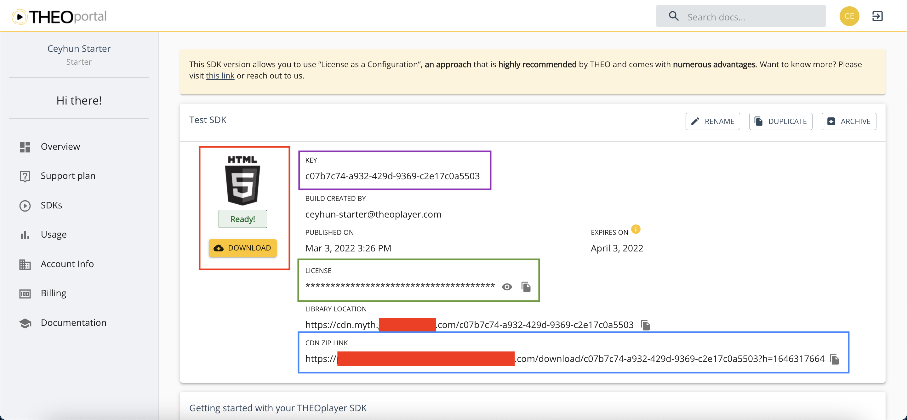

# Getting started on Web

import Link from '@docusaurus/Link';

THEOplayer is the universal video player solution created by THEO Technologies.
The THEOplayer HTML5/Tizen/webOS SDK offers support for HLS, MPEG-DASH, advertisements, DRM and much more.

:::info NPM

THEOplayer v2.82.0 and above can be managed through NPM. Refer to https://www.npmjs.com/package/theoplayer for more information.

:::

This article is your starting point if you are using THEOplayer for the first time.
It takes you through the required steps to achieve a basic manual implementation of the THEOplayer SDK on Web.
The outcome of this article is the template below.

```html
<!doctype html>
<html lang="en">
  <head>
    <meta charset="UTF-8" />
    <title>THEOplayer</title>
    <meta name="viewport" content="width=device-width, initial-scale=1.0" />
    <link rel="stylesheet" type="text/css" href="/path/to/ui.css" />
  </head>
  <body>
    <div class="theoplayer-container video-js theoplayer-skin vjs-16-9"></div>
    <script src="/path/to/THEOplayer.js"></script>
    <script>
      var element = document.querySelector(".theoplayer-container");
      var player = new THEOplayer.Player(element, {
        libraryLocation: "/path/to/your-theoplayer-folder/",
        license: "your_license_string"
      });
      player.source = {
        sources: [
          {
            src: "//cdn.theoplayer.com/video/star_wars_episode_vii-the_force_awakens_official_comic-con_2015_reel_(2015)/index.m3u8",
            type: "application/x-mpegurl"
          }
        ]
      };
    </script>
  </body>
</html>
```

## Prerequisites

Before we can start using THEOplayer, you'll need a few things:

1. A web server and domain name to host your code and provide access to viewers.
2. A THEOplayer SDK and license to implement the THEOplayer library and access the THEOplayer API.
3. A video stream (e.g. an `.m3u8` or `.mpd` file) to show to your viewers through the THEOplayer API.

### THEOplayer SDK and license

Acquiring a THEOplayer SDK and license takes three steps:

1. Sign up for [https://portal.theoplayer.com](https://portal.theoplayer.com).
2. Create a THEOplayer Web SDK.
3. Have your ["CDN URL" and "license string"](#sdkready) handy.

## Basic setup

Now, we're ready to set up THEOplayer on your website. This guide explains how you implement THEOplayer in four steps:

1. We'll [start from a basic HTML file](#step-1-set-up-an-html-file), with no mention of THEOplayer.
2. In the [second step](#step-2-including-the-theoplayer-library), we'll explain what the THEOplayer library is and how you can include it.
   We'll do the same for the default THEOplayer UI.
3. In the [third step](#step-3-the-video), we'll describe how you play a video stream through THEOplayer.
4. In the [fourth step](#step-4-the-result), we'll give a final overview.

### Step 1: Set up an HTML file

When THEOplayer is used as a web video player, we will need a web page (i.e. HTML file) to embed THEOplayer and the code.

Note that a THEOplayer SDK license can only be used on whitelisted domains.
You configure these domains when you create a THEOplayer Web SDK at [https://portal.theoplayer.com](https://portal.theoplayer.com).

Let's start with the following HTML file:

```html
<!doctype html>
<html lang="en">
  <head>
    <meta charset="UTF-8" />
    <title>THEOplayer</title>
    <meta name="viewport" content="width=device-width, initial-scale=1.0" />
  </head>
  <body></body>
</html>
```

Next, we’ll include the THEOplayer SDK.

### Step 2: Including the THEOplayer library

To access the THEOplayer API and default UI, you must first include the THEOplayer library files.
The JavaScript library exposes the THEOplayer API and the CSS library contains the default UI.

#### THEOplayer JavaScript library

The following line includes the THEOplayer JavaScript library, and gives you access to the THEOplayer API.

```html
<script src="/path/to/THEOplayer.js"></script>
```

The `<script>` tag can include an external JavaScript library on a web page.
In this case we use it to include the THEOplayer library.

The `src` attribute is the URI of the THEOplayer library that you wish to use. This could be something like: `/path/to/THEOplayer.js`, where the URL is a link to your THEOplayer.js file.
<Link id="sdkready"/>


You must swap `/path/to/` with your CDN URL.
If your SDK was the one above, then you'd include the following instead `<script>` tag instead.

```html
<script src="https://cdn.myth.theoplayer.com/55d71743-4924-4d1b-8440-78f9cd103879/THEOplayer.js"></script>
```

#### THEOplayer CSS library

To use the default THEOplayer UI, you need to reference the THEOplayer CSS library:

```html
<link rel="stylesheet" type="text/css" href="/path/to/ui.css" />
```

The `<link>` tag includes a CSS file on a web page.
Similar to the JavaScript library, you must swap `/path/to/` with your CDN URL.

Next, we’ll create a THEOplayer instance and configure a video stream.

### Step 3: The video

To play a video through the THEOplayer Web SDK, you must:

1. Create a video player container,
2. fetch this container through JavaScript,
3. create a THEOplayer instance associated with that container,
4. and configure a video stream for this instance.

The snippet below implements these 4 steps.

```html
<div class="theoplayer-container video-js theoplayer-skin vjs-16-9"></div>
<script src="/path/to/THEOplayer.js"></script>
<script>
  var element = document.querySelector(".theoplayer-container"); // fetch THEOplayer container div

  var player = new THEOplayer.Player(element, {
    // instantiates video player
    libraryLocation: "/path/to/your-theoplayer-folder/", // references folder containing your THEOplayer library files (theoplayer.p.js, THEOplayer.js, ...)
    license: "your_license_string" // references your THEOplayer SDK license
  });

  // HLS
  player.source = {
    sources: [
      {
        src: "//cdn.theoplayer.com/video/star_wars_episode_vii-the_force_awakens_official_comic-con_2015_reel_(2015)/index.m3u8", // sets HLS source
        type: "application/x-mpegurl" // sets type to HLS
      }
    ]
  };

  // DASH
  // player.source = {
  //     sources : [{
  //         src : '//amssamples.streaming.mediaservices.windows.net/634cd01c-6822-4630-8444-8dd6279f94c6/CaminandesLlamaDrama4K.ism/manifest(format=mpd-time-csf)', // sets DASH source
  //         type : 'application/dash+xml' // sets type to MPEG-DASH
  //     }]
  // };
</script>
```

Let's break down the above snippet.

#### Create video player container

This `<div>` element creates a video player container.

```html
<div class="theoplayer-container video-js theoplayer-skin vjs-16-9"></div>
```

- The `theoplayer-container` class is used to fetch the container through JavaScript, as demonstrated by the snippet below.
- The `video-js theoplayer-skin vjs-16-9` classes load the default THEOplayer UI. You may omit `vjs-16-9` if you don't want a 16:9 container.

```javascript
var element = document.querySelector(".theoplayer-container");
```

#### Create THEOplayer instance

The snippet below creates a THEOplayer instance for a container with a specific [Player Configuration](pathname:///theoplayer/v6/api-reference/web/interfaces/PlayerConfiguration.html).

```js
var player = new THEOplayer.Player(element, {
  // instantiates video player
  libraryLocation: "/path/to/your-theoplayer-folder/", // references folder containing your THEOplayer library files (theoplayer.p.js, THEOplayer.js, ...)
  license: "your_license_string" // references your THEOplayer SDK license
});
```

Similar to the JavaScript and CSS library, you must swap out `'/path/to/your-theoplayer-folder/'` and `'your_license_string'`.
For example, for the [previously shown screenshot](#sdkready) representing your SDK,
you would instead configure the snippet below:

```js
var player = new THEOplayer.Player(element, {
  libraryLocation:
    "https://cdn.myth.theoplayer.com/55d71743-4924-4d1b-8440-78f9cd103879/",
  license:
    "sZP7IYe6T6PeCl0iCSbrI6klIQf_FSaZ3Le-TSez0mzoIDat3DarTSIlCSb6FOPlUY3zWokgbgjNIOf9fKaZTux10LUlFDXgTSb-3QIg06k1IKhrFSBrISCo0QPeCo0i36fVfK4_bQgZCYxNWoryIQXzImf90SCZ3SfZ0u5i0u5i0Oi6Io4pIYP1UQgqWgjeCYxgflEc3l5r3u0k0Se_this_is_a_fake_license_string_1dDrLYtA1Ioh6TgV6UQ1gWtAVCYggb6rlWoz6FOPVWo31WQ1qbta6Ymi6IQj-CDgpbkjLWt4ZCoh6TgV6UQ1gWtAVCYggb6rlWoz6FOPVWo31WQ1qbta6FOfJfgzVfG3edt06TgV6dwx-Wuh6Ymi6bo4pIXjNWYAZIY3LdDjpflNzbG4gya"
});
```

You can read more about configuring the `license` at the [License section](../../../how-to-guides/12-license/00-introduction.md).

#### Configure video stream

The snippet below configures a HLS video stream for the THEOplayer instance.

```js
player.source = {
  sources: [
    {
      src: "//cdn.theoplayer.com/video/star_wars_episode_vii-the_force_awakens_official_comic-con_2015_reel_(2015)/index.m3u8", // sets HLS source
      type: "application/x-mpegurl" // sets type to HLS
    }
  ]
};
```

To configure a DASH stream instead,
you must set `type` to `'application/dash+xml'` instead of `'application/x-mpegurl'`,
as demonstrated by commented out code in one of the earlier snippets.

In the next step we'll put everything together.

### Step 4: The result

Use the snippet below on your web server,
or experiment with it on an [online code playground](https://jsfiddle.net/thijsl/vxm08owd/3/).

```html
<!doctype html>
<html lang="en">
  <head>
    <meta charset="UTF-8" />
    <title>THEOplayer</title>
    <meta name="viewport" content="width=device-width, initial-scale=1.0" />
    <link rel="stylesheet" type="text/css" href="/path/to/ui.css" />
  </head>
  <body>
    <div class="theoplayer-container video-js theoplayer-skin vjs-16-9"></div>
    <script src="/path/to/THEOplayer.js"></script>
    <script>
      var element = document.querySelector(".theoplayer-container");
      var player = new THEOplayer.Player(element, {
        libraryLocation: "/path/to/your-theoplayer-folder/",
        license: "your_license_string"
      });
      player.source = {
        sources: [
          {
            src: "//cdn.theoplayer.com/video/star_wars_episode_vii-the_force_awakens_official_comic-con_2015_reel_(2015)/index.m3u8",
            type: "application/x-mpegurl"
          }
        ]
      };
    </script>
  </body>
</html>
```

## Next steps

Ready to learn more?

- Go through our [documentation](http://docs.portal.theoplayer.com/) to learn about [UI customization](../../../how-to-guides/11-ui/00-introduction.md), [advertising](../../../how-to-guides/01-ads/00-introduction.md), [DRM](../../../how-to-guides/04-drm/00-introduction.md), [casting](../../../how-to-guides/03-cast/01-chromecast/00-introduction.md), [analytics](../../../how-to-guides/02-analytics/00-introduction.md) and other topics.
- Check out our [API reference](pathname:///theoplayer/v6/api-reference/web/classes/ChromelessPlayer.html).
- Try out samples from our [GitHub](https://github.com/THEOplayer).
