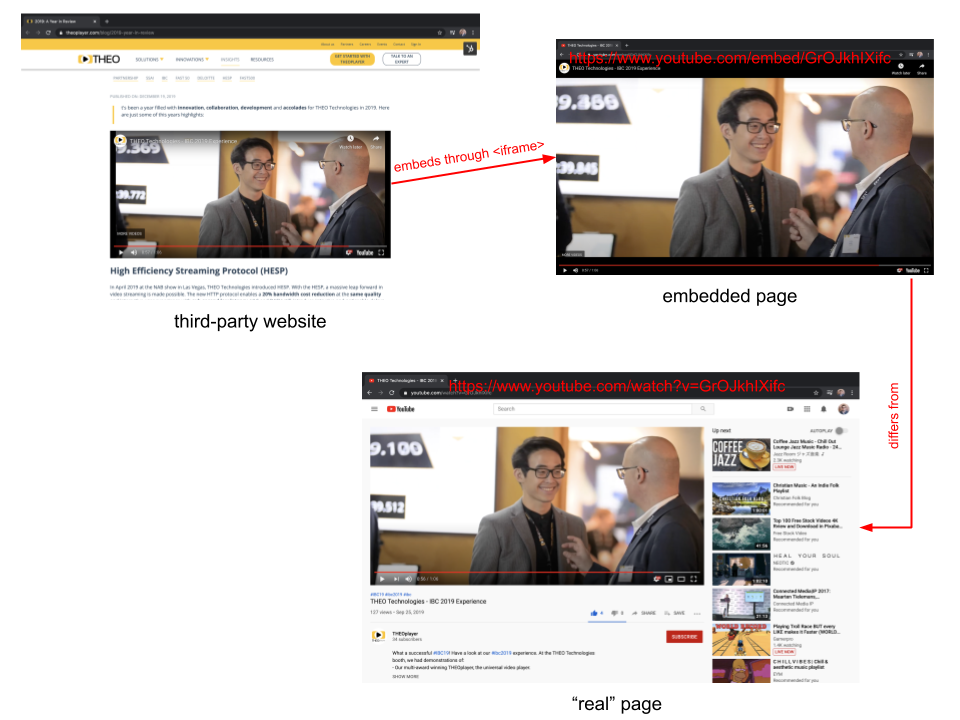

# How to embed an iframe

Embedding a video player through an `<iframe>` can be interesting for a number of reasons:

- You might want to easily embed your videos across different domains and brands.
- You want to facilitate social sharing on third-party websites through your viewers.
- You are using a service or framework which doesn't allow you to include custom JavaScript, but it does allow you to embed an `<iframe>`.

Regardless of your use-case: you can embed THEOplayer through an iframe on first-party and third-party domains.

The goal of this guide is to help you embed THEOplayer through an `<iframe>` by going through the following topics:

1. [\<iframe\>](#iframe): what is an iframe?
2. [Implementation](#implementation): which THEOplayer APIs are relevant and how can I achieve my use-case?
   1. [Allowing embedding](#allowing-embedding)
   2. [Enabling fullscreen and other features](#enabling-fullscreen-and-other-features)
   3. [Deciding approaches](#deciding-approaches)
   4. [Considering limitations](#considering-limitations)
   5. [Adjusting UI and UX](#adjusting-ui-and-ux)
3. [Demo](#demo): resulting implementation and live demo
4. [Resources](#resources)

Just want to copy-paste code and view a live example? [Skip to the demo](#demo).

## \<iframe\>

An iframe is an HTML tag, the [`<iframe>`](https://developer.mozilla.org/en-US/docs/Web/HTML/Element/iframe) tag, which allows you to embed an HTML page (i.e. "a website") on your HTML page (i.e. "your website").
You come across iframes all the time when using the web.
(_That YouTube video on that news website you just visited? That's an iframe. That Facebook or Twitter post which was embedded on that blog? That could also be an iframe. They are all HTML website pages which are embedded on another HTML website page._)

```html
<iframe width="560" height="315" src="https://www.youtube.com/embed/GrOJkhIXifc" frameborder="0" allow="accelerometer; autoplay; encrypted-media; gyroscope; picture-in-picture" allowfullscreen></iframe>
```

The code snippet above represent an actual `<iframe>` tag. Adding this code snippet to the HTML of your website would embed [https://www.youtube.com/embed/GrOJkhIXifc](https://www.youtube.com/embed/GrOJkhIXifc), which is a YouTube video.
If you opened this link, you would see that it is a YouTube video which fits the entire size of your browser window.



As you can see, [the embedded page](https://www.youtube.com/embed/GrOJkhIXifc) is quite different from the "[real](https://www.youtube.com/watch?v=GrOJkhIXifc)" YouTube page.
When you design and develop a page which should be embedded through an `<iframe>`, you optimize for this embedding use-case. Typically, your component (e.g. a video player) fills the entire browser window,
and thus has a width and height of 100%. (You set the width and height of the `<iframe>` on your page, as can be seen from the above code snippet.)

We won't go into the pros and cons of using an `<iframe>` in this article. We do argue that you should try to avoid using iframes, because iframes can be [evil](https://www.blackburnlabs.com/iframe-evil/) and can cause [usability issues](https://www.ostraining.com/blog/webdesign/against-using-iframes).
From our experience, most services and companies are trying to phase out iframes, and are instead embedding JavaScript code to render the same result.

## Implementation

When embedding THEOplayer through an `<iframe>` tag, you need to do a couple of things:

1. [Allow embedding](#allowing-embedding): you need to use the THEOplayer API to allow for embedding.
2. [Enable fullscreen (and other features)](#enabling-fullscreen-and-other-features): you might want to use the HTML API to allow certain features like fullscreen and autoplay.
3. [Decide approach](#deciding-approaches): you need to decide on a strategy on how to dynamically load content.
4. [Consider limitations](#considering-limitations): you need to be aware of the constraints and how to address them.
5. [Adjust UI and UX](#adjusting-ui-and-ux): you need to style your iframe tag.

### Allowing embedding

You can easily allow embedding by setting the `isEmbeddable`-flag in the THEOplayer's [`PlayerConfiguration`](pathname:///theoplayer/v6/api-reference/web/interfaces/PlayerConfiguration.html) to `true`, as demonstrated by the code snippet below.

```js
let playerConfiguration = {
  // ...
  libraryLocation: "</path-to-library>/",
  license: "your-license-here",
  isEmbeddable: true
  // ...
};
let player = new THEOplayer.Player(element, playerConfiguration);
```

Embedding THEOplayer through an `<iframe>` tag is disabled by default. Why?

- Your THEOplayer license (i.e. your THEOplayer Web SDK) has a set of whitelisted domains. Typically, you only whitelist domains where you deploy THEOplayer. Deploying your THEOplayer SDK on a non-whitelisted domain would result in a license error.
  Thus, you need to specify that a page which contains your THEOplayer Web SDK, may be embedded. You do not need to whitelist every domain which embeds your `<iframe>` tag.
- When embedding is allowed, and if third-party websites are embedding your THEOplayer video player,
  then those parties generate additional video views and impressions for your license. (Remember: THEOplayer charges you by the number of impressions.)
  Additionally, if your [iframe approach](#deciding-approaches) allows people to specify the video URL through the `<iframe>` tag, then third-parties could
  potentially piggyback for free on your (commercial) license if they reverse-engineer your approach.

### Enabling fullscreen and other features

If you want to allow your viewers to open your iframe in fullscreen, then you must explicitly enable the [`allowfullscreen`](https://developer.mozilla.org/en-US/docs/Web/HTML/Element/iframe#attr-allowfullscreen)-attribute.

```html
<iframe
  src="player.html"
  frameborder="0"
  scrolling="no"
  width="100%"
  height="100%"
  allowfullscreen=""
>
</iframe>
```

On top of this, you want to configure the [`allow`](https://developer.mozilla.org/en-US/docs/Web/HTML/Element/iframe#attr-allow)-attribute and track its evolution.

```html
<iframe
  src="player.html"
  frameborder="0"
  scrolling="no"
  width="100%"
  height="100%"
  allow="accelerometer; autoplay; encrypted-media; fullscreen; gyroscope; picture-in-picture"
  allowfullscreen=""
>
</iframe>
```

Through this attribute, you can allow your iframe to access a set of [features](https://developer.mozilla.org/en-US/docs/Web/HTTP/Headers/Feature-Policy#Directives),
like autoplay, Picture-in-Picture, DRM, and more.

### Deciding approaches

The previous section explains how you can make THEOplayer compatible with an `<iframe>`, but it doesn't explain the possible approaches for loading content and configurations.
What do we mean with this? When you are embedding THEOplayer, you still need a mechanism to configure a stream URL and toggle settings like autoplay and mute.
You don't want to create one HTML page per stream and combination of settings. Instead, you want to be able to embed one HTML page which is capable of dynamically configuring your stream and settings.

There are at least three approaches to pass along your stream URL and settings:

1. **Direct**: you pass along your stream URL and settings directly through the iframe URL and/or query parameters of the iframe URL.
   For example, your iframe URL could be similar to `https://cdn.theoplayer.com/demos/iframe/theoplayer.html?autoplay=false&muted=false&preload=none&src=//cdn.theoplayer.com/video/elephants-dream/playlist.m3u8`.
   On your iframe page, you (_i.e. either your front-end or back-end_) would read out these four query parameters (or GET parameters), and then use those values to set up your THEOplayer instance and configure your stream URL and settings.
2. **Indirect**: you pass along an identifier through the iframe URL and/or query parameters of the iframe URL. For example, your iframe URL could be similar to `https://cdn.theoplayer.com/demos/iframe/video-123`.
   On your iframe page, you would read out this identifier (e.g. `video-123`), and do a call to a content management system (CMS) requesting data matching your identifier. This CMS would then return the actual stream URL and settings. You use this response to set up your THEOplayer instance and configure your stream URL and settings.
3. **Hybrid**: you pass along your stream URL indirectly or directly, and your settings directly or indirectly.
   For example, your iframe URL could be similar to `https://cdn.theoplayer.com/demos/iframe/video-123?autoplay=false&muted=false&preload=none`.
   On your iframe page, you would read out this identifier and the query parameters, and use the identifier to fetch the stream URL through a CMS, but configure your settings through the values of your query parameters.

Every approach has its trade-offs. Using a CMS is useful to avoid third-parties from loading their own streams through your iframe setup, but it does require you to spend resources on a CMS.

### Considering limitations

As hinted in the [\<iframe\>](#iframe)-section, using iframes can incur some limitations. Some of those limitations can be addressed,
and some of those cannot due to technological platform constraints.

- [Fullscreen might not work on iOS](../../../faq/04-why-does-fullscreen-not-behave-as-expected-on-ios.md): you can fix this.
- [Autoplay might not work](../../../faq/50-why-is-video-not-playing-automatically.md): you can fix this.
- [Chromecast does not work on iOS](../../../faq/06-why-does-chromecast-not-work-on-ios-chrome.md): you cannot address this.
- [The Visibility API does not work on IE11 and Safari](../../../faq/11-why-visibilty-api-doesnt-work-in-iframe-on-safari-and-ie11.md): you cannot address this on IE11.
- [Picture-in-Picture does not work as expected](../../../how-to-guides/07-miscellaneous/07-picture-in-picture.md#code-examples): you can address this by using native Picture-in-Picture instead, or by building a similar feature which creates a floating iframe component.

### Adjusting UI and UX

Styling the `<iframe>` element on your page, and the actual page behind the `<iframe>`, can be a challenge.
Additionally, you may want to alter your user experience by implementing messaging between your page and the embed page.

1. [Styling \<iframe\>](#styling-iframe)
2. [Styling embedded page](#styling-embedded-page)
3. [Communication parent page \<-\> embedded page](#communication-parent-page---embedded-page)

#### Styling \<iframe\>

Styling your `<iframe>` element is a breeze if you're using a fixed width and height: you can directly configure those through the `width` and `height` attributes as demonstrated below.

```html
<iframe
  src="player.html"
  frameborder="0"
  scrolling="no"
  width="800px"
  height="450px"
  allowfullscreen=""
>
</iframe>
```

However, more common is to rely on responsive styling, and not knowing your specific width and height. On top of wanting a responsive iframe, you usually want to respect the aspect ratio of your video.
Basically, you want your `<iframe>` container to automatically -and appropriately- scale when the size of your browser window changes.

```html
<iframe
  src="player.html"
  frameborder="0"
  scrolling="no"
  width="100%"
  style="width:100%;aspect-ratio:16/9"
>
</iframe>
```

The above snippet demonstrates how you can achieve this.

- You want to set an `aspect-ratio` in the `style` of your `<iframe>` element. We've used `16/9` for a 16:9 aspect ratio, but you can change this to e.g. `4/3` for a 4:3 video.
- You want to disable the border around your iframe by specifying `frameborder="0"` and disable scrolling by specifying `scrolling="no"`.
- You want to maximize the width of your iframe by specifying `width="100%"`. The height will be computed automatically based on the `aspect-ratio`.

Of course, rather than using inline styling through the `style` attribute, you could also achieve the same through CSS.
And, of course: this is not the only way to style your iframe element, but just one of the many ways.

#### Styling embedded page

You usually want your video player to fit the full width and height of your browser window, because it should fill the entire iframe container element.

```html
<html>
  <head>
    <meta
      name="viewport"
      content="width=device-width, initial-scale=1, shrink-to-fit=no"
    />
    <meta http-equiv="x-ua-compatible" content="ie=edge" />
    <style>
      html,
      body {
        margin: 0;
        padding: 0;
        width: 100%;
        height: 100%;
      }

      .theoplayer-container {
        width: 100%;
        height: 100%;
      }
    </style>
  </head>
  <body>
    <div class="theoplayer-container video-js theoplayer-skin"></div>
  </body>
</html>
```

The above snippet demonstrates a way to achieve this.

- You want to remove all padding and margin, and give your document a `width` and `height` of 100%.
- You want your video player container, the `<div>` in the above snippet, to fill the entire document by setting its `width` and `height` to 100%.

#### Communication between parent page and embedded page

You may have a need for messaging between your parent page and your embedded page.

- If your video or ad break ends, you want to hide (or destroy) the iframe container on your parent page.
- If someone clicks a control button in your video player, you may want to know about this action in your parent page.

You can achieve this with cross-document messaging and the `postMessage` API. Please refer to the resources below to learn more on this:

- [Stackoverflow.com: how to communicate between iframe and the parent side](https://stackoverflow.com/questions/9153445/how-to-communicate-between-iframe-and-the-parent-site)
- [MDN: postMessage](https://developer.mozilla.org/en-US/docs/Web/API/Window/postMessage)
- [JavaScript.info: cross-window communication](https://javascript.info/cross-window-communication)

## Demo

The video player below this paragraph is embedded through an `<iframe>` tag.

<iframe src="https://cdn.theoplayer.com/demos/iframe/theoplayer.html?autoplay=false&muted=false&preload=none&src=//cdn.theoplayer.com/video/elephants-dream/playlist.m3u8" title="Embedded THEOplayer" frameBorder="0" scrolling="no" width="100%" style={{width:'100%',aspectRatio:'16/9'}} allow="accelerometer; autoplay; encrypted-media; fullscreen; gyroscope; picture-in-picture" allowFullScreen></iframe>

We selected the "direct approach" by leveraging query parameters, as demonstrated by the code snippet below.

```html
<iframe
  src="https://cdn.theoplayer.com/demos/iframe/theoplayer.html?autoplay=false&muted=false&preload=none&src=//cdn.theoplayer.com/video/elephants-dream/playlist.m3u8"
  title="Embedded THEOplayer"
  frameborder="0"
  scrolling="no"
  width="100%"
  style="width:100%;aspect-ratio:16/9"
  allow="accelerometer; autoplay; encrypted-media; fullscreen; gyroscope; picture-in-picture"
  allowfullscreen=""
>
</iframe>
```

If we had configured a different `src`-value, like `https://cdn.theoplayer.com/demos/iframe/theoplayer.html?autoplay=false&muted=false&preload=none&src=//cdn.theoplayer.com/video/big_buck_bunny/big_buck_bunny_metadata.m3u8`, then it would have loaded a different video.
Note that unmuted autoplay may not be possible, and that you may have to [combat autoplay policies](../../../faq/02-how-to-combat-autoplay-policies.md).

You can see the code of the iframe HTML page at [https://cdn.theoplayer.com/demos/iframe/theoplayer.html](https://cdn.theoplayer.com/demos/iframe/theoplayer.html), or in the code snippet below.

```html
<html>
  <head>
    <meta
      name="viewport"
      content="width=device-width, initial-scale=1, shrink-to-fit=no"
    />
    <meta http-equiv="x-ua-compatible" content="ie=edge" />
    <link
      rel="stylesheet"
      type="text/css"
      href="/path/to/libraryLocation/ui.css"
    />
    <script src="/path/to/libraryLocation/THEOplayer.js"></script>
    <style>
      html,
      body {
        margin: 0;
        padding: 0;
        width: 100%;
        height: 100%;
      }

      .theoplayer-container {
        width: 100%;
        height: 100%;
      }
    </style>
  </head>
  <body>
    <div class="theoplayer-container video-js theoplayer-skin"></div>
    <script>
      // https://stackoverflow.com/a/901144/588833
      // function to get URL query parameters by name
      function getParameterByName(name, url) {
        if (!url) url = window.location.href;
        name = name.replace(/[\[\]]/g, "\\$&");
        var regex = new RegExp("[?&]" + name + "(=([^&#]*)|&|#|$)"),
          results = regex.exec(url);
        if (!results) return null;
        if (!results[2]) return "";
        return decodeURIComponent(results[2].replace(/\+/g, " "));
      }

      // initialize THEOplayer instance
      var element = document.querySelector(".theoplayer-container");
      var player = new THEOplayer.Player(element, {
        libraryLocation: "/path/to/libraryLocation/",
        license: "your-license-here",
        ui: {
          width: "100%",
          height: "100%"
        },
        isEmbeddable: true
      });

      // get query parameter values
      var autoplay =
        getParameterByName("autoplay") &&
        getParameterByName("autoplay") == "true";
      var muted =
        getParameterByName("muted") && getParameterByName("muted") == "true";
      var preload = getParameterByName("preload");
      var src = getParameterByName("src");

      // set settings and stream URL
      player.autoplay = autoplay;
      player.muted = muted;
      player.preload = preload;
      player.src = src;
    </script>
  </body>
</html>
```

## Resources

- [Player API - PlayerConfiguration](pathname:///theoplayer/v6/api-reference/web/interfaces/PlayerConfiguration.html)
- [iframe demo code](https://cdn.theoplayer.com/demos/iframe/theoplayer.html?autoplay=false&muted=false&preload=none&src=//cdn.theoplayer.com/video/elephants-dream/playlist.m3u8)
- [AMP](../../02-frameworks/06-amp/00-getting-started.md) (consider translating your learning to the AMP framework)
- [MDN: iframe](https://developer.mozilla.org/en-US/docs/Web/HTML/Element/iframe)
- [ottball.com: lazy loading](https://ottball.com/lazy-loading-video/#embedded-players) (consider lazy loading for your iframes)
