# Getting started on Android

## What are the differences between Android SDK and Legacy Android SDK (4.12.x)?

The Android SDK is significantly more performant than the Legacy Android SDK (4.12.x), as it removes the dependency on the WebView to handle video-playback and supported features.
Removing the WebView dependency also allowed to move many of the APIs from being asynchronous to being synchronous, such as querying the current time.

Another difference between the SDKs is that with Android SDK users will no longer need to maintain multiple flavors for different platforms or Android OS version.
This because the Android SDK works on Android mobile, Android TV and Fire TV devices with Android OS version 5.0+ (API level 21 and above).

The Android SDK moves towards more modularized features, which means there is a base SDK that can handle basic playback and additional feature integrations are provided as separate modules that can be added as desired.
This approach gives more flexibility and results in a reduced application size, since non-required parts are not included in the build of the application.

The Android SDK leverages Java 8 and Kotlin languages to provide safer and more concise code.

The Android SDK is published to the [THEOplayer Maven respository](https://maven.theoplayer.com/) where developers can easily navigate our releases and find code snippets for implementing the player into their project.
_Note: currently the Android SDK is also published to [Jitpack](https://jitpack.io/#com.theoplayer.theoplayer-sdk-android/core) but we encourage users to use the THEOplayer Maven repository as we will stop publishing to Jitpack in the future._

## Add THEOplayer and Kotlin libraries to your application

We have to modify the **build.gradle** files to be able to fetch the Android SDK and the Kotlin plugin.

1. In your **top-level** (project) **build.gradle** file

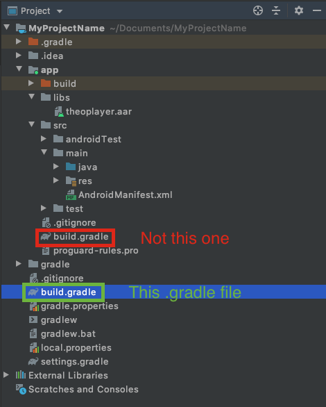

1. a) Add the THEOplayer Maven repo as a repository.

```groovy
allprojects {
    repositories {
        google()
        mavenCentral()
        maven {
            url 'https://maven.theoplayer.com/releases'
        }
    }
}
```

1. b) Add Kotlin as a plugin

```groovy
buildscript {
    dependencies {
        classpath "org.jetbrains.kotlin:kotlin-gradle-plugin:1.6.10"
    }
}
```

2. Next, we need to edit the **build.gradle** on the **module-level** (**app/build.gradle**)

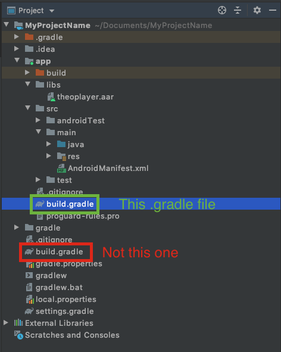

We need to apply Kotlin as a plugin using by adding `apply plugin: 'kotlin-android'`.
Then specify THEOplayer as a dependency for the app. So edit the Gradle file to contain:

```groovy
apply plugin: 'kotlin-android'

dependencies {
    implementation 'com.theoplayer.theoplayer-sdk-android:core:+'
    implementation 'org.jetbrains.kotlin:kotlin-stdlib:1.6.21'
}
```

<u>Note</u>: It's possible to replace the `+` with a particular version of THEOplayer that should be used, for example:

`implementation 'com.theoplayer.theoplayer-sdk-android:core:6.0.0'`

## Setting up the license

You need to configure your THEOplayer license, if you don't enter this license string, you might encounter licensing issues (e.g.: when trying to play non-whitelisted video streams).
First, obtain a THEOplayer Android SDK license through the THEOplayer Developer Portal at [https://portal.theoplayer.com](https://portal.theoplayer.com/login).


Then, identify your license string from the screenshot above and add the `<meta-data ...` tag below at the appropriate location in your `AndroidManifest.xml`, and swap `your_license_here` with your
actual license string.

```xml
<application>
    <meta-data
        android:name="THEOPLAYER_LICENSE"
        android:value="your_license_here" />
</application>
```

Additionally, to play online videos with THEOplayer, you first need to add [**INTERNET**](https://developer.android.com/reference/android/Manifest.permission.html#INTERNET) permission into the **AndroidManifest.xml** file too.

```xml
<uses-permission android:name="android.permission.INTERNET" />
```

More information regarding the license can be found [here](../../../how-to-guides/12-license/00-introduction.md).

## Add THEOplayer view to your application ([source](https://github.com/THEOplayer/android-sdk-starter-project/commit/db0205f330009febe0cf8b8a29d600e453445926?diff=unified))

THEOplayer can be added to an application either through a layout (i.e. XML) or programmatically through the constructor API.

This guide uses approach A.

<u>Note</u>: Refer to [Using the constructor API](https://github.com/THEOplayer/theoplayer-sdk-android#b-using-the-constructor-api)
if you want to use approach B instead.
This approach also allows you to configure the "license string" through a programmatic configuration instead of the `AndroidManifest.xml`.

You will add some code to the activity_main.xml file.

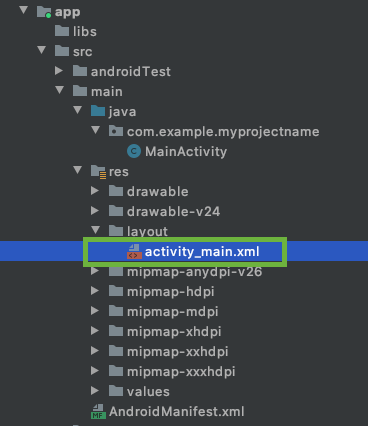

You can add the **THEOplayerView** to the layout of the **MainActivity** with the snippet below.

At least the "**id**", "**width**" and "**height**" attributes need to be specified on the new view.

The "**id**" is important because it is used to identify the view object in you **MainActivity** class.

```xml
<com.theoplayer.android.api.THEOplayerView
    android:id="@+id/theoplayer"
    android:layout_width="match_parent"
    android:layout_height="300dp"
    app:layout_constraintTop_toTopOf="parent">
</com.theoplayer.android.api.THEOplayerView>
```

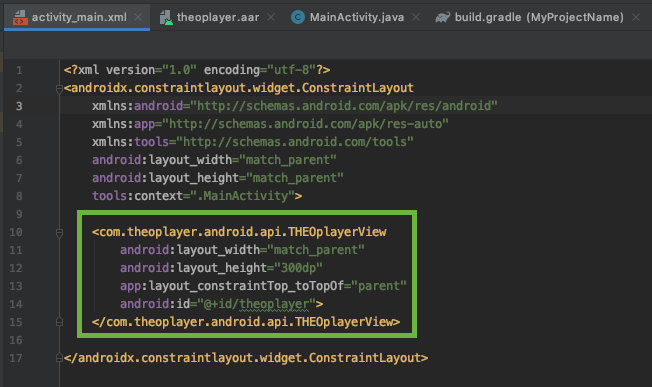

## Use THEOplayer API in your application

Now in the **MainActivity.java** we can retrieve the **THEOplayerView** by the "**id**" we set earlier using the **findViewById** method.

#### 1. Get the THEOplayer instance

```java
...
import com.theoplayer.android.api.THEOplayerView;

public class MainActivity extends AppCompatActivity{
    THEOplayerView theoPlayerView;

    @Override
    protected void onCreate(Bundle savedInstanceState) {
        super.onCreate(savedInstanceState);
        setContentView(R.layout.activity_main);

        theoPlayerView = findViewById(R.id.theoplayer);

    }
}

```

#### 2. Configure source ([source](https://github.com/THEOplayer/android-sdk-starter-project/commit/b57ccd82f8b6391636245d74f4f2a68faae227c4?diff=unified))

To play a video in THEOplayer, we need to **configure a source** for the player in our **MainActivity**:

```java
TypedSource typedSource = new TypedSource.Builder("https://cdn.theoplayer.com/video/dash/big_buck_bunny/BigBuckBunny_10s_simple_2014_05_09.mpd")
    .type(SourceType.DASH)
    .build();

SourceDescription sourceDescription = new SourceDescription.Builder(typedSource)
    .build();

theoPlayerView.getPlayer().setSource(sourceDescription);
```

#### 3. Control THEOplayer through the API ([source](https://github.com/THEOplayer/android-sdk-starter-project/commit/c9a2b448ef1a920dc6899bf0fb7aee6ac1e15e33?diff=unified))

We will now introduce a button to start/stop the video in the player.

First add the button to our **activity_main.xml** layout file

```xml
<Button
    android:layout_width="wrap_content"
    android:layout_height="wrap_content"
    android:id="@+id/btn_playpause"
    android:text="PLAY/PAUSE"
    app:layout_constraintTop_toBottomOf="@+id/theoplayer"
    app:layout_constraintLeft_toLeftOf="parent"
    app:layout_constraintRight_toRightOf="parent"/>
```

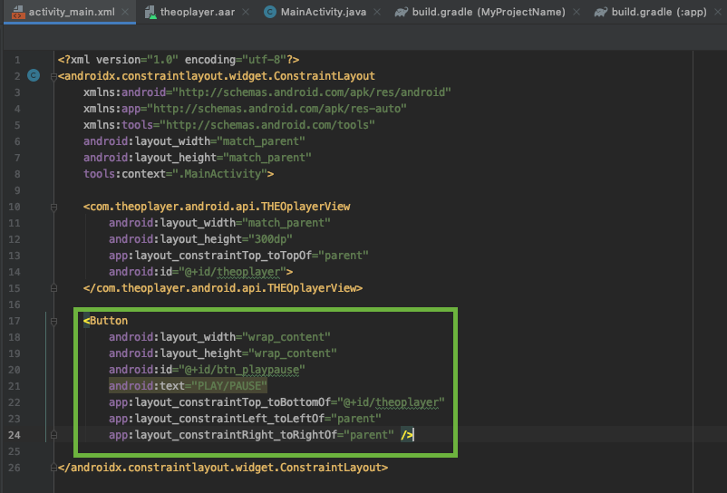

Then set an **OnClickListener()** on the button in our **MainActivity** code to trigger play and pause in the player.

```java
Button btnPlayPause;
    ...
    btnPlayPause = findViewById(R.id.btn_playpause);
    btnPlayPause.setOnClickListener(new View.OnClickListener() {
        @Override
        public void onClick(View v) {
            if (theoPlayerView.getPlayer().isPaused()) {
                theoPlayerView.getPlayer().play();
            } else {
                theoPlayerView.getPlayer().pause();
            }
        }
    });
```

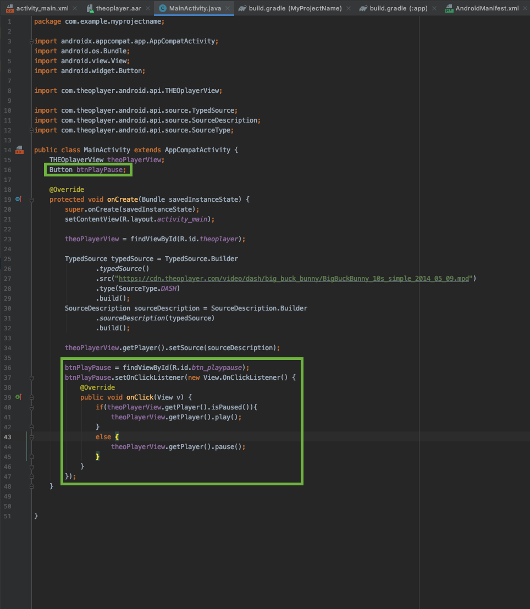

#### 4. Listen for THEOplayer events ([source](https://github.com/THEOplayer/android-sdk-starter-project/commit/52f4a46b6c856d402f2fa2dfca249779d2b22967?diff=unified))

The next step is listening for player events.

First, we need to create two more TextViews in the activity_main.xml file.

```xml
<TextView
    android:layout_width="wrap_content"
    android:layout_height="wrap_content"
    android:id="@+id/txt_playstatus"
    app:layout_constraintLeft_toRightOf="@+id/btn_playpause"
    app:layout_constraintTop_toBottomOf="@+id/theoplayer"
    app:layout_constraintBaseline_toBaselineOf="@+id/btn_playpause"
    android:layout_marginLeft="20dp"/>

<TextView
    android:layout_width="wrap_content"
    android:layout_height="wrap_content"
    android:id="@+id/txt_timeupdate"
    app:layout_constraintLeft_toRightOf="@+id/txt_playstatus"
    app:layout_constraintTop_toBottomOf="@+id/theoplayer"
    app:layout_constraintBaseline_toBaselineOf="@+id/btn_playpause"
    android:layout_marginLeft="20dp"/>
```

We will now listen for "**PLAY**", "**PAUSE**" and "**TIMEUPDATE**" in this example.

```java
TextView txtPlayStatus, txtTimeUpdate;

...

txtPlayStatus = findViewById(R.id.txt_playstatus);
txtTimeUpdate = findViewById(R.id.txt_timeupdate);

theoPlayerView.getPlayer().addEventListener(PlayerEventTypes.PLAY, new EventListener<PlayEvent>() {
    @Override
    public void handleEvent(PlayEvent playEvent) {
        txtPlayStatus.setText("Playing");
    }
});

theoPlayerView.getPlayer().addEventListener(PlayerEventTypes.PAUSE, new EventListener<PauseEvent>() {
    @Override
    public void handleEvent(PauseEvent pauseEvent) {
        txtPlayStatus.setText("Paused");
    }
});

theoPlayerView.getPlayer().addEventListener(PlayerEventTypes.TIMEUPDATE, new EventListener<TimeUpdateEvent>() {
    @Override
    public void handleEvent(TimeUpdateEvent timeUpdateEvent) {
        txtTimeUpdate.setText(String.valueOf(timeUpdateEvent.getCurrentTime()));
    }
});
```

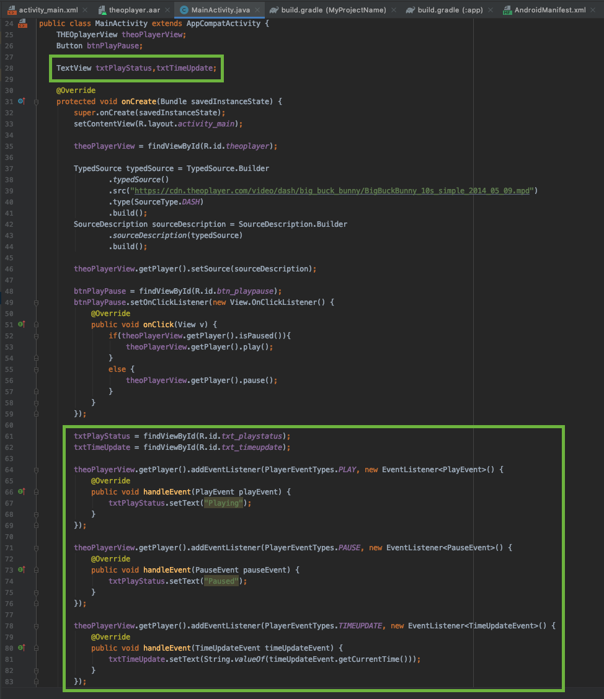

When the events are triggered, we will update the **MainActivity** UI with the corresponding state.

#### 5. Play fullscreen video in landscape mode ([source](https://github.com/THEOplayer/android-sdk-starter-project/commit/c327296197ab5cd30d206dd0cd2f5f64f4a3b6ff?diff=unified))

THEOplayer SDK contains a default fullscreen activity which can be started automatically when you rotate your device.

We have to configure our player instance in the **MainActivity** to react to orientation changes and start the Fullscreen activity.

```java
@Override
protected void onCreate(Bundle savedInstanceState) {

    // ...

    theoPlayerView = findViewById(R.id.theoplayer);
    theoPlayerView.getSettings().setFullScreenOrientationCoupled(true);

    // ...

}
```

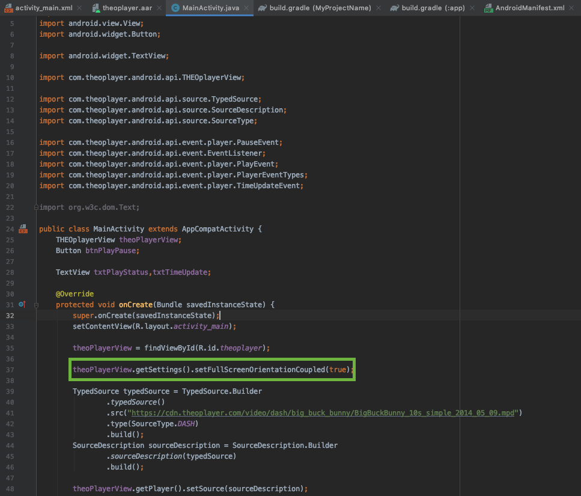

In the **AndroidManifest.xml** we can disable the default orientation behavior on our MainActivity and lock it in portrait.  
Then, because we enabled fullscreen orientation coupling with the **setFullScreenOrientationCoupled(true)** method earlier, THEOplayer will take care of the support of seamless landscape activity transition at rotation.

```xml
<activity android:name=".MainActivity"
    android:screenOrientation="userPortrait"
    android:configChanges="orientation|screenSize" >
    <intent-filter>
        <action android:name="android.intent.action.MAIN" />

        <category android:name="android.intent.category.LAUNCHER" />
    </intent-filter>
</activity>
```

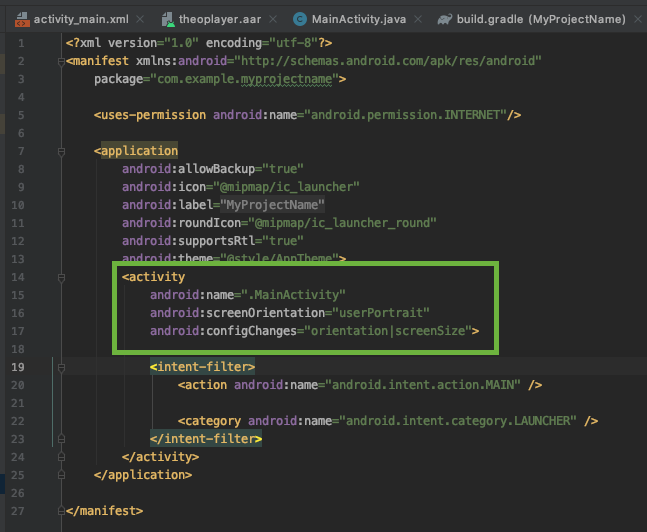

## Couple THEOplayer with the lifecycle callbacks

In order for THEOplayer to work properly and in sync with the [Activity lifecycle changes](https://developer.android.com/guide/components/activities/activity-lifecycle) (e.g. when we rotate the device or start a new Activity or the app goes to background).
We need to call the "**onResume"**, "**onPause"** and "**onDestroy"** methods of the **THEOplayerView** when the matching methods are called in the Activity.

```java
public class MainActivity extends AppCompatActivity{

    // ...

    @Override
    protected void onPause() {
        super.onPause();
        theoPlayerView.onPause();
    }

    @Override
    protected void onResume() {
        super.onResume();
        theoPlayerView.onResume();
    }

    @Override
    protected void onDestroy() {
        super.onDestroy();
        theoPlayerView.onDestroy();
    }

    // ...
}
```

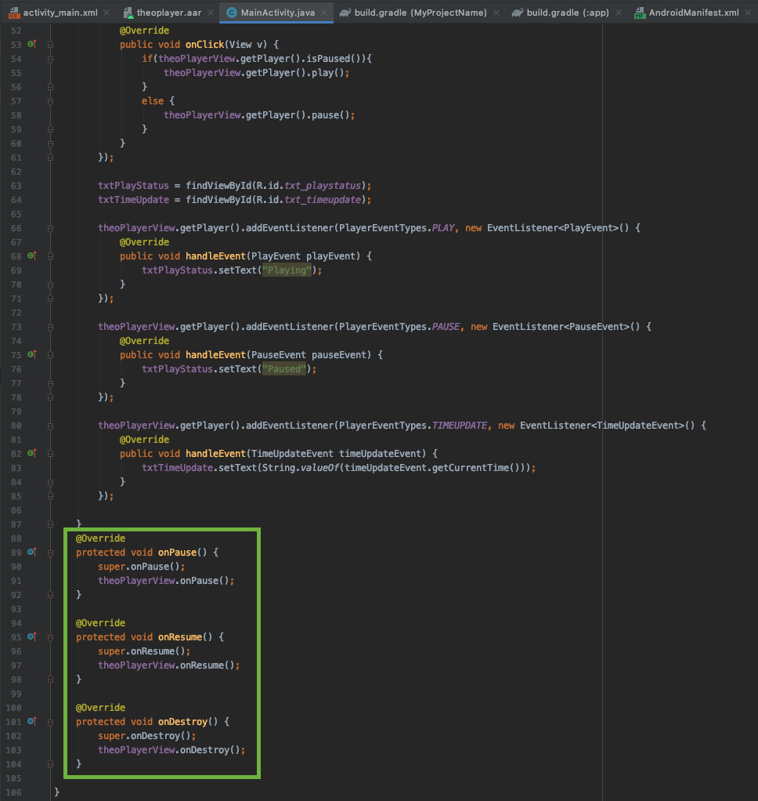

If you would like to customize the Fullscreen Activity, you can follow our tutorial [here](../../../../theoplayer_versioned_docs/version-v4/getting-started/01-sdks/02-android/01-android-sdk-customization.md).

## Run your application

Here you have some screenshots from the running application:

### Start screen

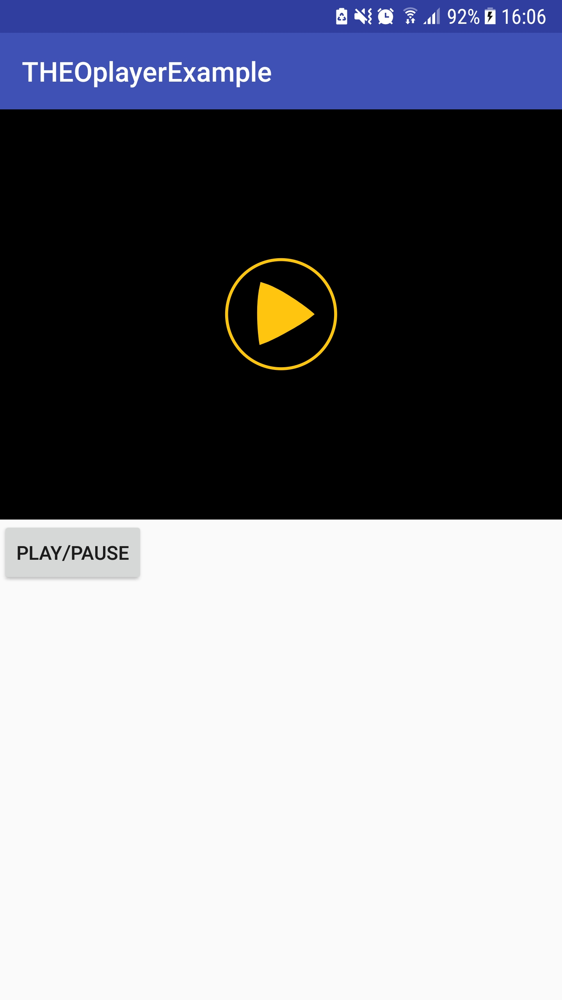

### Playing screen

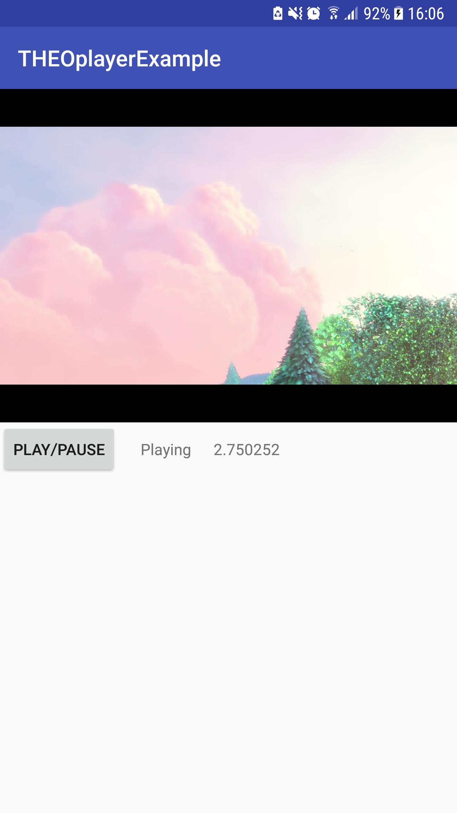

### Paused screen

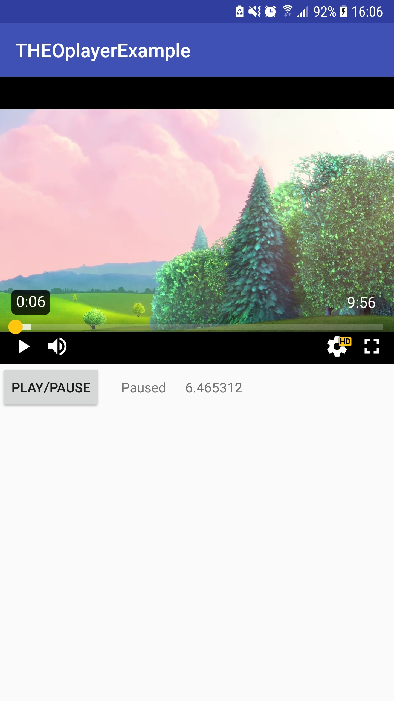

### Rotated fullscreen


## Summary

This guide focuses on creating an Android application from scratch and integrating the THEOplayer Android SDK.

- You have learned how to interact with the player via the available APIs in Java,
- you have registered player events,
- and you have learned how to enable automatic orientation detection.

The full source of this application is available on [GitHub](https://github.com/THEOplayer/android-sdk-starter-project).

You may also find the readme at [https://github.com/THEOplayer/theoplayer-sdk-android](https://github.com/THEOplayer/theoplayer-sdk-android) useful.

You can find interesting features of THEOplayer on our [demo](https://www.theoplayer.com/demo-zone) page.

Did you encounter any issues? Raise a ticket through [the ticketing system](https://opentelly.atlassian.net/servicedesk/customer/portal/1) and we will be happy to assist.
