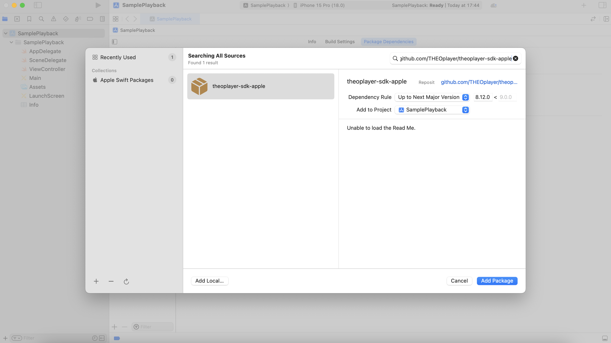
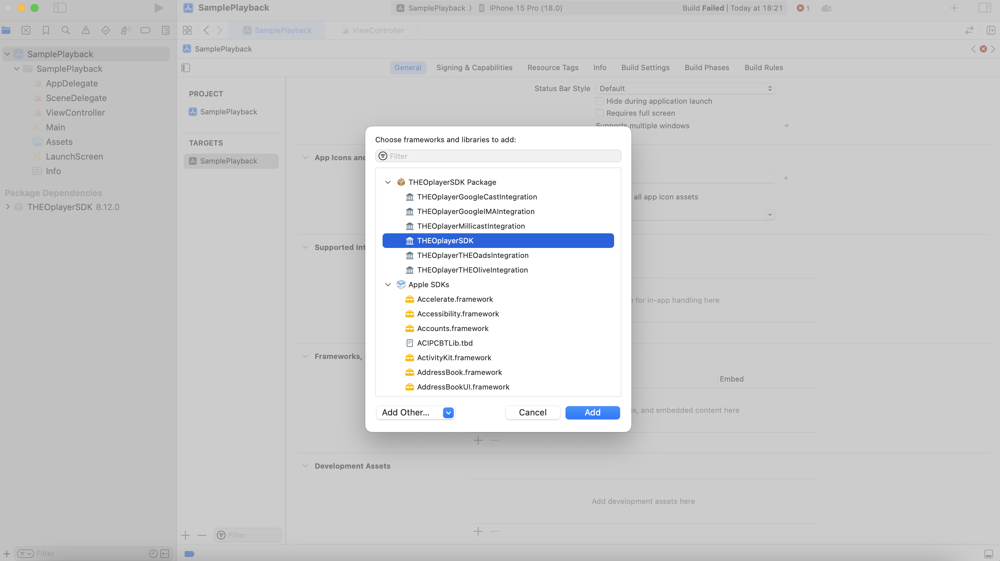
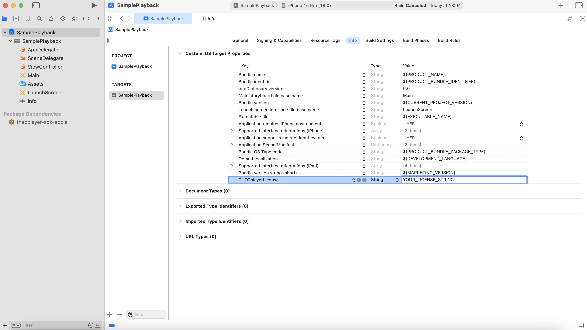

# Getting started on iOS/tvOS

## Introduction

This guide covers the steps to obtain and setup the core THEOplayer SDK targeting a native iOS/tvOS application. It also provides information and usage of the commonly used APIs.

## Setup

### THEOplayer license

THEOplayer requires a valid THEOplayer license to be configured in order to access the SDK APIs (with the exception of some whitelisted sources hosted by our CDN). Request your license via [https://portal.theoplayer.com](https://portal.theoplayer.com).

After creating your license, you can copy its license string to your clipboard as demonstrated in the screenshot below.


:::note
It's possible to add multiple platforms in a single license ie. iOS & tvOS.
:::

Later in the guide we explain how to configure the license ([in this section](#adding-the-theoplayer-license)).

### Installation

The THEOplayer SDK is published on the following package managers:

#### <span style={{ fontSize: '1.25rem' }}>Cocoapods</span>

:::tip
It's considered good practice to run `pod repo update` before adding new pods to your Podfile.
This will help find newly added pods by updating the list of references to the public spec repos.
If you just installed Cocoapods or are already up-to-date, then this step can be skipped.
:::

<br />
Add the following entry to your Podfile:

```ruby
target 'MyApp' do
  pod 'THEOplayerSDK-core', '~> 8' # at the time of writing, v8 is the latest major version.
end
```

:::note
You can skip specifying the version to get the latest published version of THEOplayerSDK.
:::

Then, using the terminal navigate to the directory where your Podfile is located and run:

```bash
pod install
```

If it's the first time that your project integrates with Cocoapods, then after this step you should stop using the `xcodeproj` file and instead start using the `xcworkspace` file generated by Cococapods.

#### <span style={{ fontSize: '1.25rem' }}>Swift Package Manager</span>

Navigate to your Xcode project, and select the `Package Dependencies` tab, then click on the `+` button to add a new dependency. Then in the search bar, add the following URL https://github.com/THEOplayer/theoplayer-sdk-apple. Choose the version and click on `Add Package`.

The following image illustrates what it should look like:



:::info
If Xcode fails to fetch the THEOplayer package, navigate in Terminal to the root directory of your project and run `xcodebuild -resolvePackageDependencies`. This will re-attempt to fetch the packages specified in the project. Restart your Xcode and the package dependencies should be in place.
:::

And make sure the THEOplayerSDK framework is added to the target application:



## Usage

The following code snippets will demonstrate a basic playback scenario. The demo adopts the `UIKit` framework, and assumes the usage of `UIViewController`.

### Adding the THEOplayer license

[After obtaining your THEOplayer license string](#theoplayer-license), navigate to your Xcode project's plist file and add a new key/value entry. The key should be `THEOplayerLicense` and the value should be your license string.

The following image illustrates what it should look like:



### Importing the framework

Add the import statement in your source files where you would like to use THEOplayer:

```swift
import THEOplayerSDK
```

### Setting up the player

THEOplayer provides a configuration object to configure the player settings. In the following snippet we configure the player license to be passed to the player.

:::note
If the license is provided through the `plist` file (as mentioned above), then passing again in the player configuration is not required.
:::

```swift
var theoplayer: THEOplayer?
...
...
override func viewDidLoad() {
...
	let configBuilder = THEOplayerConfigurationBuilder()
    configBuilder.license = "your_license_here"
    let theoplayer = THEOplayer(configuration: configBuilder.build())
    self.theoplayer = theoplayer
...
}
```

:::info
It is important to keep a strong reference to the player as demonstrated in the above code snippet, otherwise the player will not be retained by ARC.
:::

### Displaying the player

THEOplayer provides conventional APIs similar to UIKit framework's view related APIs. The following snippet demonstrates how to present an inline player view:

```swift
let playerFrame = CGRect(x: 0, y: 0, width: 320, height: 180)
theoplayer.frame = playerFrame
theoplayer.center = view.center
theoplayer.addAsSubview(of: self.view)
```

For more information on how to present the player in various modes, please check out the player documentation for the `PresentationMode` API. The link to the API reference can be found at the end of this guide.

### Adding a source for playback

Sources are passed to the player via an object called SourceDescription. The following snippet uses a source URL that serves an HLS manifest file:

```swift
let source = "https://cdn.theoplayer.com/video/big_buck_bunny/big_buck_bunny.m3u8"
let mimeType = "application/x-mpegurl"
theoplayer.source = SourceDescription(source: TypedSource(src: source, type: mimeType))
```

:::warning
Sources that are not whitelisted in the THEOplayer license will fail to play. If no player license is configured, then by default only sources from the `theoplayer` domain will play. This can be the reason of failure when updating the source in the snippet above.
:::

### Basic playback controls

#### <span style={{ fontSize: '1.25rem' }}>Starting playback</span>

```swift
theoplayer.play()
```

#### <span style={{ fontSize: '1.25rem' }}>Pausing or stopping playback</span>

```swift
theoplayer.pause()
// or
theoplayer.stop()
```

The difference between the `pause` and `stop` methods is that `pause` will allow the player to continue if `play` is called, whereas `stop` will end playback. When stopped, a new source is expected to be set.

#### <span style={{ fontSize: '1.25rem' }}>Seeking forward or backward in time</span>

```swift
let time: Double = 30.0
theoplayer.currentTime = time
```

#### <span style={{ fontSize: '1.25rem' }}>Seeking forward relatively to current time</span>

```swift
let currentTime = theoplayer.currentTime
// Jump 10 seconds forward
theoplayer.currentTime = currentTime + 10
```

### Attaching player event listeners

It's very useful during the player's lifecycle, especially for state management and UI updates, to listen to certain events that are dispatched from the THEOplayer SDK.

For example, to listen to the time update event and update the UI of the application to reflect the change:

```swift
var eventListener: EventListener?
...
...
eventListener = theoplayer.addEventListener(type: PlayerEventTypes.TIME_UPDATE) { [weak self] event in self?.onTimeUpdate(event: event) }
...
...
func onTimeUpdate(event: TimeUpdateEvent) {
    playerInterfaceView.currentTime = Float(event.currentTime)
}
```

To remove an event listener:

```swift
theoplayer.removeEventListener(type: PlayerEventTypes.TIME_UPDATE, listener: eventListener!)
```

For more player event types, please check out the player documentation for the `PlayerEventTypes` API. The link to the API reference can be found at the end of this guide.

## Useful links

- [THEOplayer iOS SDK API reference](pathname:///theoplayer/v8/api-reference/ios/index.html)
- [THEOplayer iOS sample app with basic playback](https://github.com/THEOplayer/samples-ios-sdk/tree/master/Basic-Playback)
- [THEOplayer iOS sample app with Google IMA integration](https://github.com/THEOplayer/samples-ios-sdk/tree/master/Google-IMA)
- [THEOplayer iOS sample app with Google Cast playback](https://github.com/THEOplayer/samples-ios-sdk/tree/master/Google-Cast)
