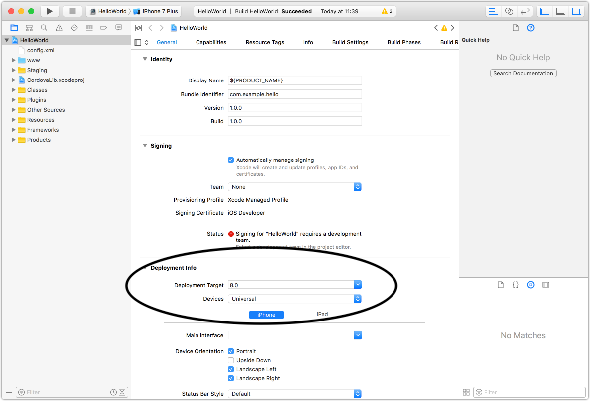

# Migrating to THEOplayer iOS/tvOS SDK 11.x

This article will guide you through updating to THEOplayer iOS/tvOS SDK version 11 (from version 10),
and the changes needed in your code.

## Update THEOplayer

Update THEOplayer iOS/tvOS SDK to version 11 in your `Podfile`.

We also recommend adding [our public self-hosted CocoaPods spec repo](https://github.com/THEOplayer/cocoapods-specs) as a source,
instead of using the default CocoaPods spec repo. [See below for details.](#self-hosted-spec-repo-for-cocoapods)

```ruby
source 'https://github.com/THEOplayer/cocoapods-specs'

target 'MyApp' do
  pod 'THEOplayerSDK-core', '~> 11'
end
```

If you're using one of [our connectors](/theoplayer/connectors/ios/),
make sure to update them to the latest version too to ensure proper support for THEOplayer version 11.

## Update deployment target to 15.0 or higher

In version 11, the minimum supported version of our iOS/tvOS SDK is raised from 13.0 to 15.0. This update aligns with current Xcode tooling requirements and enables us to maintain a high standard of performance, security, and long-term support for the SDK.

All devices that support iOS/tvOS 13 and 14 are capable of upgrading to iOS/tvOS 15 or later, meaning no active hardware is excluded by this change. Additionally, based on our internal analytics, fewer than 1% of end users remain on versions below iOS/tvOS 15, and those users are predominantly on older SDK versions. This change allows us to focus development efforts on modern platform capabilities while minimizing impact to production environments.

In your Xcode project settings, make sure the "Deployment target" is set to 15.0 or higher.



## Builds generated with Xcode 26

Starting with version 11.1.0, in an effort to align with the changes made by Apple regarding the [App Store publishing policy](https://developer.apple.com/news/?id=ueeok6yw), we now build the THEOplayer iOS SDK and its integrations with Xcode 26 (instead of Xcode 16). Effectively, this means that developing a client application using THEOplayer iOS/tvOS SDK will require a minimum version of Xcode 26.

## Self-hosted spec repo for CocoaPods

Starting with version 11, the THEOplayer iOS SDK will be released in a public self-hosted spec repo at https://github.com/THEOplayer/cocoapods-specs.
This decision comes as a solution to [the planned read-only change to the CocoaPods public spec repo at the end of 2026](https://blog.cocoapods.org/CocoaPods-Specs-Repo/).

For now, we will keep publishing to both sources, but we highly recommended switching to THEOplayer's spec repo.
Starting with 12.0.0 later this year, we plan to stop publishing to the CocoaPods public spec repo.

To get the SDK from our hosted repo, simply add it to your `Podfile`:

```ruby
source 'https://github.com/THEOplayer/cocoapods-specs'
```

## New Chromecast pipeline

We deprecated our old Chromecast pipeline in favor of the new experimental pipeline introduced in version 10.6.0. The new Chromecast pipeline offers new features and improved performance, and we are heading towards switching to the new pipeline by default.

In version 11, the old pipeline is still enabled by default. However, we highly recommend customers switch to the new pipeline by setting `enableExperimentalPipeline` to `true` in [`CastConfiguration`](pathname://theoplayer/v11/api-reference/ios/Classes/CastConfiguration.html).

Starting with 12.0.0 later this year, we plan to retire the `enableExperimentalPipeline` property together with the old pipeline, making the new pipeline the default for all customers.

## Replace or remove usages of deprecated APIs

Some properties and methods that were previously deprecated have been removed from the API.
Update your code to use the new APIs instead.

- Removed deprecated `ManifestInterceptor` and `DeveloperSettings` APIs in favor of `NetworkAPI`.
- Renamed `playerMetrics` API to `metrics`.
- Changed `Ad.adBreak` type to be optional.
- Removed deprecated `MediaTrack.activeQualityBandwidth` property in favor of `MediaTrack.activeQuality.bandwidth`.
- Removed deprecated `SourceDescription.enableStreamingDVR` property.
- Errors in `CachingTaskErrorStateChangeEvent` now dispatch cache related error codes instead of `NETWORK_ERROR` code. For more details, check the `cause` property of the error.
- Removed `preloadPublications` in THEOlive API.
