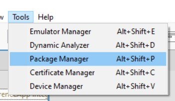
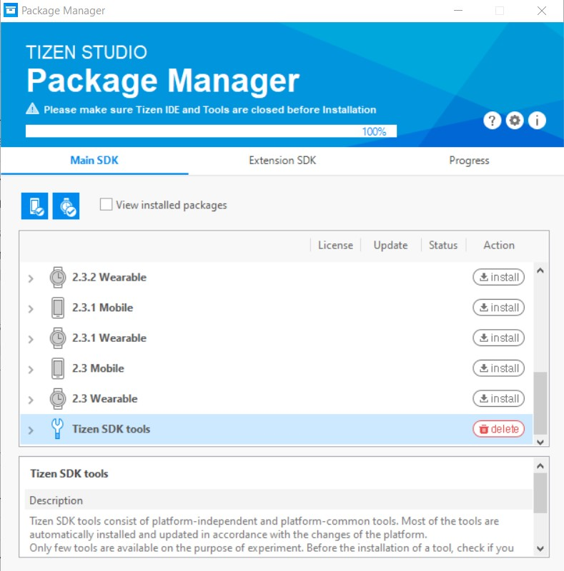
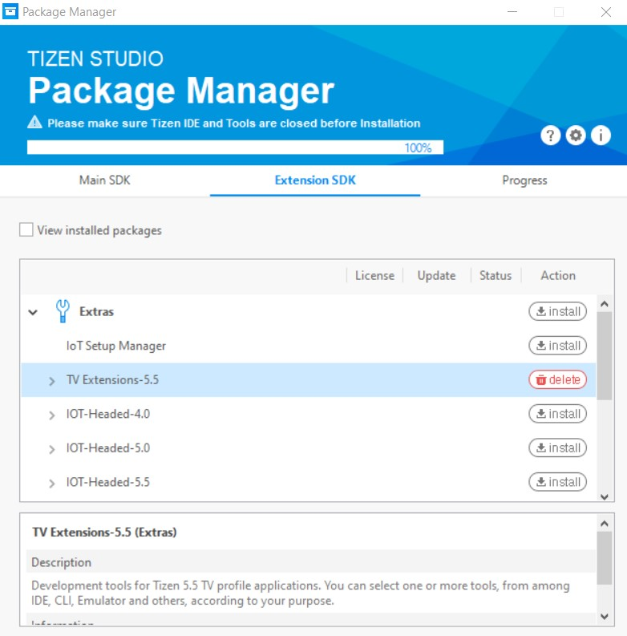

# Installing the Tizen developer tools

- Check if your device meets the [Tizen developer tools prerequisites](https://docs.tizen.org/application/tizen-studio/setup/prerequisites/).
- Download the Tizen developer tools at [Tizen development tools](https://developer.tizen.org/development/tizen-studio/download). You can decide to either install the IDE or CLI, but in this guide we assume you use the IDE.
- In Tizen Studio, make sure to install the Tizen package extensions:

Go to Tools, then Package Manager

Install everything under Tizen SDK tools under Main SDK.

**Note:** Make sure to close Tizen Studio before installing, otherwise an
empty warning message might show up that stops you from completing the installation.

Install the latest tv extensions under Extension SDK

