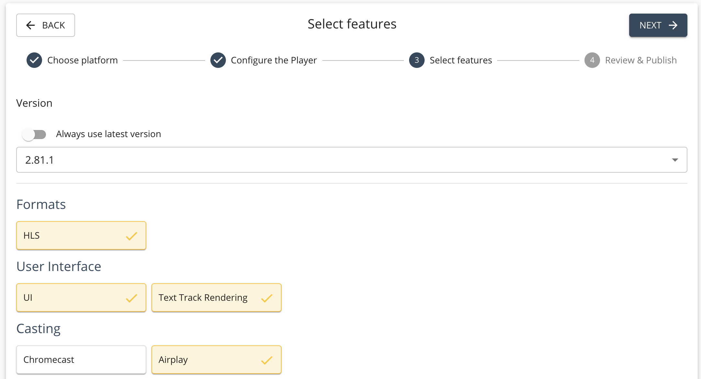
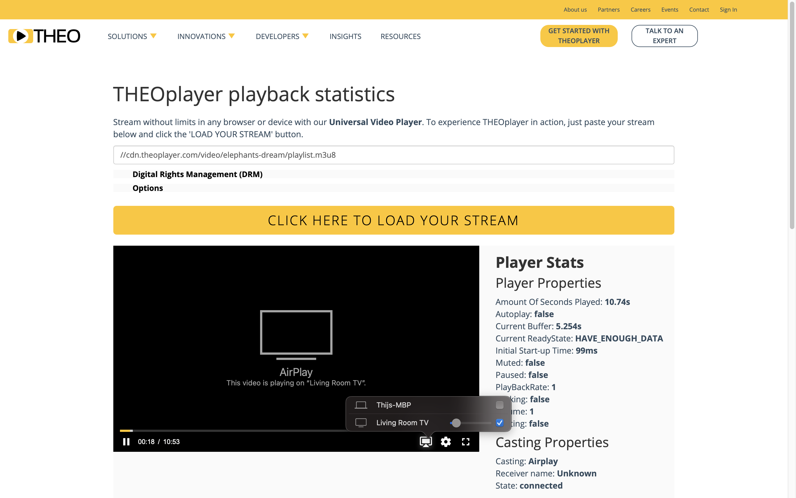

# Introduction

[AirPlay](https://www.apple.com/airplay/) is a casting technology developed by Apple.
AirPlay allows viewers to mirror their videos between AirPlay-enabled sender and receiver devices.

- iPhones, iPads and MacBooks are possible AirPlay-enabled sender devices.
- Apple TVs or AirPlay–enabled smart TVs are possible AirPlay-enabled receiver devices.

THEOplayer offers support for AirPlay on AirPlay-enabled devices through its Web SDK and iOS SDK.

## How to enable AirPlay

AirPlay is a THEOplayer feature.
Ensure that the `airplay` feature is enabled when you build a THEOplayer SDK through the [THEOplayer Developer Platform](https://portal.theoplayer.com/),
as demonstrated by the screenshot below.
Alternative, when someone shares the THEOplayer SDK with you, confirm that they enabled the `airplay` feature.



If the `airplay` feature is enabled, the default THEOplayer UI should render the AirPlay icon in the control bar,
as demonstrated by the screenshot below.
Viewers can click this AirPlay icon and select an AirPlay receiver device to initiate (and stop) the AirPlay session.

Ensure that an AirPlay-enabled receiver device is connected to your network, because you might not see an AirPlay icon otherwise.
Additionally, note that AirPlay is only supported by Apple on a limited set of devices and browsers.
For example, you cannot do AirPlay on a Chrome browser on a macOS device, even though it's an Apple device.



If you have a custom ([Chromeless](../../../how-to-guides/11-ui/06-how-to-build-chromeless-ui.mdx)) THEOplayer UI,
you need to build your own AirPlay UI and UX. You can use the THEOplayer AirPlay API to help achieve this, as discussed in the next section.

## API

As a developer, you might need to use the THEOplayer AirPlay API to build a custom AirPlay UI and UX,
or to dispatch an event to an analytics service, or for workflow purposes.

The AirPlay interface is a sub-interface of the Cast interface on both the THEOplayer Web and iOS SDK.

The API reference is available through the following links:

- Web SDK: [AirPlay](pathname:///theoplayer/v8/api-reference/web/interfaces/AirPlay.html), which inherits from [VendorCast](pathname:///theoplayer/v8/api-reference/web/interfaces/VendorCast.html)
- iOS SDK: [AirPlay](pathname:///theoplayer/v8/api-reference/ios/Protocols/AirPlay.html)

For the **THEOplayer Web SDK**, you could use the API as demonstrated below:

```javascript
// const player = new THEOplayer.Player(...)
const airPlayState = player.cast.airplay.state;
const isCasting = player.cast.airlay.casting; // true or false
// ...
// if (want to start AirPlay)
player.cast.airplay.start();
// ...
// if (want to stop AirPlay)
player.cast.airplay.stop();
// ...
if (airPlayState == "available") {
  // airplay is possible
  player.cast.airplay.addEventListener("statechange", function (event) {
    switch (event.state) {
      case "available":
        // show AirPlay available icon
        break;
      case "connected":
        // show AirPlay connected icon
        break;
    }
  });
}
```

Note that the `connected` and `available` state are the only two states offered for AirPlay, because
Safari only exposes limited information.

For the **THEOplayer iOS SDK**, you could use the API as demonstrated below:

```swift
private func setupTheoplayer() {
    // player = THEOplayer(...)
    let airPlayState = theoplayer.cast?.airPlay?.state
    let isCasting = theoplayer.cast?.airPlay?.casting
    // ...
    // if (want to start AirPlay)
        theoplayer.cast?.airPlay?.start()
    // if (want to stop AirPlay)
        theoplayer.cast?.airPlay?.stop()
    // ...
    theoplayer.cast?.airPlay?.addEventListener(type: AirPlayEventTypes.STATE_CHANGE, listener: onStateChange)
}

private func onStateChange(event: AirPlayStateChangeEvent) {
    if (event.state == PlayerCastState.available) {
        // show AirPlay available icon
    } else if (event.state == PlayerCastState.connected) {
        // show AirPlay connected icon
    }
    print(event.state)
    print(self.player.cast?.airPlay?.casting)
}
```

## Remarks

- [Chromecast](../../../how-to-guides/03-cast/01-chromecast/00-introduction.md) and AirPlay are comparable technologies.
