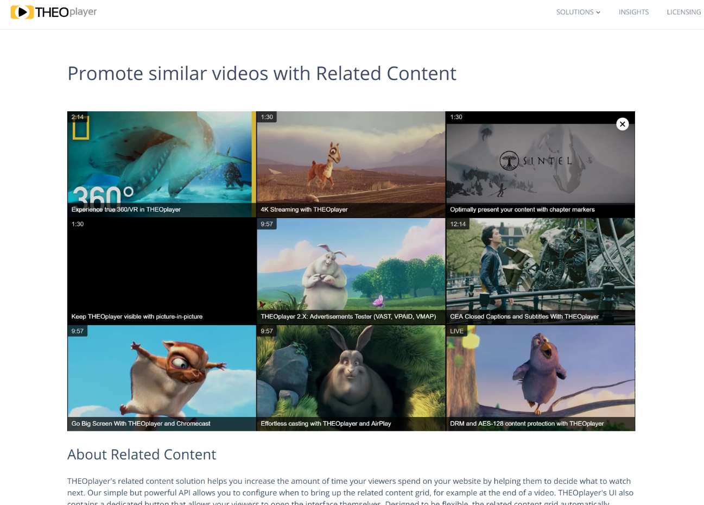

# Related Content

The article in this section describes how to implement common use-cases related to the Related Content feature. This feature adds a component to the UI which enables viewers to navigate to related content. Developers can configure the related content using the exposed Related API.



### Table of Contents

- [SDKs](#sdks)
- [Code examples](#code-examples)
- [Related articles](#related-articles)

## SDKs

| Web SDK | Android SDK | iOS SDK | tvOS SDK | Android TV SDK | Chromecast SDK |
| :-----: | :---------: | :-----: | :------: | :------------: | :------------: |
|   Yes   |     No      |   Yes   |    No    |       No       |      N/A       |

The Related Content API is a UI feature. It's currently unavailable on the Android (TV) SDK because the underlying THEOplayer CSS and JavaScript modules aren't activated. This means that you also can't enable it on the Android (TV) SDK by following the guide located at [How to add CSS or JavaScript files to an Android/iOS project](../../faq/01-how-to-add-css-or-javascript-files-to-android-ios.md).

## Code examples

##### Web SDK

The Related Content API was first released on THEOplayer's Web SDK.

- Reference API: [Related-Content API](pathname:///theoplayer/v6/api-reference/web/interfaces/RelatedContent.html)
- Online demo: [https://demo.theoplayer.com/related-content](https://demo.theoplayer.com/related-content)

```js
player.related.sources = [
  {
    image: "//cdn.theoplayer.com/video/vr/poster.jpg",
    title: "Experience true 360/VR in THEOplayer",
    duration: "2:14",
    link: "//demo.theoplayer.com/vr-and-360"
  },
  {
    image:
      "//cdn2.hubspot.net/hubfs/2163521/Demo_zone/CaminandesLlamaDramaPoster.jpg",
    title: "4K Streaming with THEOplayer",
    duration: "1:30",
    link: "//demo.theoplayer.com/4k"
  },
  {
    image: "//cdn.theoplayer.com/video/sintel/poster.jpg",
    title: "Optimally present your content with chapter markers",
    duration: "1:30",
    link: "//demo.theoplayer.com/chapters"
  },
  {
    image: "//localhost/server/azure.jpg",
    title: "Keep THEOplayer visible with picture-in-picture",
    duration: "1:30",
    link: "//demo.theoplayer.com/chapters"
  },
  {
    image: "//cdn.theoplayer.com/video/big_buck_bunny/poster.jpg",
    title: "THEOplayer: Advertisements Tester (VAST, VPAID, VMAP)",
    duration: "9:57",
    link: "//demo.theoplayer.com/chapters"
  },
  {
    image:
      "//cdn2.hubspot.net/hubfs/2163521/Demo_zone/tears_of_steel_poster.jpg",
    title: "CEA Closed Captions and Subtitles With THEOplayer",
    duration: "12:14",
    link: "//demo.theoplayer.com/closed-captions-subtitles"
  },
  {
    title: "Go Big Screen With THEOplayer and Chromecast",
    link: "//demo.theoplayer.com/chromecast",
    duration: "9:57",
    image: "//cdn.theoplayer.com/video/big_buck_bunny/poster-alt1.jpg"
  },
  {
    title: "Effortless casting with THEOplayer and AirPlay",
    link: "//demo.theoplayer.com/airplay",
    duration: "9:57",
    image: "//cdn.theoplayer.com/video/big_buck_bunny/poster-alt2.jpg"
  },
  {
    title: "DRM and AES-128 content protection with THEOplayer",
    link: "//demo.theoplayer.com/drm-aes-128-encryption",
    duration: "LIVE",
    image: "//cdn.theoplayer.com/video/big_buck_bunny/poster-alt3.jpg"
  }
];

player.addEventListener("ended", function () {
  if (!player.related.showing) {
    setTimeout(function () {
      player.related.show();
    }, 1000);
  }
});
```

##### Android (TV) SDK

This API is currently not available on the Android (TV) SDK.

##### iOS/tvOS SDK and Legacy iOS/tvOS SDK (4.12.x)

The Related Content API is available on the iOS SDK, but not on the tvOS SDK. This feature can be used as below:

```swift
//Prerequisite: You would need THEOplayer iOS SDK enabled with Related Content feature.

//create a variable to decalare related content sources to the player.
var relatedContent = self.theoplayer?.related

//Create an array variable with your related content sources.
var relatedSources = [RelatedContentSource]()
                relatedSources.append(RelatedContentSource(image: "https://cdn.theoplayer.com/video/vr/poster.jpg", source: sampleSource1, title: "xxx"))

                relatedSources.append(RelatedContentSource(image: "https://cdn.theoplayer.com/video/sintel/poster.jpg", source: sampleSource2, title: "xxx"))

                relatedSources.append(RelatedContentSource(image: "https://cdn.theoplayer.com/video/big_buck_bunny/poster.jpg", source: sampleSource3, title: "xxx"))

                relatedSources.append(RelatedContentSource(image: "https://cdn2.hubspot.net/hubfs/2163521/Demo_zone/tears_of_steel_poster.jpg", source: sampleSource4, title: "xxx"))

                relatedSources.append(RelatedContentSource(image: "https://cdn.theoplayer.com/video/vr/poster.jpg", source: sampleSource5, title: "xxx"))

                relatedSources.append(RelatedContentSource(image: "https://cdn.theoplayer.com/video/vr/poster.jpg", source: sampleSource6, title: "xxx"))

//Add the relatedSources array to the created relatedContent variable.
relatedContent?.sources = relatedSources

// Example of Source to the player defined in above relatedSources
var sampleSource1: SourceDescription {
  let src = "https://cdn.theoplayer.com/video/elephants-dream/playlist.m3u8"
  let stream = "application/x-mpegurl"
    return SourceDescription(
            source: TypedSource(
                src: src,
                type: stream

            ))
    }
```

- Reference DEMO APP: [iOS Related Content Demo APP](https://github.com/THEOplayer/samples-ios-sdk/tree/master/Related-Content)
- Reference API: [iOS Related Content API](pathname:///theoplayer/v6/api-reference/ios/Protocols/RelatedContent.html)

## Important Note

The Related Content API is limited to show a maximum of 15 tiles only. By default, it is set to show only 6 even if more than 6 are added to the player source. To show case more than 6 sources, below CSS code needs to be added to make the `<div>` scrollable. To add external CSS files to your iOS Project, refer to the related articles.

```css
.theo-related-grid {
  height: 100% !important;
  overflow-y: scroll !important;
}

.theo-related-grid-tile {
  display: block !important;
}
```

## Related articles

- [How to add CSS or JavaScript files to an Android/iOS project](../../faq/01-how-to-add-css-or-javascript-files-to-android-ios.md)
