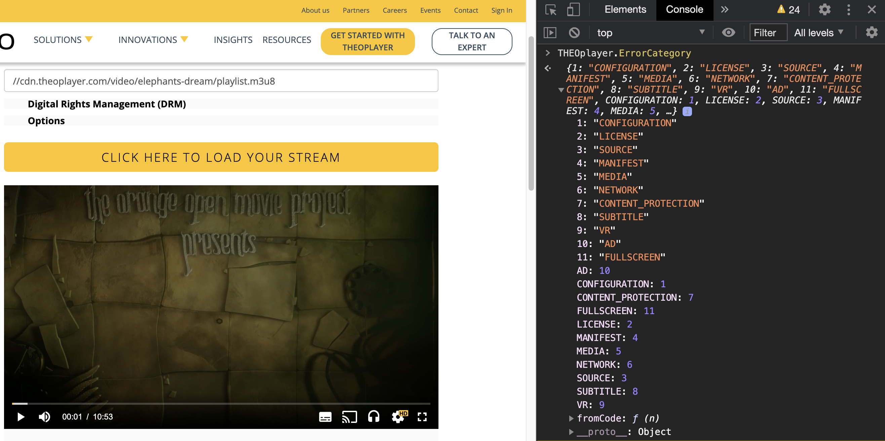
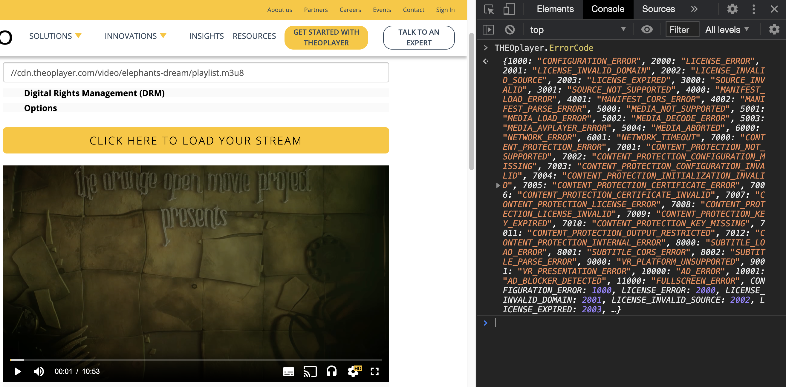

# Error codes

THEOplayer has different types of error events.
One of those error events is the "generic player error event".
This error event indicates a fatal error, and can be intercepted through the `Player` interface.

This error event exposes an "error code" to explain the occurred error.
An error code may be more interesting to track than a verbose error messages
For example, if you are logging errors through an analytics service,
it could be useful to filter them by their error code.

An error code is a number (e.g. 2001), and it belongs to a category.
The format of an error code is "[category][sub-code]".
For example, error "2001" belong to category 2, and has sub-code 001.

Refer to "[How to do error handling](01-how-to-do-error-handling.md)" to learn how to detect the "generic player error event".

## SDKs

The "generic player error event" is available across platforms and SDKs.

| Web SDK | Android SDK | iOS SDK | tvOS SDK | Android TV SDK | Chromecast SDK |
| :-----: | :---------: | :-----: | :------: | :------------: | :------------: |
|   Yes   |     Yes     |   Yes   |   Yes    |      Yes       |      Yes       |

## Categories

Each error code belongs to an error category. At the time of writing, there are 11 categories.

1. Configuration error: the integrator misconfigured the player.
2. License error: the player license is no longer valid, incorrect or not provided.
3. Source invalid: the source is not valid, or cannot be played on the current platform.
4. Manifest load error: the manifest cannot be loaded or parsed.
5. Media not supported: the media cannot be played on the current platform.
6. Network error: the network timed out, or is not available.
7. Content protection error: anything DRM related. Key system is not supported, invalid license, license expired, key missing, output restricted...
8. Subtitle load error: the subtitles cannot be loaded or parsed...
9. VR not supported: VR is not available on the current platform, VR presentation cannot be switched
10. Ad blocker detected: an ad has been blocked (or the third party CSAI library was not loaded)
11. Fullscreen error: switching to fullscreen is not possible (note: this may be the case when fullscreen was not triggered by user interaction)

You can programmatically request the list of available error categories through the THEOplayer API.
For example, on the Web SDK, you can access this list through `THEOplayer.ErrorCategory`,
as illustrated by the screenshot below.

You can also programmatically request the category of an error code through the THEOplayer API.
For example, on the Web SDK, you can access this through `THEOplayer.ErrorCategory.fromCode(<errorCode>)`.
(Meaning: `THEOplayer.ErrorCategory.fromCode(11000)` would return `11`.)

Relevant API references:

- Web SDK
  - [`ErrorCategory`](pathname:///theoplayer/v6/api-reference/web/enums/ErrorCategory.html)
  - [`ErrorCategory.fromCode()`](pathname:///theoplayer/v6/api-reference/web/functions/ErrorCategory-1.fromCode.html)
- Android SDK
  - [`ErrorCategory`](pathname:///theoplayer/v6/api-reference/android/com/theoplayer/android/api/error/ErrorCategory.html)
  - [`ErrorCategory.fromCode()`](<pathname:///theoplayer/v6/api-reference/android/com/theoplayer/android/api/error/ErrorCategory.html#fromCode(ErrorCode)>)
- iOS SDK
  - [`ErrorCategory`](pathname:///theoplayer/v6/api-reference/ios/Enums/ErrorCategory.html)

## Codes

An error code is prefixed with its category. For example, code `11001` belongs to category `11`, and has sub-code 001.
If the error is a generic sub-code for its category, then the sub-code will be `000`.
In other words, error `11000` would be the "catch-all" for category `11`.

You can programmatically request the list of all available error codes through the THEOplayer API.
For example, on the Web SDK, you can access this through `THEOplayer.ErrorCode`,
as illustrated by the screenshot below.

Relevant API references:

- Web SDK
  - [`ErrorCode`](pathname:///theoplayer/v6/api-reference/web/enums/ErrorCode.html)
- Android SDK
  - [`ErrorCode`](pathname:///theoplayer/v6/api-reference/android/com/theoplayer/android/api/error/ErrorCode.html)
- iOS SDK
  - `THEOErrorCode`
