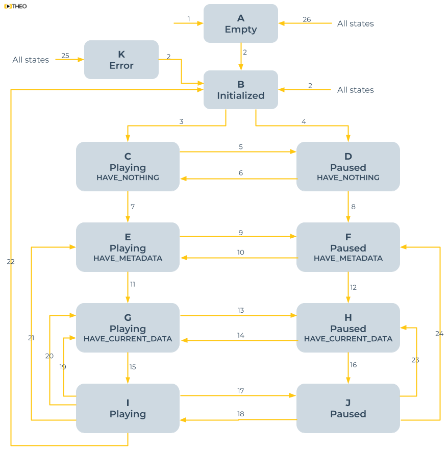

# How to track player states

A video player has states. As a developer, you should understand these states,
as each state grants you access to different data, and might imply a re-render of your UI.
For example, if your video player is in the "Paused" state, you want to show a play-button instead of a pause-button.

The objective of this guide is to define some video player states, and how to track the transition between states.

Although there's no official list of video player states,
we'll define 11 states for learning purposes. These 11 states are visualized in the state diagram below.



The table below provides the definitions of these 11 states.

| State                          | Description                                                                                                                                                                                                                                                                                                                                       |
| ------------------------------ | ------------------------------------------------------------------------------------------------------------------------------------------------------------------------------------------------------------------------------------------------------------------------------------------------------------------------------------------------- |
| A: Empty                       | A state where the player is created, but has no information or data retained on the source which is to be played. The player is idle and not undertaking any interaction with the system.                                                                                                                                                         |
| B: Initialized                 | A state where the player knows the source which is to be played, but no media data is loaded. The player is idle and not undertaking any interaction with the system.                                                                                                                                                                             |
| C: Playing - HAVE_NOTHING      | A state where the player wants to start playing a source, but has no media data available. The player is actively loading media data in order to initiate playback.                                                                                                                                                                               |
| D: Paused - HAVE_NOTHING       | A state where the player wants to fill its buffer without playing, but has no media data available. The player is actively loading media data in order to fill its buffer.                                                                                                                                                                        |
| E: Playing - HAVE_METADATA     | A state where the player wants to start playing a source, but only metadata is available and the entire buffer is still empty. The player knows which tracks and qualities are available. The player is actively loading media data in order to initiate playback.                                                                                |
| F: Paused - HAVE_METADATA      | A state where the player wants to fill its buffer without playing, but only metadata is available and the entire buffer is still empty. The player knows which tracks and qualities are available. The player is actively loading media data in order to fill its buffer.                                                                         |
| G: Playing - HAVE_CURRENT_DATA | A state where the player wants to start playing a source and has media data in its buffer for the current timestamp, but this data is insufficient to start playback and guarantee a smooth viewer experience. The player is actively loading media data in order to initiate playback.                                                           |
| H: Paused - HAVE_CURRENT_DATA  | A state where the player wants to fill its buffer without playing and has media data in the buffer for the current timestamp, but this data is insufficient to start playback and guarantee a smooth viewer experience. The player is actively loading media data in order to fill its buffer.                                                    |
| I: Playing                     | A state where the player is actively rendering out media data. The current timestamp is progressing at the speed of the current playback rate and media buffer data is being consumed and loaded in parallel. timeupdate events will be dispatched regularly during playback and progress events will be dispatched as additional data is loaded. |
| J: Paused                      | A state where the player has sufficient media data in its buffer in order to guarantee a smooth viewer experience when playback is started, but it is in a paused state. The player is not consuming any media data, but might be loading additional media data to grow its buffer in the background.                                             |
| K: Error                       | A state where the player has observed a fatal, non recoverable error. The player cannot continue playback and needs to be initialized again in order to restart playback. A player can get into this state from any state other than the Empty-state.                                                                                             |

The table below explains what triggers each of the 26 transitions between states, and what video player events are related.

| Transition | Triggers                                                                                                   | Events                                                                                                                                                    |
| ---------- | ---------------------------------------------------------------------------------------------------------- | --------------------------------------------------------------------------------------------------------------------------------------------------------- |
| 1          | `new THEOplayer.Player`                                                                                    |                                                                                                                                                           |
| 2          | `player.source = X`                                                                                        | `sourcechange`, `currentsourcechange`                                                                                                                     |
| 3          | `player.play()`                                                                                            | `play`, `loadstart`                                                                                                                                       |
| 4          | `player.load()`                                                                                            | `loadstart`                                                                                                                                               |
| 5          | `player.pause()`                                                                                           | `pause`                                                                                                                                                   |
| 6          | `player.play()`                                                                                            | `play`                                                                                                                                                    |
| 7          | The stream manifest being loaded                                                                           | `readystatechange`, `loadedmetadata`, `durationchange`                                                                                                    |
| 8          | The stream manifest being loaded                                                                           | `readystatechange`, `loadedmetadata`, `durationchange`                                                                                                    |
| 9          | `player.pause()`                                                                                           | `pause`                                                                                                                                                   |
| 10         | `player.play()`                                                                                            | `play`                                                                                                                                                    |
| 11         | Stream media data is loaded                                                                                | `readystatechange`, `loadeddata`, `progress`, `canplay`                                                                                                   |
| 12         | Stream media data is loaded                                                                                | `readystatechange`, `loadeddata`, `progress`, `canplay`                                                                                                   |
| 13         | `player.pause()`                                                                                           | `pause`                                                                                                                                                   |
| 14         | `player.play()`                                                                                            | `play`                                                                                                                                                    |
| 15         | Sufficient media data is loaded to start playback fluently.                                                | `progress`, `canplaythrough`, `readystatechange`, `playing`<br />_A `seeked` event can be dispatched if the entrance of this state was caused by a seek._ |
| 16         | Sufficient media data is loaded to start playback fluently.                                                | `canplaythrough`, `readystatechange`<br />_A `seeked` event can be dispatched if the entrance of this state was caused by a seek._                        |
| 17         | `player.pause()`                                                                                           | `pause`                                                                                                                                                   |
| 18         | `player.play()`                                                                                            | `play`, `playing`                                                                                                                                         |
| 19         | `player.currentTime = X` and there is some media data at the target time, but not enough to play fluently. | `seeking`, `readystatechange`                                                                                                                             |
| 20         | The player buffer is not being filled enough, causing a stall.                                             | `waiting`, `readystatechange`                                                                                                                             |
| 21         | `player.currentTime = X` and there is no media data at the target time.                                    | `seeking`, `readystatechange`                                                                                                                             |
| 22         | Playback has ended.                                                                                        | `ended`, `readystatechange`                                                                                                                               |
| 23         | `player.currentTime = X` and there is some media data at the target time, but not enough to play fluently. | `seeking`, `readystatechange`                                                                                                                             |
| 24         | `player.currentTime = X` and there is no media data at the target time.                                    | `seeking`, `readystatechange`                                                                                                                             |
| 25         | An error occurred.                                                                                         | `error`                                                                                                                                                   |
| 26         | `player.source = null`                                                                                     | `emptied`                                                                                                                                                 |

### Implementation

The following code samples demonstrate how you track some of the 18 events related to the state transitions across different SDKs.

- `sourcechange`
- `currentsourcechange`
- `play`
- `loadstart`
- `pause`
- `readystatechange`
- `loadedmetadata`
- `durationchange`
- `loadeddata`
- `progress`
- `canplay`
- `canplaythrough`
- `playing`
- `waiting`
- `seeking`
- `ended`
- `error`
- `emptied`

All 18 events are dispatched by the `Player` interface.

- Web SDK: [interface](pathname:///theoplayer/v8/api-reference/web/classes/ChromelessPlayer.html) and [events](pathname:///theoplayer/v8/api-reference/web/interfaces/PlayerEventMap.html)
- Android SDK: [interface](pathname:///theoplayer/v8/api-reference/android/com/theoplayer/android/api/player/Player.html) and [events](pathname:///theoplayer/v8/api-reference/android/com/theoplayer/android/api/event/player/PlayerEventTypes.html)
- iOS SDK: [interface](pathname:///theoplayer/v8/api-reference/ios/Classes/THEOplayer.html) and [events](pathname:///theoplayer/v8/api-reference/ios/Structs/PlayerEventTypes.html)
- Roku SDK

#### Web SDK

The snippet below demonstrates how you can track some of the related events through the THEOplayer Web SDK.
All other events can be tracked similarly. You can find the event names in [the `PlayerEventMap` API reference](pathname:///theoplayer/v8/api-reference/web/interfaces/PlayerEventMap.html).
This approach is valid for all web-based platforms, including Tizen and webOS.

```javascript
player.addEventListener("sourcechange", (event) => {
  console.log(event);
});
// ...
player.addEventListener("ended", (event) => {
  console.log(event);
});
```

#### Android SDK

The snippet below demonstrates how you can track some of the related events through the THEOplayer Android SDK.
All other events can be tracked similarly. You can find the event names in [the `PlayerEventTypes` API reference](pathname:///theoplayer/v8/api-reference/android/com/theoplayer/android/api/event/player/PlayerEventTypes.html).
This approach is valid for all Android-based platforms, including Android TV and Fire TV.

```java
player.addEventListener(PlayerEventTypes.SOURCECHANGE, event -> {
    System.out.println(event);
});
// ...
player.addEventListener(PlayerEventTypes.ENDED, event -> {
    System.out.println(event);
});
```

#### iOS/tvOS SDK and Legacy iOS/tvOS SDK (4.12.x)

The snippet below demonstrates how you can track some of the related events through the THEOplayer iOS SDK.
All other events can be tracked similarly. You can find the event names in [the `PlayerEventTypes` API reference](pathname:///theoplayer/v8/api-reference/ios/Structs/PlayerEventTypes.html).
This approach is valid for all iOS-based platforms, including iPadOS and tvOS.

```swift
player?.addEventListener(type: PlayerEventTypes.SOURCE_CHANGE, listener: { (event) in
    print(event)
})
// ...
player?.addEventListener(type: PlayerEventTypes.ENDED, listener: { (event) in
    print(event)
})

```

#### Roku SDK

_This subsection is in maintenance. Reach out to our team if you require help._
