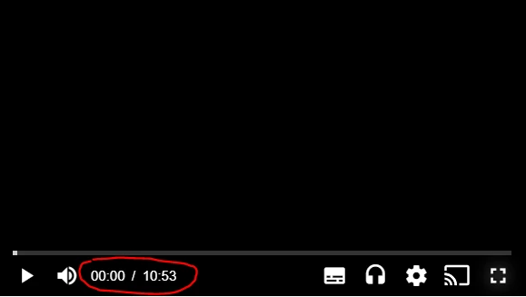

# How to align the timeline in the middle

This question is asked when developers want to change the appearance of the current time digits and duration digits in the seekbar. For example, instead of having it aligned on the left of the control bar, they might want to have it in the middle.

Please note that this article isn't final.



## SDKs

| Web SDK |           Android SDK            |             iOS SDK              | tvOS SDK | Android TV SDK | Chromecast SDK | Roku SDK |
| :-----: | :------------------------------: | :------------------------------: | :------: | :------------: | :------------: | :------: |
|   Yes   | Through CSS/JavaScript injection | Through CSS/JavaScript injection |   N/A    |      N/A       |      N/A       |   N/A    |

## Approach #1

##### Web SDK

One approach is to create a new overlay. The code snippet below implements this strategy.

CSS

```css
.custom-timeline {
  display: none;
  bottom: 0;
  position: absolute;
  width: 100%;
  text-align: center;
  line-height: 36px;
  pointer-events: none;
}

.vjs-has-started .custom-timeline.show {
  display: block;
}

.vjs-time-control {
  display: none !important;
}

.theo-mobile .custom-timeline {
  display: none;
}

.vjs-fullscreen .custom-timeline {
  margin-bottom: 8px;
}
```

HTML and JS

```html
<div class="video-container video-js theoplayer-skin">
  <div class="custom-timeline">
    <span class="current-time">00:00:00</span> / <span class="duration"></span>
  </div>
</div>
<script>
  var player = new THEOplayer.Player(element, playerConfig);
  ...
  function secondsToHms(d) {
      d = Number(d);
      var h = Math.floor(d / 3600);
      var m = Math.floor(d % 3600 / 60);
      var s = Math.floor(d % 3600 % 60);

      var hDisplay = h > 0 ? h + (h == 1 ? ":" : ":") : "00:";
      var mDisplay = m > 0 ? m + (m == 1 ? ":" : ":") : "00:";
      var sDisplay = s;
      return hDisplay + mDisplay + sDisplay;
  }

  player.addEventListener('timeupdate', function(e) {
      document.querySelector('.custom-timeline .current-time').innerText = secondsToHms(Math.floor(e.currentTime));
  })

  player.addEventListener('durationchange', function(e) {
      document.querySelector('.custom-timeline .duration').innerText = secondsToHms(Math.floor(e.duration));
      document.querySelector('.custom-timeline').classList.add('show');
  })
  ...
</script>
```

##### Android SDK

To achieve the same result on Android SDK, the same CSS need to be passed to your app.

**Step 1**

To learn how to inject CSS into your Android project, follow the guide [Android SDK Customization - Custom CSS and JavaScript files](../../faq/01-how-to-add-css-or-javascript-files-to-android-ios.md).

**Step 2**

In the CSS and JavaScript files you created, add the code reported above in the Web SDK section.

##### Legacy iOS/tvOS SDK (4.12.x)

To achieve the same result on iOS SDK, the same CSS need to be passed to your app.

**Step 1**

To learn how to inject CSS into your iOS project, follow the guide [iOS SDK Customization - Custom CSS and JavaScript files](../../faq/01-how-to-add-css-or-javascript-files-to-android-ios.md).

**Step 2**

In the CSS and JavaScript files you created, add the code reported above in the Web SDK section.
