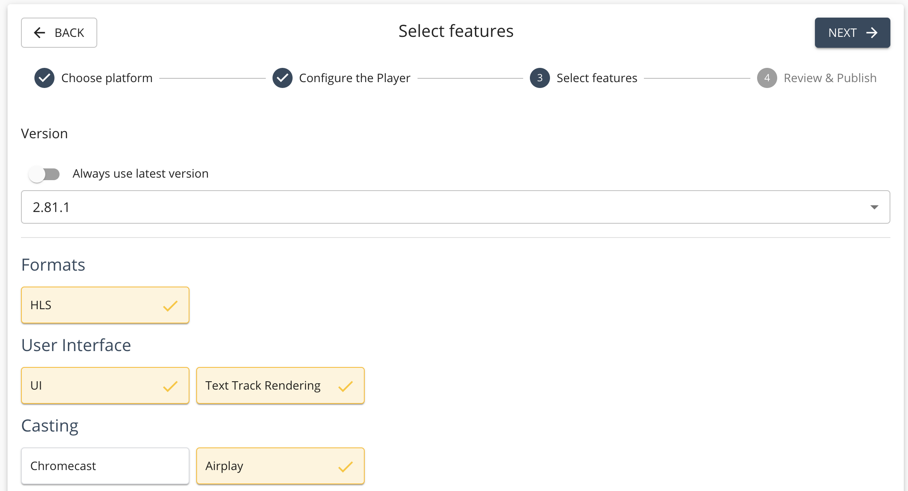
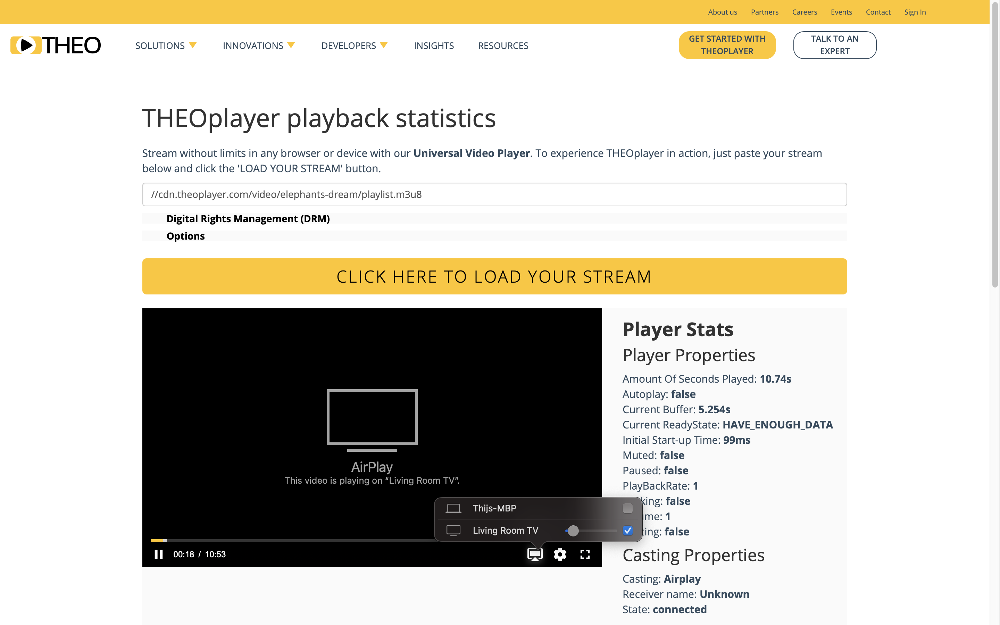

# AirPlay on Web

import Intro from '../../../shared/cast/_airplay-introduction-intro.mdx';
import Enable from '../../../shared/cast/_airplay-introduction-enable.mdx';
import ApiIntro from '../../../shared/cast/_airplay-introduction-api-intro.mdx';

<Intro />

## How to enable AirPlay

<Enable />

AirPlay is a THEOplayer feature.
Ensure that the `airplay` feature is enabled when you build a THEOplayer SDK through the [THEOplayer Developer Platform](https://portal.theoplayer.com/),
as demonstrated by the screenshot below.
Alternatively, if you are using a THEOplayer SDK from npm, make sure that the package flavor you picked has the `airplay` feature in it.



If the `airplay` feature is enabled, the default THEOplayer UI should render the AirPlay icon in the control bar,
as demonstrated by the screenshot below.
Viewers can click this AirPlay icon and select an AirPlay receiver device to initiate (and stop) the AirPlay session.



If you have a custom ([chromeless](../../ui/build-chromeless-ui.mdx)) THEOplayer UI,
you need to build your own AirPlay UI and UX. You can use the THEOplayer AirPlay API to help achieve this, as discussed in the next section.

## API

<ApiIntro />

For more information, see the API reference of [`AirPlay`](pathname:///theoplayer/v11/api-reference/web/interfaces/AirPlay.html), a sub-interface of [`Cast`](pathname:///theoplayer/v11/api-reference/web/interfaces/Cast.html) which inherits from [`VendorCast`](pathname:///theoplayer/v11/api-reference/web/interfaces/VendorCast.html).

Use the API as demonstrated below:

```javascript
// const player = new THEOplayer.Player(...)
const airPlayState = player.cast.airplay.state;
const isCasting = player.cast.airlay.casting; // true or false
// ...
// if (want to start AirPlay)
player.cast.airplay.start();
// ...
// if (want to stop AirPlay)
player.cast.airplay.stop();
// ...
if (airPlayState == 'available') {
  // airplay is possible
  player.cast.airplay.addEventListener('statechange', function (event) {
    switch (event.state) {
      case 'available':
        // show AirPlay available icon
        break;
      case 'connected':
        // show AirPlay connected icon
        break;
    }
  });
}
```

Note that the `connected` and `available` state are the only two states offered for AirPlay, because
Safari only exposes limited information.

## Remarks

- [Chromecast](../chromecast/introduction.mdx) and AirPlay are comparable technologies.
