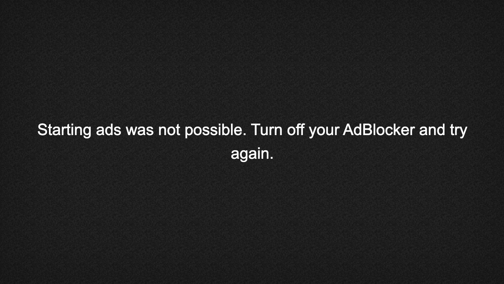

# Advertising User Guide

THEOplayer allows you to configure different aspects of its advertising environment. By following this guide you will learn about:

- The advertisement feature in THEOplayer, with a focus on a few key concepts
- The ad integrations in THEOplayer
- Ad configuration and ad block detection
- Related resources, including
  - How-to guides related to specific integrations
  - The reference API
  - Other ad-related how-to guides, information pages, blog articles, etc.

How to configure ads, code snippets and specific support and use for the various integrations are found on the guides dedicated to the specific integrations.

## Feature Overview

###  An overview of THEOplayer's Advertisement tools

THEOplayer offers an array of features that allow you to take total control over your online video content advertisement environment.

To facilitate integration between content providers and ad servers, we implement the IAB Video Suite, a set of technical specifications that are widely used by many participants in the online video advertisement industry. More specifically, we implement the following IAB specifications: _Digital Video Ad Serving Template_ (**VAST**), _Digital Video Multiple Ad Playlist_ (**VMAP**) and _Digital Video Player-Ad Interface Definition_ (**VPAID**). You will have to get acquainted with these specifications if you want to optimize your advertisement revenue.

On top of the IAB suite, THEOplayer comes with additional tools to improve advertisement efficiency, like **Adblock Detection**.

#### Digital Video Ad Serving Template (VAST)

The Digital Video Ad Serving Template (VAST) specification is a description for video ads that standardizes communication requirements between video players and ad server. It gives instructions to the video player on how ads should be handled and displayed. It can define how and how long the ad should be displayed, if and when it can be skipped and how to give tracking information to the ad servers. VAST also specifies ad pods. These are groups of advertisements which should be played back-to-back.

THEOplayer offers support for the delivery of video ads with VAST 4.0. Support is available for linear ads (pre-rolls, mid-rolls, pos-trolls and ad breaks), non-linear ads (overlay banners) and companion banners, all of which are discussed in the next section.

#### Digital Video Multiple Ad Playlist (VMAP)

With Digital Video Multiple Ad Playlist (VMAP), video content owners can exercise control over the ad inventory displayed with their content when they cannot control the video player, to capitalize on advertising while maintaining the integrity of their program content. VMAP enables the content owner to define the ad breaks within their content, including the timing for each break, how many breaks are available, what type of ads and how many are allowed in each break. It is important to note however that VMAP was mainly designed with Video on demand (VOD) in mind.

#### Digital Video Player-Ad Interface Definition (VPAID)

VPAID establishes a common communication protocol between video players and ad units that allows a single “executable ad” (one that requires software logic to be executed as part of ad playback) to be displayed in-stream with the publisher’s video content. It allows the ad and the player to expect and rely upon a common set of functionalities. The significance is that advertisers using VPAID ads can provide rich ad experiences for viewers and collect ad playback and interaction details that are just as rich as the ad experience. With the adoption of VPAID, advertisers have more control over the display experience in their video campaigns. VPAID ads can easily be integrated on top of VAST manifests.

#### Adblock detection

Ad blockers or filters (such as the AdBlock plugin for browsers) remove or alter ads on webpages such that they become less obtrusive for the user. They can be a big threat to websites that get their revenue from video advertisements as they prevent an ad from being played. THEOplayer has built-in features that can detect ad blockers and act accordingly.

### An overview of THEOplayer's different ad types

THEOplayer has support for **Linear**, **Non-linear** and **Companion** VAST and VPAID ads, as well as for VMAP ads.

THEOplayer currently supports several ad playback implementations:

**Client-side ad insertion (CSAI)**

1. THEOplayer (default)
2. Google IMA
3. SpotX
4. FreeWheel

**Server-side ad insertion (SSAI)**

1. Google DAI
2. Yospace
3. Verizon Media
4. MediaTailor

Below you can find the support matrix for different types of ads:

|            | VAST | VMAP | VPAID |
| :--------: | :--: | :--: | :---: |
| THEOplayer | Yes  | Yes  |  No   |
| Google IMA | Yes  | Yes  |  Yes  |
|   SpotX    | Yes  | Yes  |  Yes  |
| FreeWheel  | Yes  |  No  |  Yes  |
| Google DAI |  No  |  No  |  No   |
|  Yospace   | Yes  | Yes  |  No   |

#### Linear Ads

Linear ads are video ads that play before, during or after the content video. THEOplayer allows you to specify an optional offset to make a linear ad play at a given time during or after the video. Linear ads can be further configured by specifying how long the ad must be watched before the user can skip it. Linear ads can be interactive (VPAID) or can simply have a click-through that directs users to a webpage on a different screen.

#### Non-linear Ads (overlays)

Non-linear ads are shown on top of the video as an overlay during playback. The user can interact with these ads by clicking them, which will, for example, redirect them to a page with more information about the product being advertised. Non-linear ads can also be closed by users.

#### Companion Ads

Companion banners are ads surrounding the video player that, in comparison with linear and non-linear ads, do not directly interfere with a user’s viewing experience. THEOplayer allows you to choose where the companion ads should be displayed on your website so it better integrates with the layout of the page.

## Ad Integrations

Advertisements are described through the AdDescription object in the API. Beside defining a source, you can also define the integration property.

### Client-Side Ad Insertion (CSAI)

Client-Side Ad Insertion (CSAI) is the traditional method of inserting advertisements into an online video. Through this method, advertisements and video are served separately and integrated into the video player on the client side: this approach pauses your content, loads a video advertisement, and then resumes your video when the ad is finished. The benefit of CSAI is that it is easy to implement and integrate. As it has direct contact with the ad server, it also allows advertisers to better track metrics. On the client side, the video player is responsible for loading all necessary files (e.g. VAST, videos, banners), managing the timing of when the advertisements should be played, interrupting playback when needed and ensuring that switching content and error handling works smoothly.

THEOplayer provides several integrations to achieve CSAI, including its own integration:

#### THEOplayer

The THEOplayer ad system is selected with the value 'theo'. As this ad system is the default one, you do not have to indicate this preference, and you can omit the integration property altogether. More information can be found at:

- [Ads Reference API](https://docs.theoplayer.com/api-reference/web/theoplayer.ad.md)

- [How to set up VAST and VMAP ads](../../how-to-guides/01-ads/03-how-to-set-up-vast-and-vmap.md): this how-to guide contains information regarding this integration, including how to use this integration, requirements (if any) and code samples.

#### Google IMA

Set the `integration` property to `'google-ima'` to use the Google IMA integration. More information can be found at:

- [Reference API](https://docs.theoplayer.com/api-reference/web/theoplayer.imaaddescription.md)
- [Google IMA](../../how-to-guides/01-ads/10-google-ima.md): this how-to guide contains information regarding this integration, including how to use this integration, requirements (if any) and code samples.

#### SpotX

Set the `integration property` to `'spotx'` to configure SpotX ads. More information can be found at:

- [Reference API](https://docs.theoplayer.com/api-reference/web/theoplayer.spotxaddescription.md)
- [SpotX](../../how-to-guides/01-ads/07-spotx.md): this how-to guide contains more information regarding this integration, including how to use this integration, requirements (if any) and code samples.

#### FreeWheel

Set the `integration` property to `'freewheel'` to configure FreeWheel ads. Please note that, in this case, the adSource properties are different from those for other ad integrations (e.g.: theo integration). More information can be found at:

- [Reference API](https://docs.theoplayer.com/api-reference/web/theoplayer.freewheeladdescription.md)
- [FreeWheel](../../how-to-guides/01-ads/06-freewheel.md): this how-to guide contains more information regarding this integration, including how to use this integration, requirements (if any) and code samples.

### Server Side Ad Intertion (SSAI)

With Server-Side Ad Insertion (SSAI), advertising content is injected into a video stream: the broadcaster indicates when advertisements may be inserted by providing cues (hints) in the stream. The content is then forwarded to an ad insertion server, which replaces the dummy content with actual advertisements. That way, the advertisements are part of the stream. This creates an experience much like traditional broadcasting. SSAI opens the door to many possibilities. For example, inserted advertisement content can be personalized down to a single-user level, for improved advertisement efficiency. As a client can no longer make the distinction between content and advertisement video chunks, their download calls cannot be blocked by ad blockers. This increases advertisement revenue compared to traditional client-side ads.

THEOplayer pre-integrates with first-class Server-Side Ad Insertion(SSAI) providers, including Google DAI and Yospace.

#### Google Dynamic Ad Insertion (DAI)

To use the Google DAI integration you have to set the `integration` key to `'google-dai'`.

- [Reference API](https://docs.theoplayer.com/api-reference/web/theoplayer.googledaiconfiguration.md)

#### Yospace

To use the Yospace integration you have to set the `integration` key to `'yospace'`.

- [Reference API](https://docs.theoplayer.com/api-reference/web/theoplayer.yospace.md)
- [Yospace](../../how-to-guides/01-ads/04-yospace.md): this how-to guide contains more information regarding this integration, including how to use this integration, requirements (if any) and code samples.

#### Verizon Media

To use the Verizon Media integration you have to set the `integration` key to `'verizon-media'`.

You can refer to [our section on Verizon Media](../../how-to-guides/07-miscellaneous/02-verizon-media/02-ads.md) to learn more about SSAI with Verizon Media.

#### MediaTailor

To use the MediaTailor integration you have to set the `integration` key to `'mediatailor'`.

You can refer to [our MediaTailor guide](https://docs.theoplayer.com/how-to-guides/01-ads/12-mediatailor.md) to learn more about SSAI with MediaTailor.

## Ad Configuration

###  Basic Ad Configuration

As we discussed in [An overview of THEOplayer's Advertisement tools](#overview-advertisement-tools), VAST gives instructions to the video player on how ads should be handled and displayed. This guide does not go into the details of how to create a VAST file. We only refer to the VAST specification, a good starting point if you want to learn the skill.

Here, we will discuss how you can add existing VAST ads to THEOplayer - examples for all the features explained in this section can be found in the how-to guides linked below.

####  Adding and configuring VAST ads

The player supports VAST by specifying a URL parameter to the VAST description in the player configuration. The player will automatically load this advertisement description and act accordingly.

| Attribute |                                           Description                                           |
| :-------: | :---------------------------------------------------------------------------------------------: |
| `sources` | This mandatory parameter allows you to specify the location of the VAST advertisement XML file. |

**Specifying an offset for your ad**

You can specify an optional offset parameter that indicates at what time the ad should be displayed before, during or after the video. This parameter works for linear as well as non-linear and companion ads and has the following specification:

- `timeOffset`: This optional parameter allows you to determine the place of the specified ad. Five different formats are allowed:
  - **seconds**: a numeric value representing the number of seconds into the video the ad should play.
  - **time**: in the format `hh:mm:ss.mmm` (`.mmm` is optional), for example `'00:35:30.000'`.
  - **percentage**: in the format `n%`, where n is a value from 0-100, for example `50%`.
  - **start/end**: The value `'start'` signifies that the video is a pre-roll and should be played before the actual video can be watched. The value `'end'` signifies that the video is a post-roll and should be played after the original video.

**Configuring your ad to be skippable**

You can allow an ad to be skipped by adding a skip parameter in the configuration. The skip parameter describes how long - in seconds - the ad must be watched before the user can skip it. The parameter is optional: if you do not define one, THEOplayer will use the information specified by the VAST file itself.

_NOTE: ad-skipping is currently not supported on some iOS devices for google IMA._

|  Attribute   |                                                                                                           Description                                                                                                            |
| :----------: | :------------------------------------------------------------------------------------------------------------------------------------------------------------------------------------------------------------------------------: |
| `skipOffset` | This optional parameter allows you to override the amount of seconds a viewer must watch the advertisement before it can be skipped. A negative value of -1 disables ad-skipping (even if the VAST file specifies a skip delay). |

**Choosing where to place companion ads**

THEOplayer allows you to render companion ads where you want. This way, you can optimally integrate ads with the layout of your page. When a companion ad is in the VAST/VMAP/VPAID, you can detect them through an event listener. These elements can be added to the page where they fit best.

#### Control the ads shown alongside your content with VMAP

The VMAP protocol enriches the VAST data with the timing of the advertisements. Again, we will not explain how you should create VMAP files, you can read more on that in the [VMAP specification](https://www.iab.com/guidelines/digital-video-multiple-ad-playlist-vmap-1-0-1/). Configuration of the skipOffset delay can be done similarly as in the VAST configuration, discussed in [Adding and configuring VAST ads](#adding-configuring-vast-ads). The following table summarizes the possibilities and effects of each option.

|  Attribute   |                                                                                                             Description                                                                                                              |
| :----------: | :----------------------------------------------------------------------------------------------------------------------------------------------------------------------------------------------------------------------------------: |
|  `sources`   |                                                                              This parameter specifies the location of the VMAP advertisement XML file.                                                                               |
| `skipOffset` | This optional parameter allows overriding the number of seconds a viewer must watch a pre-roll ad before it can be skipped. A negative value of -1 disables ad-skipping. This will affect all linear ads specified in the VMAP file. |

#### Adding and configuring interactive VPAID ads

Our player provides VPAID 2.0 support via our Google IMA integration. This version of the specification is designed to further facilitate VPAID integration with VAST. This means that you can embed rich VPAID ads in your VAST manifests and add those manifests to our player, as we have shown in [Adding and configuring VAST ads](#adding-configuring-vast-ads).

### Advanced Ad Configuration

#### Dynamic Ad Scheduling

In [Basic Ad Configuration](#basic-ad-config), we learned how to statically add ads to THEOplayer on startup by specifying them in the configuration object. However, several interesting use cases exist that require on the fly ad injection, for example when VAST files should be added by a script provided by an external ad server.

To dynamically add advertisements, you should use the [`player.ads.schedule(AdDescription)`](https://docs.theoplayer.com/api-reference/web/theoplayer.ads.md#schedule) function which will add the given ad file as if it were specified in the initial configuration. The AdDescription - which you will pass as a parameter to the function - is the same object as previously discussed in [Basic Ad Configuration](#basic-ad-config).

NOTE: Please note that when adding a pre-roll when the original video is already playing (for example because of autoplay), the pre-roll cannot start playing. An advertisement with an offset of '0%' will always be able to play.

## Ad Block Detection

THEOplayer offers the option to block the player when an adblocker is detected. This can be achieved by setting blockOnAdBlock in the configuration.ads object to true. The player will display a message saying it has detected an ad blocker and that the user will need to turn it off in order to watch the video. A more in-depth code-example can be found at [https://demo.theoplayer.com/adblock-detection](https://demo.theoplayer.com/adblock-detection).

The default message that is shown when ad-block is detected is depicted below.

## Demos and sample applications

- [Google DAI Demo Page](https://www.theoplayer.com/theoplayer-demo-google-dai)
- [SSAI Demo Page](https://demo.theoplayer.com/ssai)
- [THEOplayer: Advertisements Tester (VAST, VPAID, VMAP)](https://www.theoplayer.com/theoplayer-demo-advertisement-tester-vpaid-vast-vmap)
- [Adblock detection](https://demo.theoplayer.com/adblock-detection)
