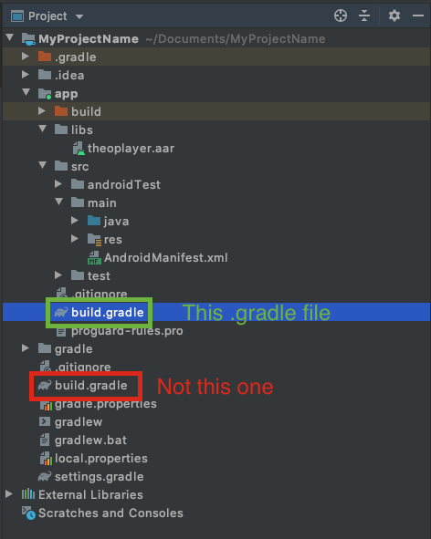
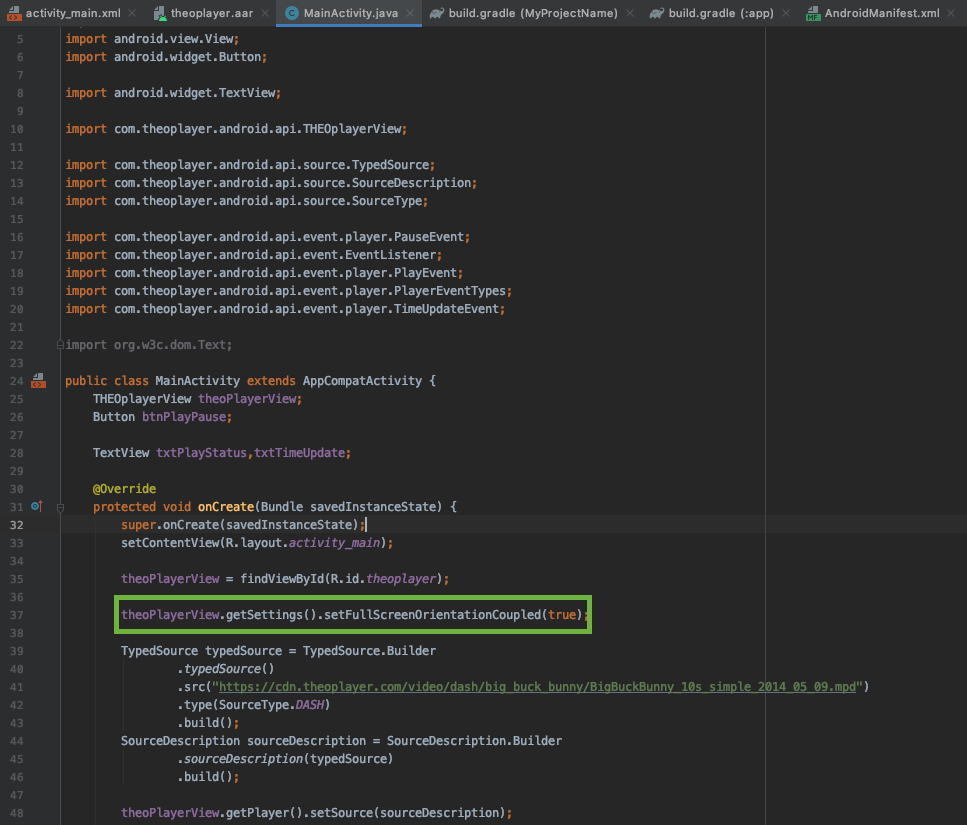
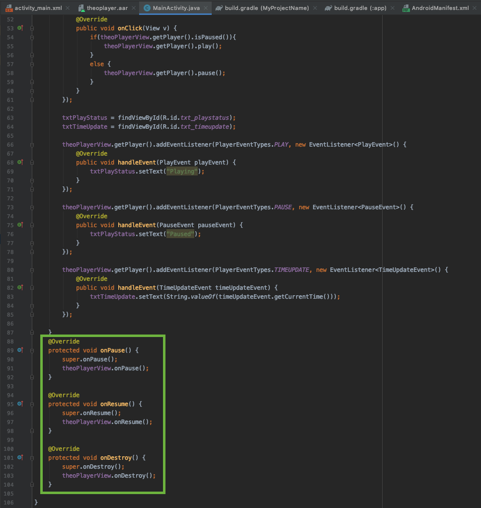

# Getting started on Legacy Android SDK (4.12.x)

This guide will provide an end-to-end explanation of how to set up an Android application with THEOplayer included.

It will cover

1. [setting up an IDE](#setup-a-starter-project-source),
2. [including all dependencies](#add-theoplayer-library-to-your-application-source) (including the THEOplayer Android SDK),
3. [adding THEOplayer to your activity](#add-theoplayer-view-to-your-application-source),
4. [interacting with the THEOplayer API](#use-theoplayer-api-in-your-application).

You can follow the guide step-by-step, or for each step you will find a link to the corresponding commit in our [Android Github](https://github.com/THEOplayer/android-sdk-starter-project) repository.
We also provide a full project for [Android TV](https://github.com/THEOplayer/android-tv-sdk-starter-project) and for [both](https://github.com/THEOplayer/android-and-android-tv-sdk-starter-project) together.

## Prerequisites

1. Download and install [Android Studio](https://developer.android.com/studio/index.html).
2. Obtain a THEOplayer Android SDK and license through the THEOplayer Developer Portal at [https://portal.theoplayer.com/](https://portal.theoplayer.com/login).

## Setup a starter project ([source](https://github.com/THEOplayer/android-sdk-starter-project/tree/a235d1d449552cc0013018254f1b5eff56aadeb1))

Start with opening Android Studio.
You will be greeted with a screen similar to the screenshot below.
Choose the "**Start a new Android Studio project**" option to begin.


On the next screen we can choose from pre-built Activities.  
An Activity is a screen of the application, it provides the window in which the app draws its UI. Because we want to show our THEOplayer on the Activity, we will select an empty one.

So, select "**Empty Activity**" and press "**Next**".


THEOplayer supports Android devices with **Android version 4.1 (Jelly Bean - API 16)** so select your minimum SDK requirement (Only the phone and tablet option).

Choose your application name, domain and project location, then hit "**Next**".

**Note the Package name as we will need this path later.**


We are now done with the setup of the new project.
Android Studio will now download the basic dependencies, project requirements and index your files.
You can see the progress at the bottom of the window.

Once this is done you will see the following screen:


### Project structure

By default, Android Studio displays your project files in the **Android** view. This view does not reflect the actual file hierarchy on the disk. The view is organized by modules and file types to simplify navigation between key source files of your project and to hide certain files or directories that are not commonly used.

To see the actual file structure of the project, including all files hidden from the **Android** view, select **Project** from the dropdown at the top of the Project window.


When you select **Project** view, you can see a lot more files and directories. The most important of which are the following:


- **app/**

  - Contains all module files:

- - **build/**
    - Contains build outputs
  - **libs/**
    - Contains private libraries
  - **src/**
    - Contains all code and resource files for the module in the following subdirectories:
    - **src/androidTest/**
      - Contains code for instrumentation tests that run on an Android device. For more information, see the [Android Test documentation](https://developer.android.com/tools/testing/index.html).
    - **src/main/**
      - Contains the "main" sourceset files: the Android code and resources shared by all build variants
    - **src/main/java/**
      - Contains Java source code files, separated by package names.
    - **src/main/res/**
      - Contains all non-code resources, such as XML layouts, UI strings, and bitmap images, divided into corresponding sub-directories. For more information about all possible resource types, see [Providing Resources](https://developer.android.com/guide/topics/resources/providing-resources.html).
    - **src/main/AndroidManifest.xml**
      - Describes the nature of the application and each of its components. For more information, see the [AndroidManifest.xml ](https://developer.android.com/guide/topics/manifest/manifest-intro.html)documentation.
  - **build.gradle**(module)
    - Shows all the project's build-related configuration files
- **build.gradle** (project)
  - This defines your build configuration that apply to all modules

## Add THEOplayer library to your application ([source](https://github.com/THEOplayer/android-sdk-starter-project/commit/1ec4834a5de05115d81994aef4f24b7cd781ce0e?diff=unified))

:::info Gradle / Maven / Jitpack

THEOplayer v2.83.0 and above can be managed through Jitpack. Refer to <a href="https://github.com/THEOplayer/theoplayer-sdk-android" target="_blank">https://github.com/THEOplayer/theoplayer-sdk-android</a> for more information.

:::

You can manually configure your THEOplayer dependencies.
When you create your THEOplayer Legacy Android SDK (4.12.x) through [https://portal.theoplayer.com](https://portal.theoplayer.com/login),
you can download the SDK. This SDK contains the following files:

- theoplayer-android-xxx-VERSION-**minapi21**-release.aar
  - Supports **all mobile and TV devices** starting with Lollipop (5.0)
- theoplayer-android-xxx-VERSION-**javadoc**.jar
  - Contains the API documentation for the library
- theoplayer-android-xxx-VERSION-**sources**.aar
  - Contains the source code of the exposed API of THEOplayer Legacy Android SDK (4.12.x)

About the file extensions:

- A **JAR** is a package file format typically used to aggregate many Java class files and associated metadata and resources into one file for distribution.
- Android Archive (**AAR**) files, unlike JAR files, can contain Android resources and a manifest file, which allows you to bundle in shared resources like layouts and drawables in addition to Java classes and methods. Usually Android Library projects are compiled to AAR file for distribution.
- Android Package (**APK**) is the package file format used by the Android operating system for distribution and installation of mobile apps. (Your application containing THEOplayer will compile to an APK file)

First add your THEOplayer **minApi21** AAR file to "**app/libs"** folder (in our example project we call it **theoplayer.aar**)


Now we have to modify the **build.gradle** files to load "**theoplayer.aar"** library.


In your **top-level** (project) **build.gradle** file add the following lines to allow loading library files from the "**libs**" folder

```groovy
allprojects {
    repositories {
        google()
        jcenter()

        flatDir {
            dirs 'libs'
        }

    }
}
```

And your Gradle file now looks like this:


Next we need to edit the **Gradle file**
on the **module-level**("**app/build.gradle**")



we need to specify for Gradle to load and compile our library from the libs folder.  
THEOplayer SDK has an external dependency on [Gson](https://github.com/google/gson) from Google. We use this library to convert Java object to and from JSON representation.

In the Gradle file, edit the dependencies to:

```groovy
dependencies {
    implementation fileTree(dir: 'libs', include: ['*.jar'])

    implementation(name:'theoplayer', ext:'aar')
    implementation 'com.google.code.gson:gson:2.8.2'

    implementation 'androidx.appcompat:appcompat:1.2.0'
    implementation 'androidx.constraintlayout:constraintlayout:2.0.1'
    testImplementation 'junit:junit:4.12'
    androidTestImplementation 'androidx.test.ext:junit:1.1.2'
    androidTestImplementation 'androidx.test.espresso:espresso-core:3.3.0'
}
```


After the modification of the **.gradle** files, Android Studio asks you to sync with Gradle. Do so by pressing the "**Sync Now**" button on the top right of the window. (in the blue border)

## Add THEOplayer view to your application ([source](https://github.com/THEOplayer/android-sdk-starter-project/commit/db0205f330009febe0cf8b8a29d600e453445926?diff=unified))

To play online videos with THEOplayer, you first need to add [**INTERNET**](https://developer.android.com/reference/android/Manifest.permission.html#INTERNET) permission into the **AndroidManifest.xml** file ("**app/src/main/AndroidManifest.xml"**):


```xml
<uses-permission android:name="android.permission.INTERNET" />
```

The manifest should look like:


You will add some code to the activity_main.xml file.


After you've added the **INTERNET** permission, you need to configure your [THEOplayer license string](../../../how-to-guides/12-license/00-introduction.md) in the same **AndroidManifest.xml** file.
If you don't enter this license string, you might encounter licensing issues (e.g.: when trying to play non-whitelisted video streams).
The screenshot below illustrates where you can find the `LICENSE` string on the THEOplayer Developer Portal.


So, head over to your SDK page on [https://portal.theoplayer.com](https://portal.theoplayer.com/login), identify your license string,
add the `<meta-data ...` tag below at the appropriate location in your `AndroidManifest.xml`, and swap `your_license_here` with your
actual license string.

```xml
<application>
    <meta-data
        android:name="THEOPLAYER_LICENSE"
        android:value="your_license_here" />
</application>
```

Next, you need to create a THEOplayer video player. You can either A) create this through a layout (i.e. XML) or either B) create this through the constructor API.
This guide uses approach A.

You can now add the **THEOplayerView** to the layout of the **MainActivity** ("**/app/src/main/java/com/theoplayer/theoplayerexample/MainActivity.java**").  
The example "Hello World!" text can be completely removed. We put the **THEOplayerView** instead.

At least the "**width**", "**height**" and "**id**" attributes need to be specified on the new view.

The "**id**" is important, it is used to identify the view object in you **MainActivity** class.

```xml
<com.theoplayer.android.api.THEOplayerView
        android:layout_width="match_parent"
        android:layout_height="300dp"
        android:id="@+id/theoplayer"
        app:layout_constraintTop_toTopOf="parent">

    </com.theoplayer.android.api.THEOplayerView>
```


Note: refer to [https://github.com/THEOplayer/theoplayer-sdk-android#b-using-the-constructor-api](https://github.com/THEOplayer/theoplayer-sdk-android#b-using-the-constructor-api)
if you want to use approach B instead, and use the constructor API.
This approach also allows you to configure the "license string" through a programmatic configuration instead of the `AndroidManifest.xml`.

## Use THEOplayer API in your application

Now in the **MainActivity.java** we can retrieve the **THEOplayerView** by the "**id**" we set earlier using the **findViewById** method.

#### 1. Create THEOplayer instance

```java
    ...
    import com.theoplayer.android.api.THEOplayerView;

    public class MainActivity extends AppCompatActivity{
        THEOplayerView theoPlayerView;

        @Override
        protected void onCreate(Bundle savedInstanceState) {
            super.onCreate(savedInstanceState);
            setContentView(R.layout.activity_main);

            theoPlayerView = findViewById(R.id.theoplayer);

        }
    }

```

#### 2. Configure source ([source](https://github.com/THEOplayer/android-sdk-starter-project/commit/b57ccd82f8b6391636245d74f4f2a68faae227c4?diff=unified))

To play a video in THEOplayer, we need to **configure a source** for the player in our **MainActivity**:

```java
        TypedSource typedSource = TypedSource.Builder
                .typedSource()
                .src("https://cdn.theoplayer.com/video/dash/big_buck_bunny/BigBuckBunny_10s_simple_2014_05_09.mpd")
                .type(SourceType.DASH)
                .build();

        SourceDescription sourceDescription = SourceDescription.Builder
                .sourceDescription(typedSource)
                .build();

        theoPlayerView.getPlayer().setSource(sourceDescription);
```


#### 3. Control THEOplayer through the API ([source](https://github.com/THEOplayer/android-sdk-starter-project/commit/c9a2b448ef1a920dc6899bf0fb7aee6ac1e15e33?diff=unified))

We will now introduce a button to start/stop the video in the player.

First add the button to our **activity_main.xml** layout file

```xml
    <Button
        android:layout_width="wrap_content"
        android:layout_height="wrap_content"
        android:id="@+id/btn_playpause"
        android:text="PLAY/PAUSE"
        app:layout_constraintTop_toBottomOf="@+id/theoplayer"
        app:layout_constraintLeft_toLeftOf="parent"
        app:layout_constraintRight_toRightOf="parent"/>
```


Navigate to the **MainActivity.java** file and import the android button functionality.

```java
    import android.widget.Button;
    import android.view.View;
```

Then set an **OnClickListener()** on the button in our **MainActivity** code to trigger play and pause in the player.

```java
Button btnPlayPause;

        ...

        btnPlayPause = findViewById(R.id.btn_playpause);
        btnPlayPause.setOnClickListener(new View.OnClickListener() {
            @Override
            public void onClick(View v) {
                if (theoPlayerView.getPlayer().isPaused()) {
                    theoPlayerView.getPlayer().play();
                } else {
                    theoPlayerView.getPlayer().pause();
                }
            }
        });
```


#### 4. Listen for THEOplayer events ([source](https://github.com/THEOplayer/android-sdk-starter-project/commit/52f4a46b6c856d402f2fa2dfca249779d2b22967?diff=unified))

The next step is listening for player events.

First, we need to create two more TextViews in the activity_main.xml file.

```xml
    <TextView
        android:layout_width="wrap_content"
        android:layout_height="wrap_content"
        android:id="@+id/txt_playstatus"
        app:layout_constraintLeft_toRightOf="@+id/btn_playpause"
        app:layout_constraintTop_toBottomOf="@+id/theoplayer"
        app:layout_constraintBaseline_toBaselineOf="@+id/btn_playpause"
        android:layout_marginLeft="20dp"/>

    <TextView
        android:layout_width="wrap_content"
        android:layout_height="wrap_content"
        android:id="@+id/txt_timeupdate"
        app:layout_constraintLeft_toRightOf="@+id/txt_playstatus"
        app:layout_constraintTop_toBottomOf="@+id/theoplayer"
        app:layout_constraintBaseline_toBaselineOf="@+id/btn_playpause"
        android:layout_marginLeft="20dp"/>
```

Then import the following Android and THEOplayer libraries in the MainActivity file:

```java
    ...
    import android.widget.TextView;
    ...
    import com.theoplayer.android.api.event.player.PauseEvent;
    import com.theoplayer.android.api.event.EventListener;
    import com.theoplayer.android.api.event.player.PlayEvent;
    import com.theoplayer.android.api.event.player.PlayerEventTypes;
    import com.theoplayer.android.api.event.player.TimeUpdateEvent;
```


We will now listen for "**PLAY**", "**PAUSE**" and "**TIMEUPDATE**" in this example.

```java
TextView txtPlayStatus, txtTimeUpdate;

        ...

        txtPlayStatus = findViewById(R.id.txt_playstatus);
        txtTimeUpdate = findViewById(R.id.txt_timeupdate);

        theoPlayerView.getPlayer().addEventListener(PlayerEventTypes.PLAY, new EventListener<PlayEvent>() {
            @Override
            public void handleEvent(PlayEvent playEvent) {
                txtPlayStatus.setText("Playing");
            }
        });

        theoPlayerView.getPlayer().addEventListener(PlayerEventTypes.PAUSE, new EventListener<PauseEvent>() {
            @Override
            public void handleEvent(PauseEvent pauseEvent) {
                txtPlayStatus.setText("Paused");
            }
        });

        theoPlayerView.getPlayer().addEventListener(PlayerEventTypes.TIMEUPDATE, new EventListener<TimeUpdateEvent>() {
            @Override
            public void handleEvent(TimeUpdateEvent timeUpdateEvent) {
                txtTimeUpdate.setText(String.valueOf(timeUpdateEvent.getCurrentTime()));
            }
        });
```


When the events are triggered, we will update the **MainActivity** UI with the corresponding state.

```xml
<Button
        android:layout_width="wrap_content"
        android:layout_height="wrap_content"
        android:id="@+id/btn_playpause"
        android:text="PLAY/PAUSE"
        app:layout_constraintLeft_toLeftOf="parent"
        app:layout_constraintRight_toRightOf="parent"
        app:layout_constraintTop_toBottomOf="@+id/theoplayer"/>
    <TextView
        android:layout_width="wrap_content"
        android:layout_height="wrap_content"
        android:id="@+id/txt_playstatus"
        app:layout_constraintRight_toRightOf="@+id/btn_playpause"
        app:layout_constraintTop_toBottomOf="@+id/theoplayer"
        app:layout_constraintBaseline_toBaselineOf="@+id/btn_playpause"
        android:layout_marginLeft="20dp"/>
    <TextView
        android:layout_width="wrap_content"
        android:layout_height="wrap_content"
        android:id="@+id/txt_timeupdate"
        app:layout_constraintLeft_toRightOf="@+id/txt_playstatus"
        app:layout_constraintTop_toBottomOf="@+id/theoplayer"
        app:layout_constraintBaseline_toBaselineOf="@+id/btn_playpause"
        android:layout_marginLeft="20dp"/>

        </androidx.constraintlayout.widget.ConstraintLayout>
```

#### 5. Play fullscreen video in landscape mode([source](https://github.com/THEOplayer/android-sdk-starter-project/commit/c327296197ab5cd30d206dd0cd2f5f64f4a3b6ff?diff=unified))

THEOplayer SDK contains a default fullscreen activity which can be started automatically when you rotate your device.

We have to configure our player instance in the **MainActivity** to react to orientation changes and start the Fullscreen activity.

```java
   @Override
    protected void onCreate(Bundle savedInstanceState) {

        // ...

        theoPlayerView = findViewById(R.id.theoplayer);
        theoPlayerView.getSettings().setFullScreenOrientationCoupled(true);

        // ...

    }
```



In the **AndroidManifest.xml** we can disable the default orientation behavior on our MainActivity and lock it in portrait.  
Then, because we enabled fullscreen orientation coupling with the **setFullScreenOrientationCoupled(true)** method earlier, THEOplayer will take care of the support of seamless landscape activity transition at rotation.

```xml
        <activity android:name=".MainActivity"
            android:screenOrientation="userPortrait"
            android:configChanges="orientation|screenSize"
            >
            <intent-filter>
                <action android:name="android.intent.action.MAIN" />

                <category android:name="android.intent.category.LAUNCHER" />
            </intent-filter>
        </activity>
    </application>

</manifest>
```


In order to work properly and in sync with the [Activity lifecycle changes](https://developer.android.com/guide/components/activities/activity-lifecycle) (e.g. when we rotate the device or start a new Activity or the app goes to background). We need to call the "**onResume"**, "**onPause"** and "**onDestroy"** methods of the **THEOplayerView** when the matching methods are called in the Activity.

```java
public class MainActivity extends AppCompatActivity{

    // ...

    @Override
    protected void onPause() {
        super.onPause();
        theoPlayerView.onPause();
    }

    @Override
    protected void onResume() {
        super.onResume();
        theoPlayerView.onResume();
    }

    @Override
    protected void onDestroy() {
        super.onDestroy();
        theoPlayerView.onDestroy();
    }

    // ...

}

```



If you would like to customize the Fullscreen Activity, you can follow our tutorial [here](./01-android-sdk-customization.md).

## Run your application

To run your application, you have to click on the **green "Play" icon** next to the "app" module on the Toolbar of Android Studio.

Then you have two choices:

- connect your device via usb to your computer
- run the application in an emulator

We suggest you to **run the application on a real device** for the best performance.

You can either plug in a USB cable between your device and your computer, or enable network debugging on your device and connect using adb connect IP-ADDRESS.

Also keep in mind, on emulators which run Android 7.0 and above the video in THEOplayer is not showing. If you want to still test in emulators you need to use a version with Android 6.0 or below.

And finally, here you have some screenshots from the running application:


Start screen


Playing screen


Paused screen


Rotated fullscreen

## Summary

This guide focuses on creating an Android application from scratch, and integrating the THEOplayer Legacy Android SDK (4.12.x).

- You have learned how to interact with the player via the available APIs in Java,
- you have registered player events,
- and you have learned how to enable automatic orientation detection.

The full source of this application is available on [GitHub](https://github.com/THEOplayer/android-sdk-starter-project).
You may also find the readme at [https://github.com/THEOplayer/theoplayer-sdk-android](https://github.com/THEOplayer/theoplayer-sdk-android) useful.

You can find interesting features of THEOplayer on our [demo](https://www.theoplayer.com/demo-zone) page.

Did you encounter any issues? Raise a ticket through [the ticketing system](https://opentelly.atlassian.net/servicedesk/customer/portal/1) if you're on a [support plan](https://www.theoplayer.com/supportplans).
