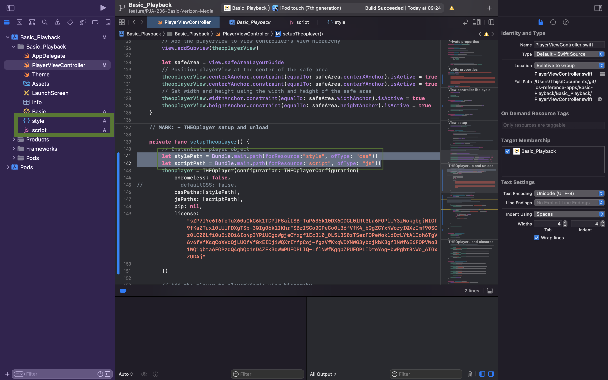

# iOS/tvOS SDK and Legacy iOS/tvOS SDK (4.12.x) Customization

## Custom CSS and JavaScript files

If you want to use custom CSS or JavaScript files you can instantiate the player with a THEOplayerConfiguration object.

```swift
let stylePath = Bundle.main.path(forResource:"style", ofType: "css")!
let scriptPath = Bundle.main.path(forResource:"script", ofType: "js")!
let playerConfig = THEOplayerConfiguration(defaultCSS: false, cssPaths:[stylePath], jsPaths: [scriptPath])
/* or let playerConfig = THEOplayerConfiguration(chromeless: true, cssPaths:[stylePath], jsPaths: [scriptPath]) */
var theoplayer = THEOplayer(configuration: playerConfig)
```

Note that the snippet above implies that you've created `style.css` and `script.js` in your iOS project.
Ensure that these files are created and referenced correctly.
The screenshot below demonstrates that these files are "discoverable" in our sample project because they appear in the left sidebar.



#### Custom CSS and the Chromeless flag

With the `chromeless` flag you can choose to use the chromeless version of the player which does not contain the THEOplayer UI.
This allows you to write your own custom UI.

The THEOplayer CSS is not loaded when `chromeless` is enabled.

When `chromeless` is `false`, the THEOplayer UI is used.
In that case the default style can still be disabled by setting the `defaultCss` flag to `false`.

#### Communication between a custom JavaScript file and the THEOplayer iOS SDK (≥ 1.0.10)

You can send messages from within a custom JavaScript file to the iOS SDK.

1. Register a message listener in your native (e.g. Swift) code through [`addJavascriptMessageListener`](<pathname:///theoplayer/v6/api-reference/ios/Classes/THEOplayer.html#/c:@CM@THEOplayerSDK@objc(cs)THEOplayer(im)addJavascriptMessageListenerWithName:listener:>), as demonstrated in the example below:

```swift
func onMessageReceived(message : [String:Any]) {
    print(message)
    let a : String = message["a"] as! String
    let b : Int = message["b"] as! Int // booleans get converted to integers
    let c : Int = message["c"] as! Int
    let d : [String:Any] = message["d"] as! [String:Any]
    print(a, b, c, d)
}
theoplayer.addJavascriptMessageListener(name: "myMessageName", listener: onMessageReceived)
```

2. Send a message in your custom JavaScript file (script.js):

To send a message the `_webkit.messageHandlers.<messageName>.postMessage(<message body>)_` method must be used,
as demonstrated in the example below:

```javascript
/* this example sends a message every 10 seconds */
setInterval(function () {
  const message = {
    a: "abc",
    b: true,
    c: 123,
    d: {
      a: "abc",
      b: true,
      c: 123
    }
  };
  window.webkit.messageHandlers.myMessageName.postMessage(message);
}, 10000);
```

The message body can be a JavaScript object or string:

- If it's an object then the resulting type in Swift will be a dictionary `[String:Any]`.
- If it's a string then the result in Swift is a dictionary with one value and `"data"` as key.

#### Communication between the THEOplayer iOS SDK (≥ 1.0.10) and a custom JavaScript file

You can send messages from your native (e.g. Swift) code to your custom JavaScript file.

1. Create a function in your custom JavaScript file, as demonstrated in the example below:

```swift
function foobar(value) {
        console.log(value);
        if (value != "test") {
            throw new Error("An error occured.");
        }
        return value;
}
```

2. Call your JavaScript function in your native code through [`theoplayer.evaluateJavaScript`](<pathname:///theoplayer/v6/api-reference/ios/Classes/THEOplayer.html#/c:@CM@THEOplayerSDK@objc(cs)THEOplayer(im)evaluateJavaScript:completionHandler:>), as demonstrated in the example below:

```swift
theoplayer.addEventListener(type: PlayerEventTypes.PAUSE) { event in
        print(event)
        self.theoplayer.evaluateJavaScript("foobar('test')") { result, error in
            if error == nil {
                let result_ = result as! String
                print("result", result_)
            } else {
                print("error", error!)
            }
        }
}
```

## Publishing to App Store

Please note that this is only necessary for versions below **2.16**. Do not use this step if you have a newer version.

THEOplayer.framework is released as a FAT framework containing several architectures. The framework includes the i386, x86_64, armv7 and arm64 architectures. Sometimes the App Store will not accept these (especially legacy simulator i386 and x86_64 architectures.)

In order to thin down the framework prior to archiving it and submitting it for upload, use the following command in Terminal:

```text
lipo [path to THEOplayer.framework] -remove [i386, x86_64] -output [path to output the thinned framework]
```
