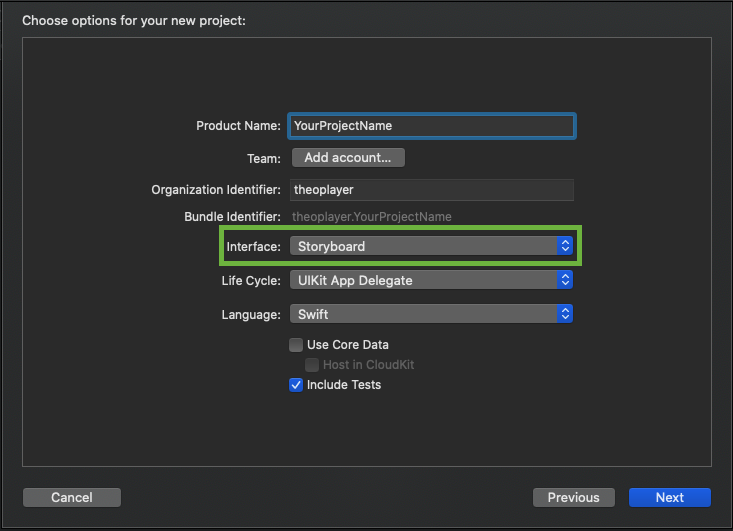
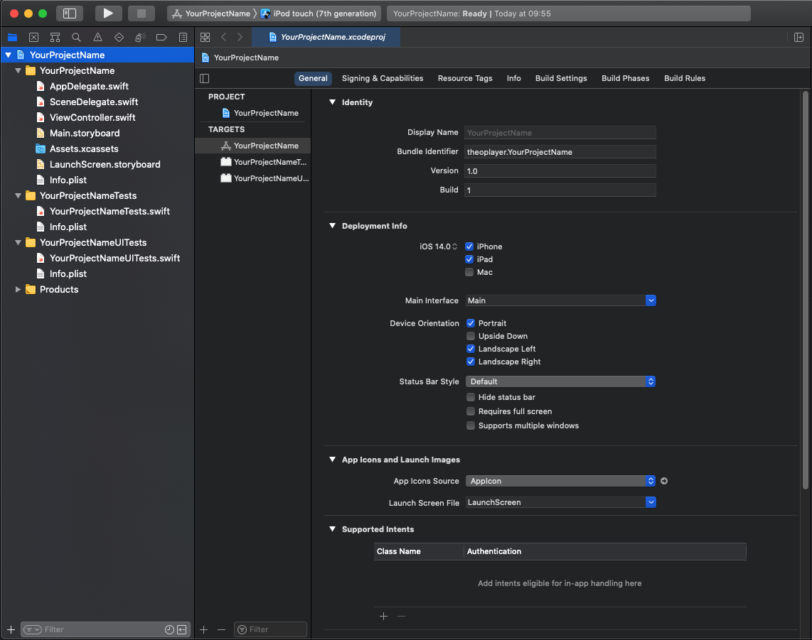
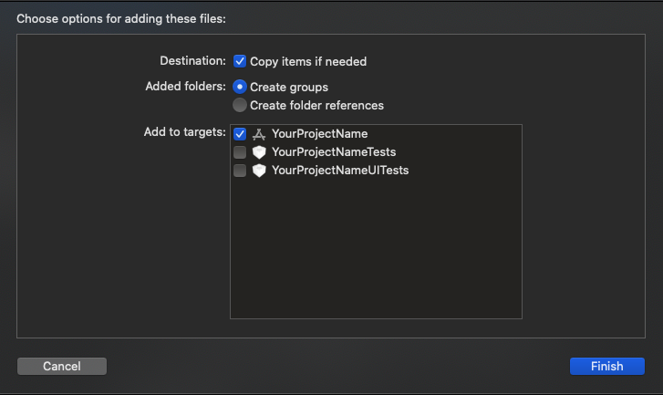
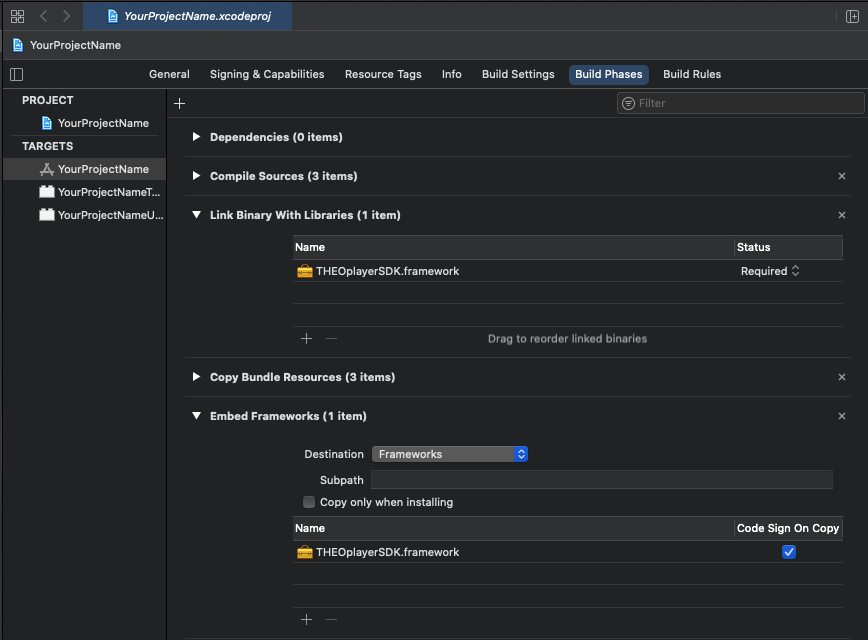
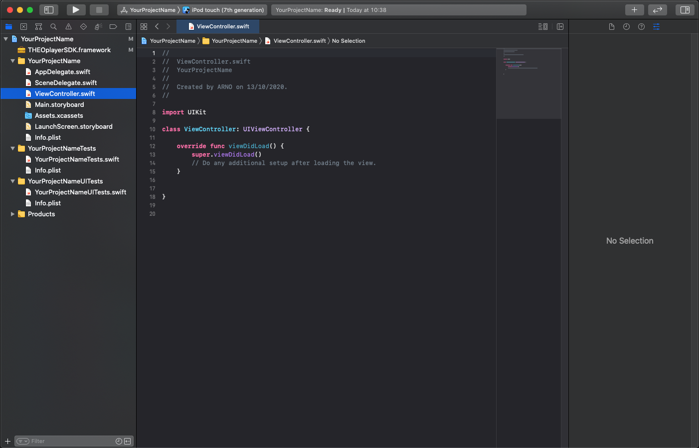

# Getting started on iOS

This page is a step-by-step guide on how to get THEOplayer iOS SDK running on iOS/iPadOS apps. It will cover:

1. [Creating a new iOS project](#creating-a-new-ios-project)
2. [Configuring the THEOplayer SDK](#configure-theoplayer-sdk-framework)
3. [Using the THEOplayer iOS API](#develop-the-app-using-the-theoplayer-sdk)
4. [Using event listeners](#steps-for-adding-and-removing-event-listeners)

This example uses Xcode version 12.0.1 (12A7300) and macOS Catalina version 10.15.7.

:::info Cocoapods

THEOplayer v2.83.0 and above can be managed through Cocoapods. Refer to <a href="https://github.com/THEOplayer/theoplayer-sdk-ios" target="_blank">https://github.com/THEOplayer/theoplayer-sdk-ios</a> for more information.

:::

## Prerequisites

- Download and install Xcode.
- Obtain a THEOplayer iOS SDK through the THEOplayer Developer Portal at [https://portal.theoplayer.com](https://portal.theoplayer.com/login).
  - And have the license string handy, as depicted in the screenshot below, because you'll need it when configuring your video player.


## Creating a new iOS project

Steps for creating a new project:

1. Create new project (cmd + shift + n).
2. Select new App and click 'next'.


3.  Enter project details, set interface to 'storyboard' and click 'next'.



After selecting the directory location, you should see something similar to the screenshot below.



## Configure THEOplayer SDK framework

You can manually load and configure the THEOplayer SDK if you're not using [Cocoapods](https://github.com/THEOplayer/theoplayer-sdk-ios/).
First, download your THEOplayer iOS SDK from [https://portal.theoplayer.com](https://portal.theoplayer.com/login).

Open "Finder" and drag your THEOplayerSDK.framework into to the project directory.


This screen pops up. Make sure these settings are selected, and click finish.



Go to the project configuration (1), select the General tab (2), and make sure the THEOplayerSDK.framework is embedded and signed in.
(3) Add it with the "+" if necessary.


Validate that the framework will correctly be added during builds:

Go to the Build Phases tab in the project configuration. Then, go to the Embed Frameworks section and check that the THEOplayerSDK.framework is present.



## Develop the app using the THEOplayer SDK

Steps for a minimal app using THEOplayer:

1. Open the ViewController.

   The file should look like this:

   

2. Import THEOplayerSDK.
   ```swift
       import THEOplayerSDK
   ```
3. Make the setupTheoPlayer() function:

   This function sets all the initial dimensions for the player and adds it to the view when called.

   ```swift
    func setupTheoPlayer() {
        var frame: CGRect = UIScreen.main.bounds
        frame.origin.y = 0
        frame.size.height = frame.size.width * 9 / 16
        var playerConfig = THEOplayerConfiguration(pip: nil, license: "your_license_here")
        self.theoplayer = THEOplayer(configuration: playerConfig)
        self.theoplayer = THEOplayer()
        self.theoplayer.frame  = frame
        self.theoplayer.addAsSubview(of: self.view)
    }
   ```

   Do not forget to swap `your_license_here` with the license string mentioned in the ["Prerequisites"](#prerequisites).

4. Define the sampleSource:
   ```swift
   var sampleSource: SourceDescription {
        return SourceDescription(
            source: TypedSource(
            src: "https://cdn.theoplayer.com/video/elephants-dream/playlist.m3u8",
            type: "application/x-mpegurl"
            )
        )
    }
   ```
5. Set up a player during `viewDidLoad()`, it is important to keep a reference to this instance
   ```swift
    override func viewDidLoad() {
        super.viewDidLoad()
        setupTheoPlayer()
        self.theoplayer.source = sampleSource
        /* Do any additional setup after loading the view.*/
    }
   ```

The result is the following snippet:

```swift
import UIKit
import THEOplayerSDK

class ViewController: UIViewController {
    var theoplayer: THEOplayer!

    override func viewDidLoad() {
        super.viewDidLoad()
        setupTheoPlayer()
        self.theoplayer.source = sampleSource
    }

    func setupTheoPlayer() {
        var frame: CGRect = UIScreen.main.bounds
        frame.origin.y = 0
        frame.size.height = frame.size.width * 9 / 16

        var playerConfig = THEOplayerConfiguration(pip: nil, license: "your_license_here")
        self.theoplayer = THEOplayer(configuration: playerConfig)
        self.theoplayer.frame =  frame
        self.theoplayer.addAsSubview(of: self.view)
    }

    var sampleSource: SourceDescription {
        return SourceDescription(
            source: TypedSource(
                src: "https://cdn.theoplayer.com/video/elephants-dream/playlist.m3u8",
                type: "application/x-mpegurl"
            )
        )
    }
}
```

## Steps for adding and removing event listeners.

1. Add `var listeners: [String: EventListener] = [:]` to ViewController

```swift
  var theoplayer: THEOplayer!
  var listeners: [String: EventListener] = [:]
```

2. Write the functions to create and delete the EventListeners on play and pause events.

```swift
class ViewController: UIViewController {

    ...

    func attachEventListeners() {
        self.listeners["play"] = self.theoplayer.addEventListener(type: PlayerEventTypes.PLAY, listener: onPlay)
        self.listeners["pause"] = self.theoplayer.addEventListener(type: PlayerEventTypes.PAUSE, listener: onPause)
    }

    func removeEventListeners() {
        self.theoplayer.removeEventListener(type: PlayerEventTypes.PLAY, listener: listeners["play"]!)
        self.theoplayer.removeEventListener(type: PlayerEventTypes.PAUSE, listener: listeners["pause"]!)
    }

    func onPlay(event: PlayEvent) {
        print("Play event occured")
    }

    func onPause(event: PauseEvent) {
        print("Pause event occured")
    }
}
```

3. Add `attachEventListeners()` to the setupTheoPlayer() function to create the EventListeners when the THEOplayer is initialized.

```swift
func setupTheoPlayer() {
       var frame: CGRect = UIScreen.main.bounds
       frame.origin.y = 0
       frame.size.height = frame.size.width * 9 / 16

       var playerConfig = THEOplayerConfiguration(pip: nil, license: "your_license_here")
       self.theoplayer = THEOplayer(configuration: playerConfig)
       self.theoplayer.frame =  frame
       self.theoplayer.addAsSubview(of: self.view)

       attachEventListeners()
   }
```

4.  Modify the `viewWillDisappear()` method to also delete the EventListeners we previously made when the current view is inactive.

```swift
override func viewWillDisappear(_ animated: Bool) {
    super.viewWillDisappear()
    removeEventListeners()
}
```

## Full code overview:

```swift
import UIKit
import THEOplayerSDK

class ViewController: UIViewController {
    var theoplayer: THEOplayer!
    var listeners: [String: EventListener] = [:]

    override func viewDidLoad() {
        super.viewDidLoad()
        setupTheoPlayer()
        self.theoplayer.source = sampleSource
    }

    func setupTheoPlayer() {
        var frame: CGRect = UIScreen.main.bounds
        frame.origin.y = 0
        frame.size.height = frame.size.width * 9 / 16

        var playerConfig = THEOplayerConfiguration(pip: nil, license: "your_license_here")
        self.theoplayer = THEOplayer(configuration: playerConfig)
        self.theoplayer.frame =  frame
        self.theoplayer.addAsSubview(of: self.view)

        attachEventListeners()
    }

    var sampleSource: SourceDescription {
        return SourceDescription(
            source: TypedSource(
            src: "https://cdn.theoplayer.com/video/elephants-dream/playlist.m3u8",
            type: "application/x-mpegurl"
            )
        )
    }
    override func viewWillDisappear(_ animated: Bool) {
        super.viewWillDisappear()
        removeEventListeners()
    }

    func attachEventListeners() {
        self.listeners["play"] = self.theoplayer.addEventListener(type: PlayerEventTypes.PLAY, listener: onPlay)
        self.listeners["pause"] = self.theoplayer.addEventListener(type: PlayerEventTypes.PAUSE, listener: onPause)
    }

    func removeEventListeners() {
        self.theoplayer.removeEventListener(type: PlayerEventTypes.PLAY, listener: listeners["play"]!)
        self.theoplayer.removeEventListener(type: PlayerEventTypes.PAUSE, listener: listeners["pause"]!)
    }

    func onPlay(event: PlayEvent) {
        print("Play event occured")
    }

    func onPause(event: PauseEvent) {
        print("Pause event occured")
    }
}

```

Finally, validate that the tutorial has been completed successfully:

- Run the application. You can boot a simulator, or use your own physical device.
- Click the big play button.
