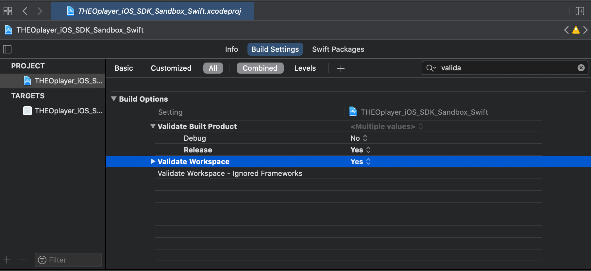

# Building for iOS Simulator, but the linked and embedded framework THEOplayerSDK.framework was built for iOS + iOS Simulator

When using Xcode version 12.3 or above, it's possible that Xcode triggers the following error:

```text
Building for iOS Simulator, but the linked and embedded framework ‘THEOplayerSDK.framework’ was built for iOS + iOS Simulator.
```

You solve this issue by setting `Validate Workspace` to `Yes` in the `Build Settings` of Xcode.


