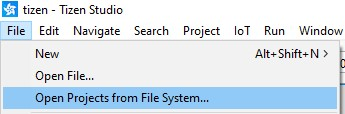

# Getting started on Tizen

This how-to guide describes how to set up a Tizen application using the THEOplayer SDK on Tizen.

You may also find the [Getting Started on Web](../01-web/00-getting-started.mdx) to be useful.

## Set-up

For brevity, set-up is split up over multiple pages:

- [Setting up Tizen Studio](01-installing-tizen-studio.md)
- [Generating a certificate](02-generating-a-certificate.md)
- [Setting up and deploying on a physical device (recommended)](03-setting-up-physical.md)
- [Setting up and deploying on an emulator (less recommended)](04-setting-up-emulator.md)

## Getting started with the THEOplayer Tizen reference app

### Prerequisites

- Generate a Tizen SDK build via the [THEOplayer portal](https://portal.theoplayer.com/).
- Download the [reference app project](https://github.com/THEOplayer/samples-tizen)
- Read the README to get started. There is one at the root level and one in the two examples.
- Import the project in Tizen Studio

Go to File -> Open Projects from File System

Select the directory. Then press Finish.

### Reference app structure structure

- **example-with-ui/**
  - Contains a Tizen project with a UI. Follow the readme for more instructions.
  - **css/**
    - CSS styles as used in the app.
  - **js/**
    - JavaScript files as used in the app. The compiled result of `src/` is put in here.
  - **src/**
    - The source code of the UI application. Change or replace as desired.
  - **libs/**
    - (Insert your THEOplayer Tizen SDK here)
  - **index.html**
    - Entry point of application.
  - **config.xml**
    - Permissions of the app.
  - **package.json**
    - Contains the commands required to build the UI.
- **minimum-example/**
  - Contains a very minimal Tizen project example. No UI included.
  - **libs/**
    - (Insert your THEOplayer Tizen SDK here)
  - **index.html**
    - Entry point of application.
  - **config.xml**
    - Permissions of the app.
