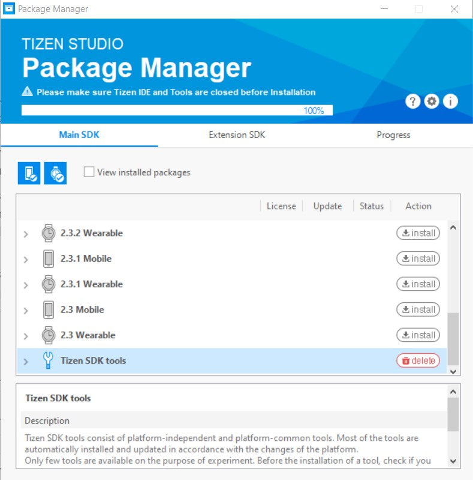
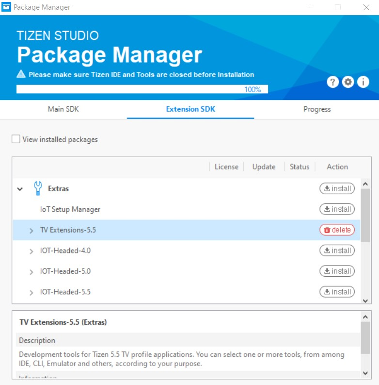

# Installing the Tizen developer tools

- Check if your device meets the [Tizen developer tools prerequisites](https://developer.tizen.org/development/tizen-studio/download/prerequisites).
- Download the Tizen developer tools at [Tizen development tools](https://developer.tizen.org/development/tizen-studio/download). You can decide to either install the IDE or CLI, but in this guide we assume you use the IDE.
- In Tizen Studio, make sure to install the Tizen package extensions:

Go to Tools, then Package Manager

Install everything under Tizen SDK tools under Main SDK

Install the latest tv extensions under Extension SDK

