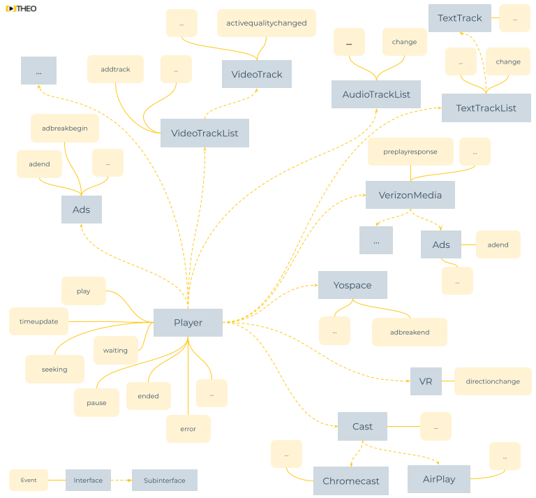

# Custom Analytics Integration

As mentioned in our [Introduction](00-introduction.md), video analytics provide tremendous insights into your user's QoE, bring extra business intelligence and enhance decision-making.
There are a wide selection of analytics systems in the current landscape (e.g. Google Analytics, Conviva, ...), often with their own focus, expertise and value.

What most video analytics systems have in common is that their insights (partly) originate from video events:

- `play` event: a user clicks the play button, or resumes playback after a pause
- `fullscreen` event: a user goes fullscreen on their device
- `quality` change event: the video quality switches from a lower resolution to a higher one
- `waiting` event: the video is stalled and unable to continue playback for some time
- ...

To access these video events, and forward them to a video analytics system, an application developer must hook into
the video player API.

This guide explains the role of the THEOplayer API.
Additionally, it explains how to do a custom integration with an analytics system, with Google Analytics as a sample case.
This guide should be useful when THEOplayer doesn't have an existing sample integration with a specific (commercial) video analytics service,
or when you want to fully control the data flow.

Keep in mind that GA is not the only analytics system out there. The APIs and concepts that we'll discuss are relevant for all analytics systems.
For example, you can easily swap out the Google Analytics example with something like [Nielsen](http://www.nielsen.com/eu/en/solutions/capabilities/media-analytics.html)
or [Youbora](https://nicepeopleatwork.com/youbora/) (Nice People At Work), or even your own custom analytics back-end.

## Prerequisites

There are two prerequisites in order to continue with this guide:

1. You have a THEOplayer license. You can grab a license at [https://portal.theoplayer.com](https://portal.theoplayer.com).

2. You have some [basic knowledge](../../getting-started/01-sdks/01-web/00-getting-started.mdx) on how to use THEOplayer,
   and can navigate comfortable through [the API](pathname:///theoplayer/v6/api-reference/web/) to find [relevant events](http://demo.theoplayer.com/using-events-examples).

Refer to our [getting started guide](../../getting-started/01-sdks/01-web/00-getting-started.mdx) before advancing
to the code samples.

## API

You can access the video data through the THEOplayer API. Through the API, you can subscribe to events, and attach a callback.
For example, when the `ended` event is triggered (meaning: someone completely watched the video),
your callback could be that when this happens, you do a request to a remote video analytics service.

Events are organized across interfaces and subinterfaces, as illustrated by the image below. For example, the [`Player`](pathname:///theoplayer/v6/api-reference/web/interfaces/PlayerEventMap.html) contains
general video player events like `play`, `pause` and `ended`.
The [`Ads`](pathname:///theoplayer/v6/api-reference/web/interfaces/AdsEventMap.html) interface contains events related to advertisements,
like `adbreakbegin` and `adend`.



When creating a custom analytics implementation, you must familiarize yourself with the relevant interfaces and events.
Luckily, all information is available at [https://docs.theoplayer.com/](https://docs.theoplayer.com/),
and the names of interfaces and events are very similar across all the THEOplayer SDKs.

Below is an (incomplete) list of some common interface event maps.

- Player is the interface the represents the video player instance.
  You use this interface to detect general video events, like a play, a pause, and so on.
  - [Web](pathname:///theoplayer/v6/api-reference/web/interfaces/PlayerEventMap.html)
  - [iOS](pathname:///theoplayer/v6/api-reference/ios/Structs/PlayerEventTypes.html)
  - [Android](pathname:///theoplayer/v6/api-reference/android/com/theoplayer/android/api/event/player/PlayerEventTypes.html)
- Ads is the interface that represents the advertisements.
  You use this interface to detect when an ad starts and stops.
  - [Web](pathname:///theoplayer/v6/api-reference/web/interfaces/AdsEventMap.html)
  - [iOS](pathname:///theoplayer/v6/api-reference/ios/Ads%20Events.html)
  - [Android](pathname:///theoplayer/v6/api-reference/android/com/theoplayer/android/api/event/ads/AdsEventTypes.html)
- AudioTrackList is the interface that represents the list of audio tracks.
  You use this interface to detect when a new audio track is added, or when another audio track becomes active.
  - [Web](pathname:///theoplayer/v6/api-reference/web/interfaces/TrackListEventMap.html)
  - [iOS](pathname:///theoplayer/v6/api-reference/ios/Structs/AudioTrackListEventTypes.html)
  - [Android](pathname:///theoplayer/v6/api-reference/android/com/theoplayer/android/api/event/track/mediatrack/audio/list/AudioTrackListEventTypes.html)
- VideoTrack is the interface that represents a single video track containing one or more video qualities.
  You use this interface to detect when another video quality becomes active.
  - [Web](pathname:///theoplayer/v6/api-reference/web/interfaces/MediaTrackEventMap.html)
  - iOS: unavailable due to Apple limitations
  - [Android](pathname:///theoplayer/v6/api-reference/android/com/theoplayer/android/api/event/track/mediatrack/video/VideoTrackEventTypes.html)
- TextTrackList is comparable AudioTrackList, but for subtitles, closed captions and metadata (e.g. id3, emsg, EventStream, EXT-X-DATERANGE).
  - [Web](pathname:///theoplayer/v6/api-reference/web/interfaces/TrackListEventMap.html)
  - [iOS](pathname:///theoplayer/v6/api-reference/ios/Structs/TextTrackListEventTypes.html)
  - [Android](pathname:///theoplayer/v6/api-reference/android/com/theoplayer/android/api/event/track/texttrack/list/TextTrackListEventTypes.html)
- Cast is the interface that is used to detect events related to Chromecast and AirPlay.
  - [Web](pathname:///theoplayer/v6/api-reference/web/interfaces/VendorCastEventMap.html)
  - iOS: [AirPlay](pathname:///theoplayer/v6/api-reference/ios/Structs/AirPlayEventTypes.html) & [Chromecast](pathname:///theoplayer/v6/api-reference/ios/Structs/ChromecastEventTypes.html)
  - [Android](pathname:///theoplayer/v6/api-reference/android/com/theoplayer/android/api/event/chromecast/package-summary.html)
- Network is the interface that is used to intercept HTTP(S) requests and responses.
  You should only use this API on the THEOplayer Web SDK, and only when you can't use [Service Workers](https://developer.mozilla.org/en-US/docs/Web/API/Service_Worker_API/Using_Service_Workers) to accomplish the same.
  - [Web](../08-network/00-introduction.md)

Note that maintaining the above list manually is unfortunately a no-go because our interfaces evolve.
This means that you should research your events through our automatically managed API references at [https://docs.theoplayer.com/](https://docs.theoplayer.com/).
For example, interfaces like VR, TextTrackCueList, VideoTrackList, Verizon Media and Yospace are omitted because manually maintaining this would be too challenging.

When doing a custom analytics integration, you should also check our [Metrics](pathname:///theoplayer/v6/api-reference/web/interfaces/Metrics.html) API,
and our articles on [error handling](../07-miscellaneous/04-error/00-introduction.md).

### Video analytics metrics and events

Let's discuss some popular metrics, and how you could track it with a video player events.

Plays (or Impressions). This metric represents the amount of plays.
You can calculate this event by identifying the first [`playing`](pathname:///theoplayer/v6/api-reference/web/interfaces/PlayerEventMap.html#playing) event after every [`sourcechange`](pathname:///theoplayer/v6/api-reference/web/interfaces/PlayerEventMap.html#sourcechange) event.

Video Startup Time (or Time-to-First-Frame or Join Latency). This metric represents the time it takes your video to start.
You can calculate this event by calculating the difference between the timestamps of the first [`playing`](pathname:///theoplayer/v6/api-reference/web/interfaces/PlayerEventMap.html#playing) and the first [`play`](pathname:///theoplayer/v6/api-reference/web/interfaces/PlayerEventMap.html#play) event after every [`sourcechange`](pathname:///theoplayer/v6/api-reference/web/interfaces/PlayerEventMap.html#sourcechange) event.

Seek Time (or Seek Latency). This metric represents the time it takes for your video to resume when you scrub to another position.
You can calculate this event by calculating the difference between the timestamps of the [`seeking`](pathname:///theoplayer/v6/api-reference/web/interfaces/PlayerEventMap.html#seeking) and the [`seeked`](pathname:///theoplayer/v6/api-reference/web/interfaces/PlayerEventMap.html#seeked) event.

Watch Time. This metric represents how much time is spent watching content by your viewers.
You calculate this value by tracking the [`playing`](pathname:///theoplayer/v6/api-reference/web/interfaces/PlayerEventMap.html#playing) event,
and halting it when the [`waiting`](pathname:///theoplayer/v6/api-reference/web/interfaces/PlayerEventMap.html#waiting),
[`pause`](pathname:///theoplayer/v6/api-reference/web/interfaces/PlayerEventMap.html#pause),
[`ended`](pathname:///theoplayer/v6/api-reference/web/interfaces/PlayerEventMap.html#ended) or
[`error`](pathname:///theoplayer/v6/api-reference/web/interfaces/PlayerEventMap.html#error) event occurs.

Rebuffer Ratio (or Stalls). This metric represents how often the viewer is watching the "spinner icon" versus the actual video.
This metric is closely related to the Watch Time.
You can calculate this event by tracking the [`waiting`](pathname:///theoplayer/v6/api-reference/web/interfaces/PlayerEventMap.html#waiting) event, which is triggered when the video starts to stall,
and the [`playing`](pathname:///theoplayer/v6/api-reference/web/interfaces/PlayerEventMap.html#playing) event.

Average Bitrate. This metric represents the average video quality that your viewers are watching.
You can calculate this metric by tracking the [`activequalitychanged`](pathname:///theoplayer/v6/api-reference/web/interfaces/MediaTrackEventMap.html#activequalitychanged) event.

Average % Complete (or Watched Ratio). This metric represents the relative completion rate of your videos.
This metric is related to the Watch Time, and related in a similar fashion.
You could also use the [`duration`](pathname:///theoplayer/v6/api-reference/web/classes/ChromelessPlayer.html#duration) to determine the length of the asset.

Exit Before Video Start. This metric represents how often your viewers aren't able to start the video, even though they had the intent to watch it.
You can calculate this metric by tracking the first [`play`](pathname:///theoplayer/v6/api-reference/web/interfaces/PlayerEventMap.html#play) event,
and it never getting to the [`playing`](pathname:///theoplayer/v6/api-reference/web/interfaces/PlayerEventMap.html#playing) event.

Video Playback Failure. This metric represents how often your viewers have a problem with playback once a video starts.
You can calculate this metric by tracking the [`error`](pathname:///theoplayer/v6/api-reference/web/interfaces/PlayerEventMap.html#error) event
after the first [`playing`](pathname:///theoplayer/v6/api-reference/web/interfaces/PlayerEventMap.html#playing) event.

Note that these proposed calculations are only loosely formulated to help you understand the relationship between video metrics and a video player API.

When talking about metrics, you often apply dimensions or filters to a metric.
For example, when talking about the "Plays" metric (see above), the base metric would apply to all logs throughout all time.
When analyzing your data, you might want to apply a filter (or dimension), such time (to consider all "Plays" for a specific period of time), asset (to research a specific asset), user (to check a specific user's activity), and so on.
It is up to you (or your commercial analytics service) to associate certain dimensions with a raw video player event.

### Session management

It's important to note that THEOplayer doesn't associate a user ID or session ID with an event.
(This is pretty normal, because THEOplayer is a client-side video player library.
It's not aware of your "back-end" "CMS", "users" or "sessions".)

When you are implementing an analytics service, you usually want to associate a session or user with an event
when forwarding the event to your remote analytics database. As an app developer, it is your responsibility
to do this association.

## Integrating Google Analytics

This subsection shows you how you could connect the THEOplayer Web SDK with Google Analytics.

### Web SDK

Google Analytics (GA) requires you to [load in the GA library](https://developers.google.com/analytics/devguides/collection/analyticsjs/) and configure it through JavaScript.
This script also sets up a default tracker for your tracking ID UA-XXXXX-Y.

```html
<head>
  ...
  (function(i,s,o,g,r,a,m){i['GoogleAnalyticsObject']=r;i[r]=i[r]||function(){
  (i[r].q=i[r].q||[]).push(arguments)},i[r].l=1*new Date();a=s.createElement(o),
  m=s.getElementsByTagName(o)[0];a.async=1;a.src=g;m.parentNode.insertBefore(a,m)
  })(window,document,'script','//www.google-analytics.com/analytics.js','ga');
  ga('create', 'UA-XXXXX-Y', 'auto'); ga('send', 'pageview'); ...
</head>
```

Then, you must use the THEOplayer API to "add an event listener".
In an event listener, you specify which events you want to track,
and what the reaction should be when such an event should be detected.

For example, with Google Analytics, we could subscribe to a list of events,
and call the `ga('send')` function from the Google Analytics API to forward this event to your Google Analytics database.

```js
player.addEventListener(
  [
    "durationchange",
    "stalled",
    "ended",
    "seeking",
    "seeked",
    "waiting",
    "playing",
    "pause",
    "volumechange"
  ],
  function (event) {
    ga("send", {
      hitType: "event",
      eventCategory: "video",
      eventAction: event.type,
      eventLabel: player.src,
      eventValue: Math.floor(player.currentTime)
    });
  }
);
```

For more advanced integrations, Google Analytics also allows you to [create multiple named trackers](https://developers.google.com/analytics/devguides/collection/analyticsjs/creating-trackers).

Of course, you control the code, so you could send custom "made up" events.
A useful example would a `firstplay` event, which would map to the "first play" event for a session.

```js
var firstplay = true;
player.addEventListener("play", function (event) {
  if (firstplay) {
    ga("send", {
      hitType: "event",
      eventCategory: "video",
      eventAction: "firstplay",
      eventLabel: player.src,
      eventValue: Math.floor(player.currentTime)
    });
    firstplay = false;
  }
  ga("send", {
    hitType: "event",
    eventCategory: "video",
    eventAction: event.type,
    eventLabel: player.src,
    eventValue: Math.floor(player.currentTime)
  });
});
```

(Keep in mind that you should reset `firstplay` to `true` when you configure another video.)

Another useful "fake" event that you could track is the "video startup time", as discussed at [How to measure time-to-first-frame?](../../how-to-guides/09-player/03-how-can-we-track-the-first-playing-event.md).

Remember that not every event is accessible through the `Player` interface which is accessible through the `player` property.
For example, if you want to notify GA of a video quality change event, you have to subscribe to the correct video track,
and leverage the `VideoTrackList` interface and the `VideoTrack` interface.

```js
player.videoTracks.addEventListener("addtrack", function (e0) {
  e0.track.addEventListener("activequalitychanged", function (e1) {
    ga("send", {
      hitType: "event",
      eventCategory: "video",
      eventAction: e1.type,
      eventLabel: player.src,
      eventValue: Math.floor(player.currentTime)
    });
  });
});
```

### Android (/TV) SDK & iOS (/tvOS) SDK

Refer to Google Analytics' documentation at https://developers.google.com/analytics/solutions/mobile if you’re interested in integrating Google Analytics on an Android or iOS-based platform. Similar to the Web SDK, developers would subscribe to events and properties emitted by THEOplayer and create a custom mapping to the Google Analytics library.

## Conclusion

A custom analytics integration gives you full control over your code, and the data you want to submit to your analytics system. This data is exposed through the THEOplayer API, and allows you to subscribe to events such as the [start of an ad](https://support.theoplayer.com/hc/en-us/articles/115000275789-Ads-API), or a [direction change event in 360/VR](https://support.theoplayer.com/hc/en-us/articles/115003088225-360-Video-and-VR-API) playback.

Extra resources:

1. [THEOplayer API](pathname:///theoplayer/v6/api-reference/web/)

2. [THEOplayer Getting Started Guide](../../getting-started/01-sdks/01-web/00-getting-started.mdx)
