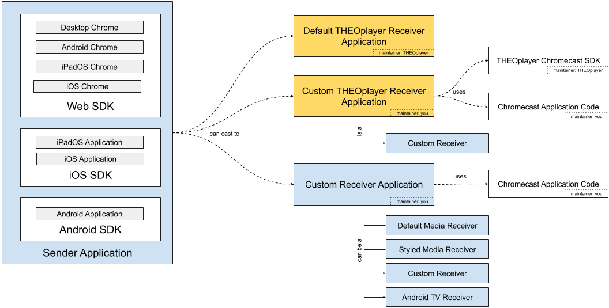

# Introduction

In this section you will learn everything about how THEOplayer works with Chromecast.

## API

As a developer, you might need to use the THEOplayer Chromecast API to build a custom Chromecast UI and UX,
or to dispatch an event to an analytics service, or for workflow purposes.

The Chromecast interface is a sub-interface of the Cast interface on THEOplayer Web and on both mobile (Android & iOS) SDKs.

The API reference is available through the following links:

- Web SDK: [Chromecast](pathname:///theoplayer/v6/api-reference/web/interfaces/Chromecast.html), which inherits from [VendorCast](pathname:///theoplayer/v6/api-reference/web/interfaces/VendorCast.html)
- Android SDK: [Chromecast](pathname:///theoplayer/v6/api-reference/android/api/cast/chromecast/Chromecast.html)
- iOS SDK: [Chromecast](pathname:///theoplayer/v6/api-reference/ios/Protocols/Chromecast.html)

Use the API as demonstrated below:

#### THEOplayer Web SDK

```javascript
// const player = new THEOplayer.Player(...)
const chromecastState = player.cast.chromecast.state;
const isCasting = player.cast.chromecast.casting; // true or false
// ...
// if (want to start Chromecast)
player.cast.chromecast.start();
// ...
// if (want to stop Chromecast)
player.cast.chromecast.stop();
// ...
if (chromecastState != "unavailable") {
  // Chromecast is possible
  player.cast.chromecast.addEventListener("statechange", function (event) {
    switch (event.state) {
      case "connecting":
        // show Chromecast trying-to-connect icon
        break;
      case "available":
        // show Chromecast available icon
        break;
      case "connected":
        // show Chromecast connected icon
        break;
      case "unavailable":
        // hide Chromecast icon
        break;
    }
  });
}
```

#### THEOplayer Android SDK

##### Android SDK

```java
// Verify the Cast dependency is present in your build.gradle file.
// Add Cast Integration to the player.
CastIntegration castIntegration = CastIntegrationFactory.createCastIntegration(theoplayerView);
theoplayerView.getPlayer().addIntegration(castIntegration);

// For actions you can use both the THEOplayerView and the CastIntegration object.
theoplayerView.getCast().getChromecast().start();
// or
castIntegration.start();

// For listening to events nothing changed.
theoplayerView.getCast().getChromecast().addEventListener(ChromecastEventTypes.STATECHANGE, event -> {
    // See Android section.
});
```

##### Legacy Android SDK (4.12.x)

```java
PlayerCastState chromecastState = theoplayerView.getCast().getChromecast().getState();
boolean isCasting = theoplayerView.getCast().isCasting();
// if (want to start Chromecast)
theoplayerView.getCast().getChromecast().start();
// if (Want to stop Chromecast)
theoplayerView.getCast().getChromecast().stop();
theoplayerView.getCast().getChromecast().addEventListener(ChromecastEventTypes.STATECHANGE, event -> {
    if (event.getState() == PlayerCastState.AVAILABLE) {
        // show Chromecast available icon
    } else if (event.getState() == PlayerCastState.CONNECTED) {
        // show Chromecast connected icon
    } else if (event.getState() == PlayerCastState.CONNECTING) {
        // show Chromecast connecting icon
    } else if (event.getState() == PlayerCastState.UNAVAILABLE) {
        // show Chromecast unavailable icon
    }
});
```

#### THEOplayer iOS SDK

```swift
private func setupTheoplayer() {
    // player = THEOplayer(...)
    let chromecastState = theoplayer.cast?.chromecast?.state
    let isCasting = theoplayer.cast?.chromecast?.casting
    // ...
    // if (want to start Chromecast)
        theoplayer.cast?.chromecast?.start()
    // if (want to stop Chromecast)
        theoplayer.cast?.chromecast?.stop()
    // ...
    theoplayer.cast?.chromecast?.addEventListener(type: ChromecastEventTypes.STATE_CHANGE, listener: onStateChange)
}

private func onStateChange(event: ChromecastStateChangeEvent) {
    if (event.state == PlayerCastState.available) {
        // show Chromecast available icon
    } else if (event.state == PlayerCastState.connected) {
        // show Chromecast connected icon
    } else if (event.state == PlayerCastState.connecting) {
        // show Chromecast connecting icon
    } else if (event.state == PlayerCastState.unavailable) {
       // show Chromecast unavailable icon
    }
    print(event.state)
    print(self.player.cast?.chromecast?.casting)
}
```

## Related articles

- [Connecting from custom Sender applications](../../../how-to-guides/03-cast/01-chromecast/01-connecting-from-custom-sender-applications.md)
- [Debugging](../../../how-to-guides/03-cast/01-chromecast/02-debugging.md)
- [How to configure a different stream to Chromecast](../../../how-to-guides/03-cast/01-chromecast/03-how-to-configure-to-a-different-stream.md)
- [Sending messages from/to Sender to/from Receiver](../../../how-to-guides/03-cast/01-chromecast/04-sending-messages-from-to-sender-to-from-receiver.md)
- [Pass subtitle selection on to Chromecast](../../../how-to-guides/03-cast/01-chromecast/05-pass-subtitle-section-on-to-chromecast.md)
- [Enable Chromecast on the Sender](../../../how-to-guides/03-cast/01-chromecast/06-enable-chromecast-on-the-sender.md)

## Sender Applications vs Receiver Applications

When a viewer is streaming through a Chromecast device, they are actually casting content from a sender application (e.g. an Android application) to a receiver application. A sender application informs a physical Chromecast device which receiver application it should load through an application ID.

If you have implemented THEOplayer in your sender application, you can [enable Chromecast](../../../how-to-guides/03-cast/01-chromecast/06-enable-chromecast-on-the-sender.md). Furthermore, you can also [specify the application ID](../../../how-to-guides/03-cast/01-chromecast/06-enable-chromecast-on-the-sender.md#custom-receiver-app) in your sender application.



By specifying the application ID, you implicitly connect it with a type of receiver application. The following three types of receiver applications are common:

| Type                                    | Maintainer             | Info                                                                                                                                                                                                               | Benefits                                                                                                                                                                                                      | Disadvantages                                                                                                                       |
| --------------------------------------- | ---------------------- | ------------------------------------------------------------------------------------------------------------------------------------------------------------------------------------------------------------------ | ------------------------------------------------------------------------------------------------------------------------------------------------------------------------------------------------------------- | ----------------------------------------------------------------------------------------------------------------------------------- |
| Default THEOplayer Receiver Application | THEOplayer             | This is the default receiver application THEOplayer SDKs will connect with. The app ID of this default THEOplayer receiver application is `1ADD53F3` and it is hosted on `https://d3ojqkc95d8mrd.cloudfront.net/`. | You (i.e. the developer) do not need to do anything extra on the Chromecast receiver application side. You don't need to create a Chromecast receiver, you don't need to register it at, ... - it just works. | You are limited w.r.t. customizing the UI and integrating custom logic.                                                             |
| Custom THEOplayer Receiver Application  | Developer + THEOplayer | This is a custom receiver application you can build, and where you integrate the [THEOplayer Chromecast SDK](../../../getting-started/01-sdks/06-chromecast/00-getting-started.md).                                | You (i.e. the developer) can adjust the look and feel, and integrate custom logic.                                                                                                                            | You need to create a Chromecast receiver, register it, maintain it, ...                                                             |
| Customer Receiver Application           | Developer              | This is a custom receiver application you can build, but without using the THEOplayer Chromecast SDK.                                                                                                              | The THEOplayer Chromecast Receiver SDK is not a dependency.                                                                                                                                                   | You are responsible for building and maintaining the receiver application, and its connection with the various sender applications. |

## Whitelisting Receiver Applications

Streaming services and products often require you to whitelist domain names to allow playback.
When viewers are casting content to a Chromecast receiver application, your Chromecast device
will actually stream the content on a domain name. In other words: CORS and whitelisting/blacklisting policies do apply to Chromecast sessions.
Ensure that you've whitelisted the domain name which hosts your Chromecast receiver application. (You can look up the domain name of your receiver application at https://cast.google.com/publish/#/overview.)

If you're using the Default THEOplayer Receiver Application you may whitelist `https://d3ojqkc95d8mrd.cloudfront.net/`.
