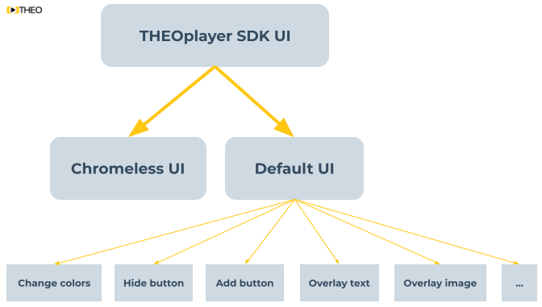
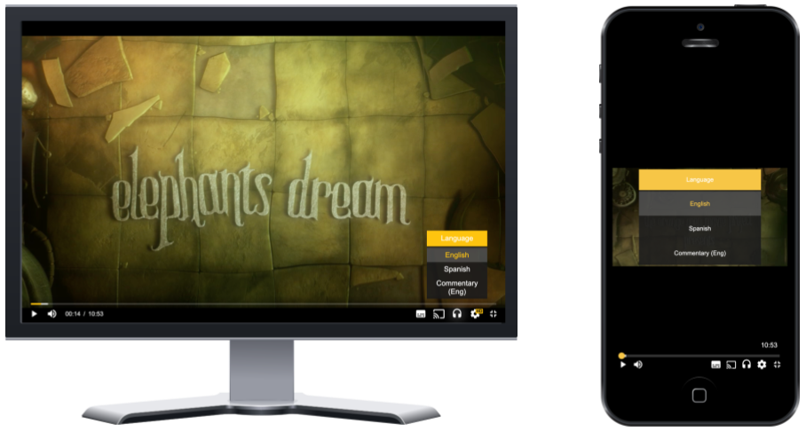
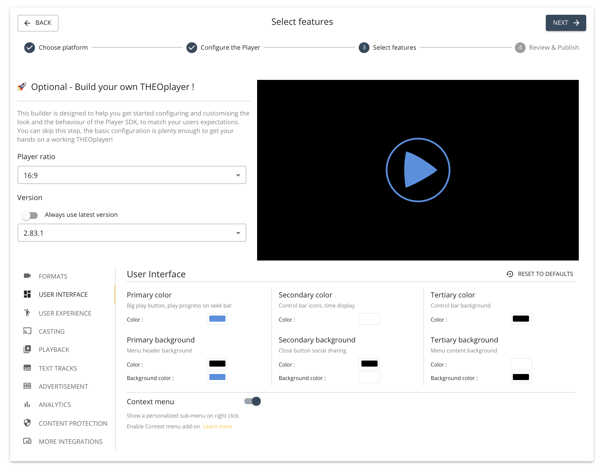

# Introduction

THEOplayer has a default user interface (UI). The default UI is optimized for browsers, mobile devices and tablets.
As a developer, you may A) use this UI as is, B) customize it, or C) create a brand-new Chromeless UI, as depicted in the screenshot below.

The default UI is responsive, so it looks different depending on your device, as visualized in the screenshot below.

The default UI has all the basic controls you'd expect from a video player, ranging from a scrub bar to a fullscreen button.

Building a Chromeless UI means building a new UI from scratch using the THEOplayer API and custom application code.
In other words: you are responsible for inserting your own controls (e.g. a play button),
and connecting it with the THEOplayer API (e.g. `player.play()`).

Note that some features are dependent on our default UI, because they are built on top of our default UI.
For example, the [Up Next](../../how-to-guides/07-miscellaneous/03-up-next.md) feature (and API) wouldn't work when you build a Chromeless UI.

## Customize the UI

The next sections tackle the following topics:

1. [Default UI versus Chromeless UI](#default-ui-versus-chromeless-ui)
2. [Modify default UI](#modify-default-ui)
3. [Implement Chromeless UI](#implement-chromeless-ui)

### Default UI versus Chromeless UI

It's possible that the envisioned design of your video player looks different from THEOplayer's default UI.
When that happens, your team has to decide whether to A) customize THEOplayer's default UI, or B) implement a Chromeless UI.

The default UI has all the basic functionality you expect from a video player, but it might be missing some more exotic UI (or UX) features.
Changing the colors of the default UI is relatively straightforward, as is hiding a default control item (e.g. the fullscreen button),
as is inserting a new button in the default control bar.
However, truly transforming the default UI, such as repositioning elements, using all new icons, and more complex operations,
can be quite challenging.

Implementing a Chromeless UI gives you total control of your UI and UX.
However, this requires an understanding of video and the THEOplayer API, and you might feel like you're reinventing the wheel.

So what to pick: modify the default UI or implement a Chromeless UI?

If the envisioned design looks "quite different" from the default UI, we encourage people to implement a Chromeless UI.
Alternatively, if that isn't an option, we advise people to compromise, and to adapt their envisioned design to look "quite similar" to the default UI.

If you are targeting mobile applications through our iOS and Android SDK,
you should consider the fact that you'll be using JavaScript and CSS to modify it.
You may like this (because you can re-use it across iOS and Android), or you may dislike it because you have to operate
outside your "native codebase".

Furthermore, if you're using frameworks like React Native and Flutter, modifying a WebView contained by a native module might be another consideration.

Our default UI is not optimized for big screen devices like Samsung Tizen, LG webOS and Android TV.
If you're targeting those (and similar devices), you should consider implementing a Chromeless UI,
as demonstrated on our [Tizen](https://github.com/THEOplayer/samples-tizen) and [webOS](https://github.com/THEOplayer/samples-webos)
Github repositories.

Our default UI for Apple TV (i.e. tvOS SDK) is similar to the default Apple TV video player.
You should consider a Chromeless UI for this platform should you want to divert from this design.

### Modify default UI

You can modify the default UI through JavaScript and CSS.

Changing the colors is quite easy. There's a GUI when building your Web SDK at [https://portal.theoplayer.com](https://portal.theoplayer.com)
to generate code (depicted in the screenshot below), or you can use a similar tool at [https://demo.theoplayer.com/ui-skinning](https://demo.theoplayer.com/ui-skinning).
More information on changing the colors is available at our article on [UI skinning](13-ui-skinning.md).

The default UI is a fork of Video.js 5, so you may also use the Video.js 5 API to modify the UI, as demonstrated in some of our articles.
This may - for example - simplify the process of [adding a new button](../../how-to-guides/11-ui/07-how-to-insert-a-button.md) to the default control bar.

Removing a button is a matter of identifying the appropriate CSS selector, and configuring `display: none!important`.

Overlaying text and images is a matter of overlaying a custom `
` (or native element) on top of the THEOplayer container.

#### iOS and Android SDK

The default UI on our iOS and Android SDK is the same UI as our Web SDK.
This default UI is implemented by overlaying a WebView on top of the video player.

In other words, to modify the default UI, you should use JavaScript and CSS,
as explained in our customization articles for [Android Legacy (4.12.x)](../../getting-started/01-sdks/02-android/01-android-sdk-customization.md) and [iOS](../../getting-started/01-sdks/03-ios/01-ios-sdk-customization.md).

#### Related articles

Below are some articles related to modifying our default UI:

- [Is it possible to remove an element from the UI?](../../how-to-guides/11-ui/01-is-it-possible-to-remove-an-element.md)
- [How to align the timeline in the middle](../../how-to-guides/11-ui/02-how-to-align-timeline-in-the-middle.md)
- [How to change the Big Play Button?](../../how-to-guides/11-ui/03-how-to-change-big-play-button.md)
- [How to make the control bar always visible?](../../how-to-guides/11-ui/04-how-to-make-control-keys-always-visible.md)
- [Is it possible to hide/disable the Google IMA UI](../../how-to-guides/11-ui/05-is-it-possible-to-hide-googla-ima.md)
- [How to insert a button](../../how-to-guides/11-ui/07-how-to-insert-a-button.md)
- [How to change the default UI language to other](../../how-to-guides/11-ui/08-how-to-change-default-UI-language-to-other.md)
- [Customize UI during ad playback](../../how-to-guides/11-ui/09-customize-ui-during-playback.md)
- [How to change how a video should be fit inside of a container](../../how-to-guides/11-ui/10-how-to-change-how-a-video-should-fit-inside-a-container.md)
- [How to make an audio-only player](../../how-to-guides/11-ui/11-how-to-make-audio-only-player.md)
- [Customizing the UI: vertical volume slider](../../how-to-guides/11-ui/12-customising-vertical-volume-slider.md)
- [UI Skinning](../../how-to-guides/11-ui/13-ui-skinning.md)

### Implement Chromeless UI

Building a Chromeless UI may be daunting at first, but it's rewarding.
A Chromeless UI gives you full control over your UI and UX,
but you must understand the flow of a video, its API and its events.

Refer to our article on [How to build a Chromeless UI](../../how-to-guides/11-ui/06-how-to-build-chromeless-ui.mdx) for more information.

#### iOS and Android SDK

You can implement a Chromeless UI on iOS and Android completely on top of THEOplayer through the native technologies and programming languages.
The THEOplayer API exposes all the events and properties that you need to implement a custom design.

Alternatively, for these mobile SDKs, you may implement your Chromeless UI in our WebView,
as this allows you to re-use your implementation across Android and iOS.
