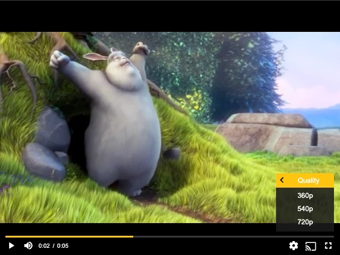

# How to customise quality selection & labels (MP4)

Some of our customers prefer MP4 assets over HLS/MPEG-DASH ones. One major downside to this approach is that Adaptive Bitrate Streaming (ABR) is not possible with such streams, as they don't have a playlist with multiple qualities.

To counter this, we've made it possible to pass on a list of MP4 qualities & switch between them manually, to improve the overall UX. What is nice about this piece of integration code, is that it can be tweaked and applied to customise other parts of the default UI as well!

## SDKs

| Web SDK | Android SDK | iOS SDK | tvOS SDK | Android TV SDK | Chromecast SDK |
| :-----: | :---------: | :-----: | :------: | :------------: | :------------: |
|   Yes   |     Yes     |   Yes   |   N/A    |      Yes       |      N/A       |

## Customizing the quality selector & labels

This example explains how to customise quality selection & labels for MP4 assets.

##### Web SDK

First of all, we need to [set up the player](./00-getting-started.mdx) (don't forget to edit the placeholders to match your setup).

Then, the different MP4 qualities of the same asset need to be stated, along with the corresponding resolutions:

```js
// set your resolutions and sources
var resolutions = [
  { name: "360p", src: "http://example.com/demos/sample-videos/low.mp4" },
  { name: "540p", src: "http://example.com/demos/sample-videos/medium.mp4" },
  { name: "720p", src: "http://example.com/demos/sample-videos/high.mp4" }
];
```

Now for the slightly trickier part: Removing current & adding custom menu

```js
var currentTime, wasPaused;
var settingsMenu = player.ui
  .getChild("ControlBar")
  .getChild("SettingsButton").menu;

// Remove built-in quality sub menu
settingsMenu.removeMenuItem(settingsMenu.menuItems[0]);

// Create custom quality sub menu
var qualityMenuItem = settingsMenu.addSubMenuItem({
  index: 0
});
var qualityMenuTitle = document.createElement("span");
qualityMenuTitle.className = "theo-settings-control-menu-item-title";
qualityMenuTitle.innerHTML = "Quality";
var qualityMenuValue = document.createElement("span");
qualityMenuValue.className = "theo-settings-control-menu-item-value";
qualityMenuItem.el().appendChild(qualityMenuTitle);
qualityMenuItem.el().appendChild(qualityMenuValue);
qualityMenuItem.subMenu.menuHeader.el().innerHTML = "Quality";
var qualityItems = resolutions.map(function (resolution) {
  var qualityItem = qualityMenuItem.subMenu.addMenuItem();
  qualityItem.el().innerHTML = resolution.name;
  qualityItem.on("click", function () {
    selectQuality(resolution);
  });
  return qualityItem;
});

// Getting the player/UI in the correct state
function selectQuality(resolution) {
  qualityMenuValue.innerHTML = resolution.name;
  currentTime = player.currentTime;
  wasPaused = player.paused;
  player.src = resolution.src;
  player.currentTime = currentTime;
  if (!wasPaused) {
    player.play();
  }
  var qualityItem = qualityItems[resolutions.indexOf(resolution.name)];
  qualityItems.forEach(function (item) {
    item.selected(item === qualityItem);
  });
}
selectQuality(resolutions[0]);
```

##### Android SDK

The above JavaScript code can be used for Android projects by injecting the JavaScript code.
Documentation for: [Injecting CSS and JavaScript to Android/iOS](../../../../version-v4/faq/01-how-to-add-css-or-javascript-files-to-android-ios.md)

##### Legacy iOS/tvOS SDK (4.12.x)

The above JavaScript code can be used for Android projects by injecting the JavaScript code.
Documentation for: [Injecting CSS and JavaScript to Android/iOS](../../../../version-v4/faq/01-how-to-add-css-or-javascript-files-to-android-ios.md)

You can now select multiple qualities of the same MP4 asset!


