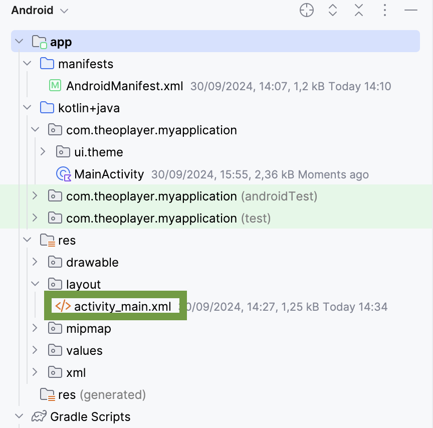
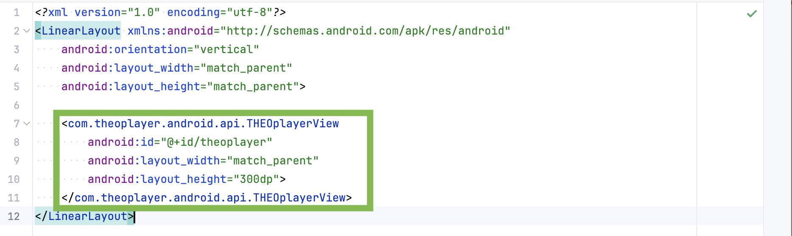
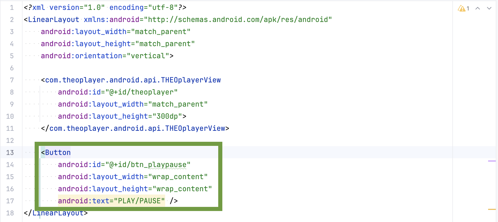
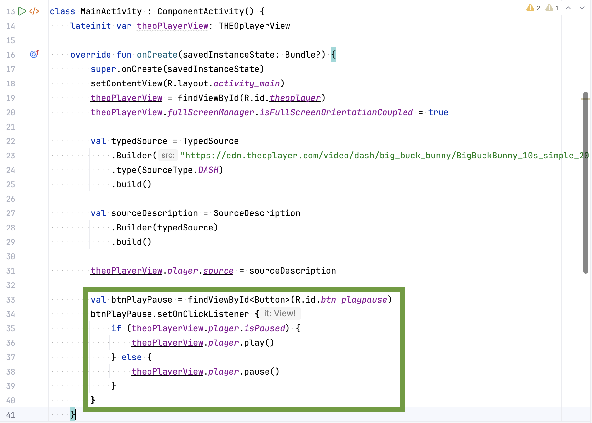
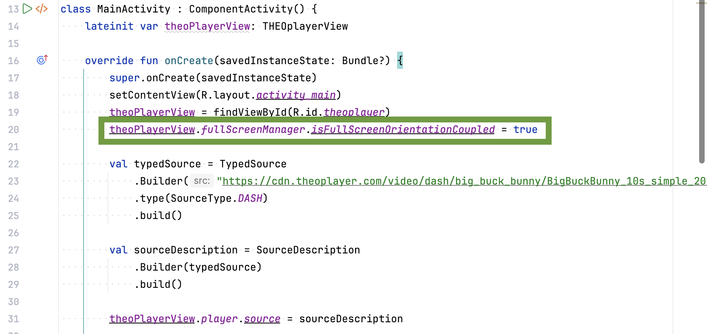
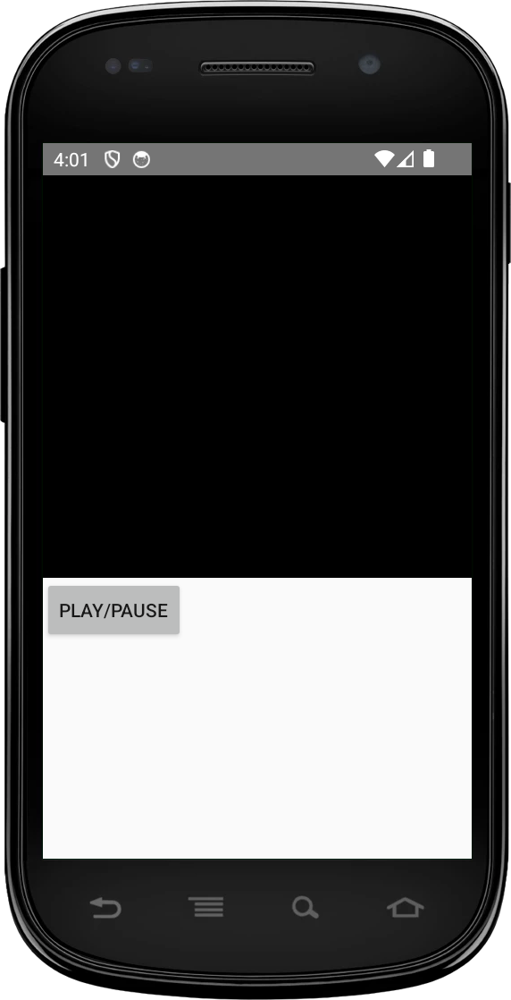
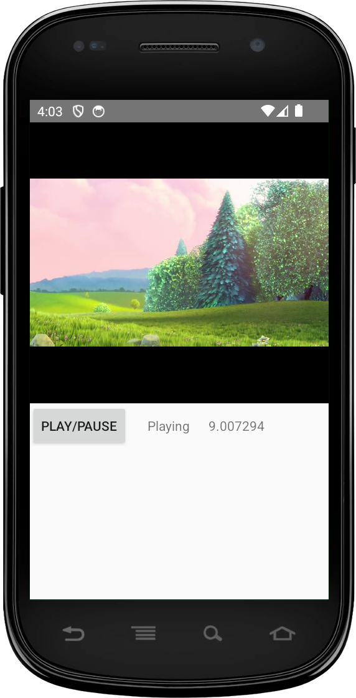
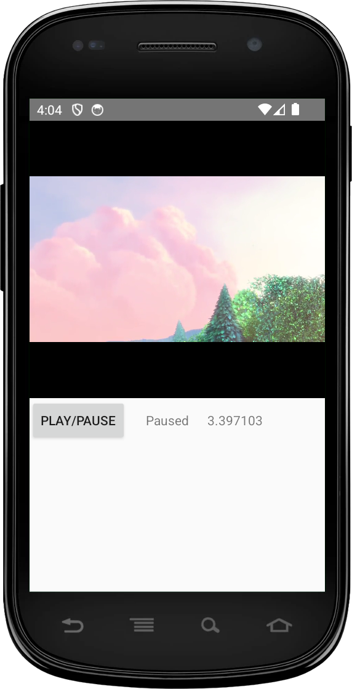
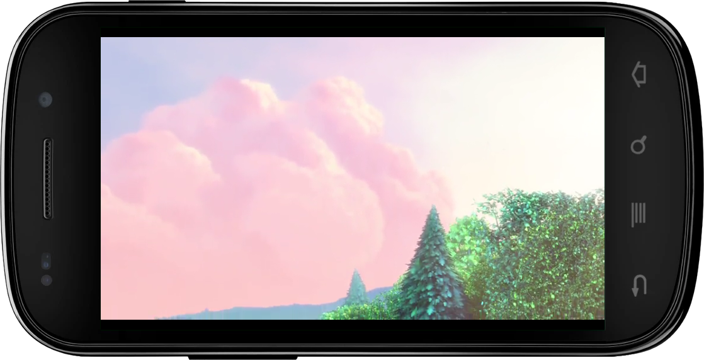

import Tabs from '@theme/Tabs';
import TabItem from '@theme/TabItem';

# Getting started on Android

## Add THEOplayer and Kotlin libraries to your application

We have to modify the `build.gradle` files to be able to fetch the Android SDK and the Kotlin plugin.

1. In your **top-level** (project) `settings.gradle.kts` file

1. Add the THEOplayer Maven repository.
<Tabs queryString="lang">
   <!-- prettier-ignore-start -->
   <TabItem value="groovy" label="Groovy">
    ```groovy
    dependencyResolutionManagement {
        repositories {
            google()
            mavenCentral()
            maven { url "https://maven.theoplayer.com/releases" }
        }
    }
    ```
    </TabItem>
    <TabItem value="kotlin" label="Kotlin">
    ```kotlin
    dependencyResolutionManagement {
        repositories {
            google()
            mavenCentral()
            maven { url = uri("https://maven.theoplayer.com/releases") }
        }
    }
    ```
    </TabItem>
    <!-- prettier-ignore-end -->
</Tabs>

1. Next, we need to edit the `build.gradle` on the **module-level** (**app/build.gradle**)

<Tabs queryString="lang">
   <!-- prettier-ignore-start -->
   <TabItem value="groovy" label="Groovy">
    ```groovy
    implementation "com.theoplayer.theoplayer-sdk-android:core:+"
    implementation "org.jetbrains.kotlin:kotlin-stdlib:1.6.21"
    implementation "androidx.appcompat:appcompat:1.7.0"
    ```
    </TabItem>
    <TabItem value="kotlin" label="Kotlin">
    ```kotlin
    implementation("com.theoplayer.theoplayer-sdk-android:core:+")
    implementation("org.jetbrains.kotlin:kotlin-stdlib:1.6.21")
    implementation("androidx.appcompat:appcompat:1.7.0")
    ```
    </TabItem>
    <!-- prettier-ignore-end -->
</Tabs>

<u>Note</u>: It's possible to replace the `+` with a particular version of THEOplayer that should be used, for example:

`implementation 'com.theoplayer.theoplayer-sdk-android:core:6.0.0'`

## Setting up the license

You need to configure your THEOplayer license, if you don't enter this license string, you might encounter licensing issues (e.g.: when trying to play non-whitelisted video streams).

First, obtain a THEOplayer Android SDK license through the [THEOplayer Developer Portal](https://portal.theoplayer.com/login).


Then, identify your license string from the screenshot above and add the `<meta-data ...` tag below at the appropriate location in your `AndroidManifest.xml`, and swap `your_license_here` with your
actual license string.

```xml
<application>
    <meta-data
        android:name="THEOPLAYER_LICENSE"
        android:value="your_license_here" />
</application>
```

Additionally, to play online videos with THEOplayer, you first need to add [INTERNET](https://developer.android.com/reference/android/Manifest.permission.html#INTERNET) permission into the `AndroidManifest.xml` file too.

```xml
<uses-permission android:name="android.permission.INTERNET" />
```

More information regarding the license can be found [here](../../../how-to-guides/12-license/00-introduction.md).

## Add THEOplayer view to your application

THEOplayer can be added to an Android application either:

1. **Through a layout (XML)**: By adding the `THEOplayerView` to your layout XML file (e.g., `activity_main.xml`), or
2. **Programmatically using the Constructor API**: This approach also allows you to configure the license string through a programmatic configuration instead of the `AndroidManifest.xml`.

### Adding THEOplayerView via XML layout

You can add the `THEOplayerView` to the layout of the `MainActivity` with the snippet below.



At least the `id`, `width` and `height` attributes need to be specified on the new view. The `id` is important as it is used to identify the view object in your `MainActivity` class.

```xml
<com.theoplayer.android.api.THEOplayerView
    android:id="@+id/theoplayer"
    android:layout_width="match_parent"
    android:layout_height="300dp"
    app:layout_constraintTop_toTopOf="parent">
</com.theoplayer.android.api.THEOplayerView>
```



### Adding THEOplayerView programmatically (Constructor API)

In the Activity/Fragment, you can use the [constructor API](https://docs.theoplayer.com/api-reference/android/index.html?com/theoplayer/android/api/THEOplayerView.html) to create a THEOplayer instance
by passing along a context and a [`THEOplayerConfig`](https://docs.theoplayer.com/api-reference/android/index.html?com/theoplayer/android/api/THEOplayerConfig.html).

In this `THEOplayerConfig`, you can configure your license string, as demonstrated in the snippet below.

<Tabs queryString="lang">
   <!-- prettier-ignore-start -->
   <TabItem value="kotlin" label="Kotlin">
    ```kotlin
    val playerConfig = THEOplayerConfig.Builder()
        .license("your_license_here")
        .build()

    val theoPlayerView = THEOplayerView(this, playerConfig)
    ```
    </TabItem>
    <TabItem value="java" label="Java">
    ```java
    THEOplayerConfig playerConfig = new THEOplayerConfig.Builder()
        .license("your_license_here")
        .build();

    THEOplayerView theoPlayerView = new THEOplayerView(this, playerConfig);
    ```
    </TabItem>
    <!-- prettier-ignore-end -->

</Tabs>

This approach is ideal when you need to adjust the configuration dynamically, such as during runtime or based on specific app conditions. It removes the need for XML-based configuration and is useful for advanced customization scenarios.

## Use THEOplayer API in your application

Now in the `MainActivity` we can retrieve the `THEOplayerView` by the `id` we set earlier using the `findViewById` method.

### 1. Get the THEOplayer instance

<Tabs queryString="lang">
       <!-- prettier-ignore-start -->
       <TabItem value="kotlin" label="Kotlin">
            ```kotlin
            ...
            import com.theoplayer.android.api.THEOplayerView

            class MainActivity : ComponentActivity() {
                lateinit var theoPlayerView: THEOplayerView

                override fun onCreate(savedInstanceState: Bundle?) {
                    super.onCreate(savedInstanceState)
                    setContentView(R.layout.activity_main)
                    theoPlayerView = findViewById(R.id.theoplayer)
                }
            }
            ```
        </TabItem>
        <TabItem value="java" label="Java">
            ```java

            import com.theoplayer.android.api.THEOplayerView;

            public class MainActivity extends ComponentActivity {
                private THEOplayerView theoPlayerView;

                @Override
                protected void onCreate(@Nullable Bundle savedInstanceState) {
                    super.onCreate(savedInstanceState);
                    setContentView(R.layout.activity_main);
                    theoPlayerView = findViewById(R.id.theoplayer);
                }
            }
            ```
        </TabItem>
        <!-- prettier-ignore-end -->
    </Tabs>

### 2. Configure source

To play a video in THEOplayer, we need to configure a source for the player in our `MainActivity`:

<Tabs queryString="lang">
       <!-- prettier-ignore-start -->
       <TabItem value="kotlin" label="Kotlin">
        ```kotlin
        val typedSource = TypedSource
            .Builder("https://cdn.theoplayer.com/video/dash/big_buck_bunny/BigBuckBunny_10s_simple_2014_05_09.mpd")
            .type(SourceType.DASH)
            .build()

        val sourceDescription = SourceDescription
            .Builder(typedSource)
            .build()

        theoPlayerView.player.source = sourceDescription
        ```

        </TabItem>
        <TabItem value="java" label="Java">
        ```java
        TypedSource typedSource = new TypedSource
                .Builder("https://cdn.theoplayer.com/video/dash/big_buck_bunny/BigBuckBunny_10s_simple_2014_05_09.mpd")
                .type(SourceType.DASH)
                .build();

        SourceDescription sourceDescription = new SourceDescription
                .Builder(typedSource)
                .build();

        theoPlayerView.getPlayer().setSource(sourceDescription);
        ```
        </TabItem>
        <!-- prettier-ignore-end -->
    </Tabs>

### 3. Control THEOplayer through the API

We will now introduce a button to start/stop the video in the player.

First add the button to our `activity_main.xml` layout file.

```xml
<Button
        android:layout_width="wrap_content"
        android:layout_height="wrap_content"
        android:id="@+id/btn_playpause"
        android:text="PLAY/PAUSE" />
```



Then set an `OnClickListener()` on the button in our `MainActivity` code to trigger `play()` and `pause()` on the player.

<Tabs queryString="lang">
       <!-- prettier-ignore-start -->
       <TabItem value="kotlin" label="Kotlin">
        ```kotlin
        val btnPlayPause = findViewById<Button>(R.id.btn_playpause)
        btnPlayPause.setOnClickListener {
            if (theoPlayerView.player.isPaused) {
                theoPlayerView.player.play()
            } else {
                theoPlayerView.player.pause()
            }
        }
        ```
        </TabItem>
        <TabItem value="java" label="Java">
        ```java
        Button btnPlayPause = findViewById(R.id.btn_playpause);
        btnPlayPause.setOnClickListener(new View.OnClickListener() {
            @Override
            public void onClick(View v) {
                if (theoPlayerView.getPlayer().isPaused()) {
                    theoPlayerView.getPlayer().play();
                } else {
                    theoPlayerView.getPlayer().pause();
                }
            }
        });
        ```
        </TabItem>
        <!-- prettier-ignore-end -->
    </Tabs>



### 4. Listen for THEOplayer events

The next step is listening for player events.

First, we need to create two more TextViews in the `activity_main.xml` file.

```xml
<TextView
    android:layout_width="wrap_content"
    android:layout_height="wrap_content"
    android:id="@+id/txt_playstatus"
    android:layout_marginStart="20dp"/>

<TextView
    android:layout_width="wrap_content"
    android:layout_height="wrap_content"
    android:id="@+id/txt_timeupdate"
    android:layout_marginStart="20dp"/>
```

We will now listen for `PLAY`, `PAUSE` and `TIMEUPDATE` in this example.

<Tabs queryString="lang">
       <!-- prettier-ignore-start -->
       <TabItem value="kotlin" label="Kotlin">
        ```kotlin
        val txtPlayStatus = findViewById<TextView>(R.id.txt_playstatus)
        val txtTimeUpdate = findViewById<TextView>(R.id.txt_timeupdate)

        theoPlayerView.player.addEventListener(PlayerEventTypes.PLAY) {
            txtPlayStatus.text = "Playing"
        }

        theoPlayerView.player.addEventListener(PlayerEventTypes.PAUSE) {
            txtPlayStatus.text = "Paused"
        }

        theoPlayerView.player.addEventListener(PlayerEventTypes.TIMEUPDATE) { timeUpdateEvent ->
            txtTimeUpdate.text = timeUpdateEvent.currentTime.toString()
        }
        ```
        </TabItem>
        <TabItem value="java" label="Java">
        ```java
        TextView txtPlayStatus = findViewById(R.id.txt_playstatus);
        TextView txtTimeUpdate = findViewById(R.id.txt_timeupdate);

        theoPlayerView.getPlayer().addEventListener(PlayerEventTypes.PLAY, new EventListener<PlayEvent>() {
            @Override
            public void handleEvent(PlayEvent playEvent) {
                txtPlayStatus.setText("Playing");
            }
        });

        theoPlayerView.getPlayer().addEventListener(PlayerEventTypes.PAUSE, new EventListener<PauseEvent>() {
            @Override
            public void handleEvent(PauseEvent pauseEvent) {
                txtPlayStatus.setText("Paused");
            }
        });

        theoPlayerView.getPlayer().addEventListener(PlayerEventTypes.TIMEUPDATE, new EventListener<TimeUpdateEvent>() {
            @Override
            public void handleEvent(TimeUpdateEvent timeUpdateEvent) {
                txtTimeUpdate.setText(String.valueOf(timeUpdateEvent.getCurrentTime()));
            }
        });
        ```
        </TabItem>
        <!-- prettier-ignore-end -->
    </Tabs>

When the events are triggered, we will update the **MainActivity** UI with the corresponding state.

### 5. Play fullscreen video in landscape mode

THEOplayer SDK contains a default fullscreen activity which can be started automatically when you rotate your device.

We have to configure our player instance in the `MainActivity` to react to orientation changes and start the Fullscreen activity.

<Tabs queryString="lang">
       <!-- prettier-ignore-start -->
       <TabItem value="kotlin" label="Kotlin">
        ```kotlin
        override fun onCreate(savedInstanceState: Bundle?) {
            //...
            theoPlayerView = findViewById(R.id.theoplayer)
            theoPlayerView.settings.isFullScreenOrientationCoupled = true
            //...
        }
        ```
        </TabItem>
        <TabItem value="java" label="Java">
        ```java
        @Override
        protected void onCreate(Bundle savedInstanceState) {
            // ...
            theoPlayerView = findViewById(R.id.theoplayer);
            theoPlayerView.getSettings().setFullScreenOrientationCoupled(true);
            // ...
        }
        ```
        </TabItem>
        <!-- prettier-ignore-end -->
    </Tabs>



In the `AndroidManifest.xml` we can disable the default orientation behavior on our `MainActivity` and lock it in portrait. Then, because we enabled fullscreen orientation coupling with the `setFullScreenOrientationCoupled(true)` method earlier, THEOplayer will take care of the support of seamless landscape activity transition at rotation.

```xml
<activity android:name=".MainActivity"
    android:screenOrientation="userPortrait"
    android:configChanges="orientation|screenSize" >
    <intent-filter>
        <action android:name="android.intent.action.MAIN" />

        <category android:name="android.intent.category.LAUNCHER" />
    </intent-filter>
</activity>
```

If you would like to customize the Fullscreen Activity, you can take a look at our sample [here](https://github.com/THEOplayer/samples-android-sdk/tree/master/full-screen-handling).

## Couple THEOplayer with the lifecycle callbacks

In order for THEOplayer to work properly and in sync with the [Activity lifecycle changes](https://developer.android.com/guide/components/activities/activity-lifecycle) (e.g. when we rotate the device or start a new Activity or the app goes to background).
We need to call the `onResume`, `onPause` and `onDestroy` methods of the `THEOplayerView` when the matching methods are called in the Activity.

<Tabs queryString="lang">
       <!-- prettier-ignore-start -->
       <TabItem value="kotlin" label="Kotlin">
        ```kotlin
        class MainActivity : ComponentActivity() {

            // ...

            override fun onPause() {
                super.onPause()
                theoPlayerView.onPause()
            }

            override fun onResume() {
                super.onResume()
                theoPlayerView.onResume()
            }

            override fun onDestroy() {
                super.onDestroy()
                theoPlayerView.onDestroy()
            }

            // ...

        }
        ```
        </TabItem>
        <TabItem value="java" label="Java">
        ```java
        public class MainActivity extends AppCompatActivity{

            // ...

            @Override
            protected void onPause() {
                super.onPause();
                theoPlayerView.onPause();
            }

            @Override
            protected void onResume() {
                super.onResume();
                theoPlayerView.onResume();
            }

            @Override
            protected void onDestroy() {
                super.onDestroy();
                theoPlayerView.onDestroy();
            }

            // ...
        }
        ```
        </TabItem>
        <!-- prettier-ignore-end -->
    </Tabs>

## Run your application

Here you have some screenshots from the running application:

### Start screen



### Playing screen



### Paused screen



### Rotated fullscreen



## Summary

This guide focuses on creating an Android application from scratch and integrating the THEOplayer Android SDK.

- You have learned how to interact with the player via the available APIs in Kotlin and Java,
- you have registered player events,
- and you have learned how to enable automatic orientation detection.

You can find various samples for different use cases on [GitHub](https://github.com/THEOplayer/samples-android-sdk/tree/master).

Did you encounter any issues? Raise a ticket through [the ticketing system](https://opentelly.atlassian.net/servicedesk/customer/portal/1) and we will be happy to assist.
