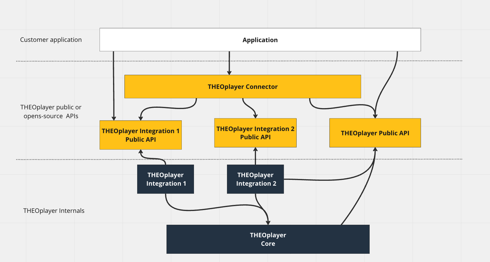

# THEOplayer 5.0 - Native Mobile iOS/tvOS and Android SDKs

Version 5.0 is a major upgrade in our THEOplayer SDK line-up.

The native mobile SDKs are re-architected and built from the ground up keeping performance, usability, and future compatibility in mind.

What does this mean?

## Performance

The legacy SDKs (4.x) did put focus on code reusability between SDKs (Web, Android, and iOS) which was really practical and helped us iterate on features faster and allowed us to bring a handful of interesting common features to the native platforms. Until a certain point where the shared code started to cause some performance hits.
This is still unnoticeable for 90% of the use cases nowadays but we wanted something better and our customers deserve something better.

### Android SDK

The new Android SDK (5.0) is a complete rewrite of the old SDK from scratch. Using low-level, platform-native APIs the new SDK competes with the best players on the market.
Thanks to our in-house expertise we don’t need any reliance on other 3rd party or open-source solutions, we have full control.

Is there a stream-specific issue? We know exactly which byte to flip and where or suggest a more specification-compliant solution on your backend.

### iOS/tvOS SDK

The iOS/tvOS SDKs also dropped the shared middle layer and are now relying on fully native APIs while keeping compatibility with the well-known universal THEOplayer APIs.
The iOS and tvOS codebase is as close as possible to each other which helps to introduce new features side by side on both platforms almost immediately. Using native platform-specific APIs gives us the control we need to deliver a top-quality playback experience on Apple devices.

## Usability

### One SDK per platform

You don’t have to worry about getting and deploying the right SDK for your application.

The Android SDK is one single universal library for all of your devices. No more Android Mobile, FireTV or AndroidTV specify builds. The new Android SDK covers all platforms within a single package that is available through Maven.

For Apple devices the provided XCFramework bundles all you need to build stunning playback experiences for iOS, iPadOS, and tvOS.

### No breaking APIs

Migration can be hard. We kept it in mind.

The new SDKs conform to the legacy (4.x) APIs to make migration easy and fun. The breaking API changes customers have to face in their applications are close to zero\*.

\*depends on the use case:
If your application is already up to date with the latest 4.x APIs (and not depending on deprecated methods) and you use features like basic playback, IMA playback, Chromecast support, then you don’t need to change anything (except registering the integrations)

### More developer control

Developers would like to know what is happening inside their applications. We would like to know it too and help them discover the changes they have to make.

THEOplayer SDK 5.0 enhances debuggability with more logs and developer friendly debug APIs to identify issues much easier. We make it our mission for the future to give developers as much control and as many debug tools as possible to find the root cause of their issues.

## Future compatibility

### Modularization

THEOplayer SDK 5.0 is built with modularization in mind. This gives us flexibility internally and easy extensibility for our partners and customers.

THEOplayer 5.0 has 3 main components:

- Core playback
- Integrations
- Connectors

### Core playback

The core playback module is the base of our SDK. It contains everything that our customers need to have basic HLS and DASH playback.

### Integration-based architecture

Every new feature can come into our player in two ways. As a new feature in the core playback module (which enhances the default playback experience), or as a new Integration module that can be optionally configured with the player.

The integrations are closed-source components where we make sure it fits into the player and it works well with current APIs.
Some of them are e.g. Google IMA integration, and Google Cast integration.

### Connector approach

The connectors are open-source THEO or community-made components that enrich the playback experience and rely only on the public player or integration APIs.

This gives our partners and customers the ability to build powerful integrations around the player without having any internal dependencies on us.

How powerful is this approach?

You can build generic or specific analytics and tracking modules.
It is possible to build open-source UI components for the player or for a specific integration.
This approach opens up the possibility of building cross-platforms SDKs.

Our THEOplayer [React Native SDK](https://www.theoplayer.com/sdk/react-native) is basically a connector on our public APIs too!

### Reliance on native APIs

Dropping the middle layer and relying only on native APIs gives us the possibility to deliver features much faster and be up-to-date with the latest platform improvements. We are not limited by the capabilities of the shared layer and we can bring new features alive as soon as they are available on the underlying platforms.

## Where to start?

### Getting started

You can follow our getting started guides for [Android](./02-android/00-getting-started.md) and for [iOS](./03-ios/00-getting-started.md)

### Migration from 4.x?

You can follow our migration guides for [Android](./02-android/02-migration-from-4.x.md) and for [iOS](./03-ios/02-migration-from-4.x.md)

#### Only one thing to keep in mind

THEOplayer Android SDK 5.0 and THEOplayer iOS/tvOS SDK 5.0 are new SDKs built from the ground up. It means that from day 1 they will not have the same feature sets available as their legacy counterparts.

We will do our best to bring feature parity with the legacy (4.x) SDKs as soon as possible.
Based on our research the current state of 5.0 covers most of the customer use cases.

### Contact us

Did you find a missing feature and something is not working as expected?

Don’t hesitate to contact us!
