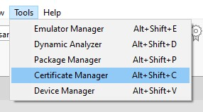
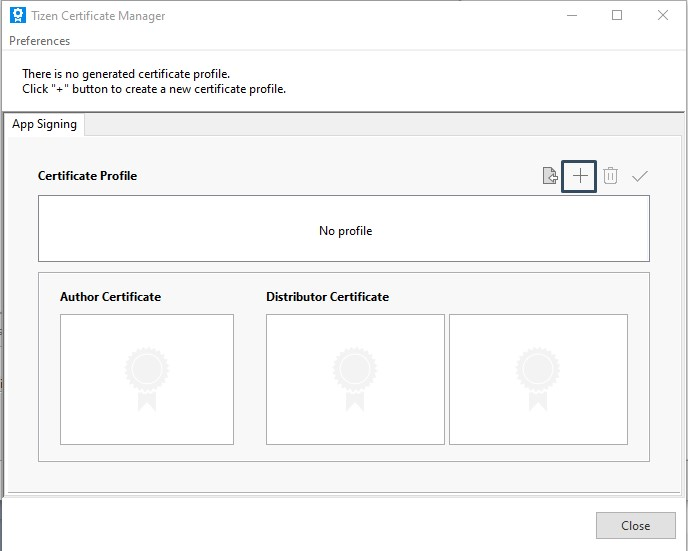
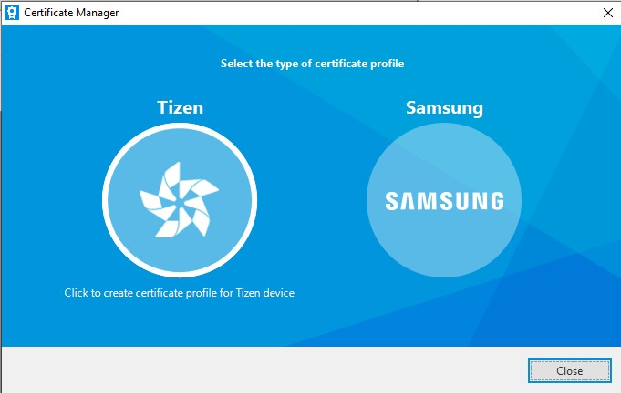
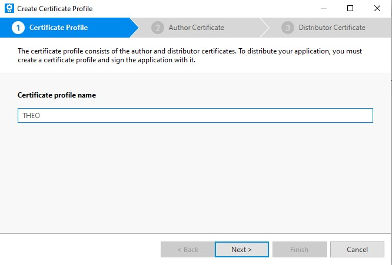
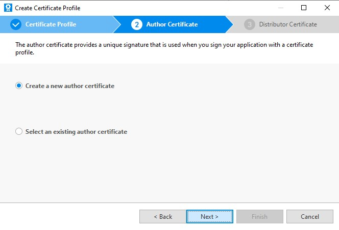
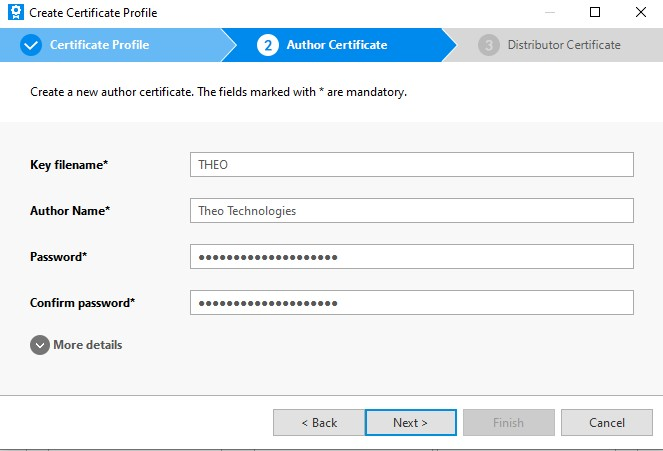
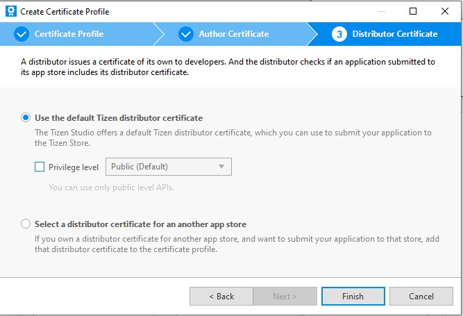
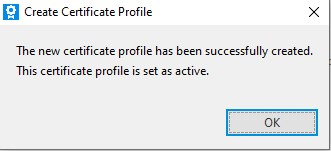
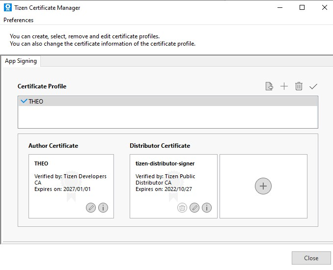

# Setting up a Tizen device for debugging

Tizen requires a certificate to launch an application on a (physical) device. Below are the steps on how to create one:

Go to Tools → Certificate Manager

In the Certificate Manager click the Add (plus) button to generate a new certificate.

Generate a Tizen Certificate

Give your certificate a profile name (name is free to pick)

Pick “Create a new author certificate” if you have never used one. If you already have one, then you can choose to select an existing author certificate instead.

If you decided to create a new author certificate, you will get this screen. Fill in the fields as requested with your own. Fill in a password. You can add additional fields when opening the “More details” component.

Pick “Use the default Tizen distributor certificate”

If everything went well, a pop-up will appear indicating that the certificate profile has been created.

Your certificate should now be available for selection.

