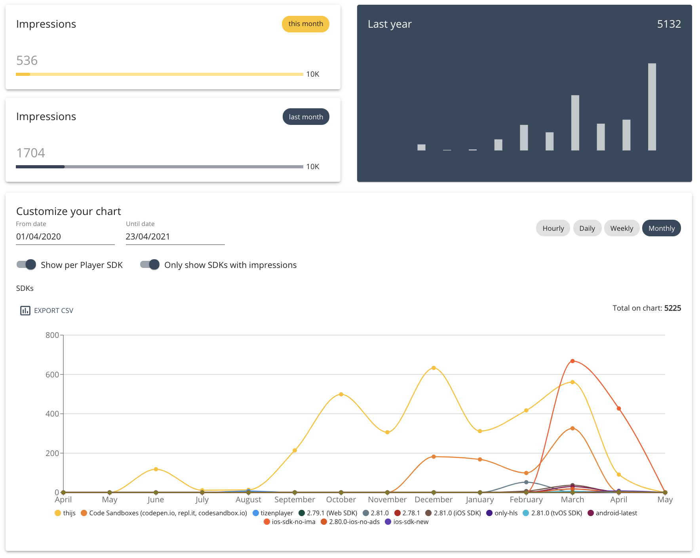

# Introduction

_Fast forward to [Integrations with commercial analytics services](#integrations-with-commercial-analytics-services) if
you want to know more about our integrations with services like Conviva, Mux and Youbora._

Video analytics offer all sorts of insights, ranging from the behavior of your viewers,
to the performance of your video players.

There are different approaches to collect these insights.

- You can use a commercial video analytics vendor (e.g. Conviva, Mux, Wicket Labs, Youbora, ...).
- You can implement a custom analytics service that you created.
- You can leverage back-end and CDN logs.

Insights are deducted from metrics. Metrics are calculated from raw video data.
For example,

1. INSIGHT: "the videos on my website start faster than the industry average (e.g. 4.71s)"
2. METRIC: "because the average video startup time was 1.7s on my website last month"
3. DATA: "that I calculated by measuring the video startup time of 1 million unique video sessions on my website"

The online video streaming industry often talks about Quality of Service (QoS) and Quality of Experience (QoE).
When talking about metrics, you'll often hear terms like Startup Time, Buffer Rate,
Error Rate, Seek Time, Exit Before Video Start.
When talking about raw data, you might hear terms like heartbeat (or ping) events, buffer events, play events, seek events and error events.

## Analytics and video players

As an application developer, you want your video player to expose an API that allows you to track video events and query
video states. With this API, a developer can implement an integration with a commercial analytics service,
or implement a connection with their custom analytics service.

With a video player, you want to be able to access the raw video data.
A video player typically doesn't calculate metrics or insights, because it doesn't have access to historical data.

As an app developer,

1. you want to track raw video data with the assistance of your video player API,
2. do some (optional) processing at runtime,
3. and forward the (processed) data to a remote analytics service.

Then, someone on the back-end, 4. would manage & manipulate this data on this remote analytics service, 5. to convert this raw data into metrics, and the metrics into insights.

## Integrations

THEOplayer _should_ be compatible with any industry-standard commercial or custom analytics service.
The THEOplayer API gives application developers access to a vast number of video events.

As an app developer,
you have the option to leverage one of our existing integrations with commercial analytics services,
or the option to create a custom integration.

### Integrations with commercial analytics services

The following commercial video analytics integrations are documented.
These articles explain how to leverage an out-of-the-box integration,
or how to implement a connector, or how to achieve a custom implementation with a specific vendor.

- [Moat](../../how-to-guides/02-analytics/01-moat.md)
- [Mux](../../how-to-guides/02-analytics/02-mux.md)
- [Youbora](../../how-to-guides/02-analytics/03-youbora.md)
- [Agama](../../how-to-guides/02-analytics/04-agama.md)
- [Conviva](../../how-to-guides/02-analytics/05-conviva/00-introduction.md)
- [Adobe Analytics](../../how-to-guides/02-analytics/07-adobe-analytics.md)
- [MediaMelon SmartSight](../../how-to-guides/02-analytics/08-mediamelon-smartsight.md)
- [Wicket Labs](../../how-to-guides/02-analytics/09-wicket-labs.md)
- [Google Analytics](../../how-to-guides/02-analytics/06-custom-analytics-integration.md#integrating-google-analytics)
- [Tealium](10-tealium.md)
- [Segment](11-segment.md)

A connector is an open-source integration that is listed on our Github at [https://github.com/THEOplayer](https://github.com/THEOplayer).
There might be connectors on our Github that are missing from the list above.

Alternatively, if you are not able to locate documentation on a specific vendor, then reach out to this vendor,
because they might be the maintainer of an integration related to THEOplayer.

### Creating a custom analytics integration

Head over to [Custom Analytics Integration](../../how-to-guides/02-analytics/06-custom-analytics-integration.md) if you want to learn more about
creating your own analytics integration using the THEOplayer API.

## THEOplayer Analytics Dashboard

If you've used the THEOplayer Developer Portal - for example to create a THEOplayer SDK -,
then you might have noticed that there is an analytics dashboard at [https://portal.theoplayer.com](https://portal.theoplayer.com).

This analytics dashboard is located in the "Usage" tab of your Portal account. The dashboard should resemble the screenshot below.

This dashboard allows you to track your [impressions](../../faq/12-what-is-an-impression.md) across different periods of times across different SDKs.

We don't _really_ consider this dashboard as a "video analytics service". The primary purpose of this dashboard is for you to monitor your impressions,
as the impressions might be related to your THEOplayer pricing model.
That being said, it is a useful dashboard, as it visualizes the consumption of your videos throughout time.
