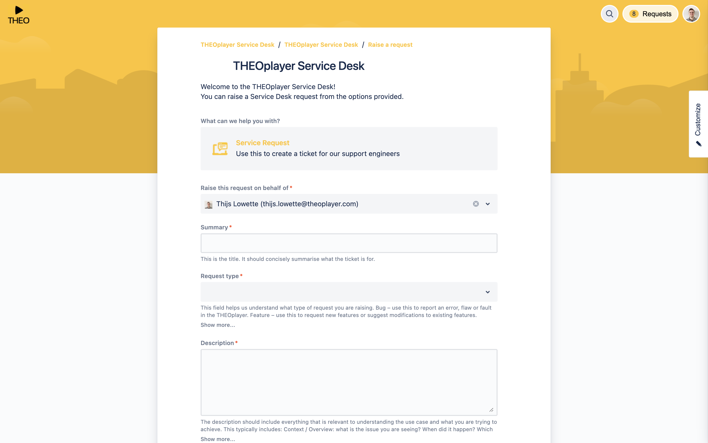

# How to create a (great) ticket

Customers can create tickets through our Jira Service Desk at https://servicedesk.theoplayer.com.
You can obtain a Service Desk account by purchasing a [support plan](https://www.theoplayer.com/supportplans) through https://portal.theoplayer.com,
or by [contacting our Sales team](https://www.theoplayer.com/pricing).

## Creating a ticket

You use our Jira Service Desk to create tickets and collaborate with our team.

When you go to https://servicedesk.theoplayer.com, you'll be asked to enter your credentials.
Afterwards, you must locate the _"Need to raise a request? Contact us."_-button, and click it.
This action will take you to https://opentelly.atlassian.net/servicedesk/customer/portal/1/group/1/create/150,
as illustrated by the screenshot below.

Enter a clear summary, select the appropriate request type, and enter a valuable description.

- Select "Information" as the request type when you're not sure how to implement a specific feature,
  or when you're not sure whether something is a bug or a feature request.
- Select "Bug" if you think your issue is due to a bug introduced by THEOplayer.
- Select "Feature" if you want to request a change or feature.
- Select "Renewals/Licensing" if you have license issues, or questions about your license.

### Creating a great ticket

A great ticket makes your life - and our life - easier.
The collaboration will go smoother, and your tickets will be resolved faster.

A great ticket is **C.R.U.S.P.** (= Collaborative, Reproducible, Use Case, Specific, Proven).

**Collaborative** | Be a team player.

- Include resources that help us understand your ticket. (For example, when documenting a difficult to reproduce bug, attach a [Loom](https://www.loom.com/) video.) Things that are obvious to you, might not be obvious to us.
- Refer to other tickets when they're related.
- Refer to documentation and samples that you think are related.
- Not sure if "something" it's relevant? Mention it regardless.

**Reproducible** | Provide simple & reliable reproduction steps and resources.

- Don't send us the link to your website. Instead, set up a simple reproduction page on https://codepen.io or https://replit.com.
- Don't send us your .apk or App Store URL. Don't send us complex code bases. Instead, fork our Github reference apps (e.g. [Basic Playback for iOS](https://github.com/THEOplayer/samples-ios-sdk/tree/master/Basic-Playback)),
  include your code that allows us to reproduce the issue, and forward it to us.
- Don't send us obfuscated, minimized or transformed (e.g. Webpack) code. Use simple code in simple environments.
- Ensure that your streams are reliable. Streams that can expire
  introduce significant overhead and will slow down the resolution time.
- Issues that you (or we) cannot consistently reproduce introduce significant overhead
  and may be rejected. Identify and describe consistent reproduction steps.
- Avoid credentials, VPNs or geo-restrictions as they introduce significant overhead.
  (If it's mandatory: specify this in every ticket. Although we might remember it recall it from your other tickets, don't assume that we remember them. Our team is spread over hundreds of customers and thousands of tickets.)

**Use case** | Provide sufficient context.

- What is the use case you're trying to achieve? _Why_ are you interested in using this API or feature?
- Providing context helps our team to tailor their answers, recommendations and alternatives.
  We want to understand your big picture -- give us chance.

**Specific** | Be as specific and detailed as you can.

- Which SDK are you using? Which version?
- What browser or platform is relevant? Which version?
- What is the current behavior? What is the expected behavior?
- What is the reproduction stream? What are the reproduction steps?

**Proven** | Provide as much self-research as possible.

- What have you done to troubleshoot it yourself?
- What happens if you try the latest version of THEOplayer? (Or an older version of THEO?)
- What happens if you try another player (e.g. Safari, Dash.js, ...)?
- What happens if you try another (third-party) stream?
- What happens if you try to implement it in a different way?
- What happens if you try another version of your platform?
- How do you know that the issue is related to THEOplayer?

## Remarks

- Avoid using emails if you're an existing customer. Emails get lost and people are bottlenecks. (Only use emails to refer to tickets when needed.)
- Refer to our article on ["How to investigate a ticket"](70-how-to-investigate-a-ticket.md) if you are interested in understanding how process your ticket.
  (You might also find this article interesting if you want to improve your troubleshooting capabilities!)
