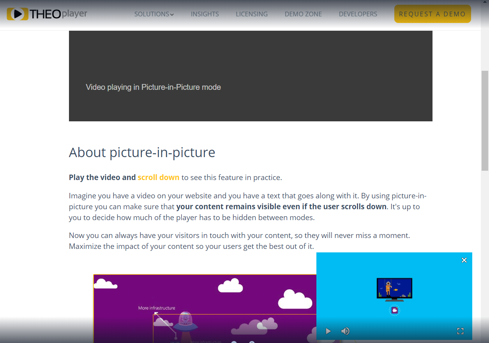

# Picture-in-Picture

This guide explains what Picture-in-Picture (PiP) is, describes how to implement it and links relevant resources.

The Picture-in-Picture feature allows developers to create a floating player. This is commonly used to let the video remain playing on screen even if:

- The user scrolls to another section of the page (causing the original player to no longer be visible).
- The user sends the application to the background.
- The user opens a new page within the same application.

## SDKs

The below table makes a comparison of the available THEOplayer APIs specifically targeting in or out of app PiP use cases. This table does not represent the possibilities on the platforms with THEOplayer.

|            Type            | Web SDK |  Android SDK   | Android TV SDK | iOS SDK | tvOS SDK | Roku SDK |  Fire TV SDK   | Chromecast SDK |
| :------------------------: | :-----: | :------------: | :------------: | :-----: | :------: | :------: | :------------: | :------------: |
|   **in-app**<sup>1</sup>   |   Yes   | No<sup>3</sup> | No<sup>3</sup> |   Yes   |    No    |    No    | No<sup>3</sup> |      N/A       |
| **out-of-app**<sup>2</sup> |   No    |      Yes       |      Yes       |   Yes   |   Yes    |    No    |      Yes       |      N/A       |

<sup>1</sup> While using in-app picture-in-picture, the visibility of the PiP window is contained to the inside of the app. In other words, it will go to background/foreground with the application.

<sup>2</sup> While using out-of-app picture-in-picture, the visibility of the PiP windows is not contained to the inside of the app. It can remain visible while the user navigates to other views, pages or apps.

<sup>3</sup> On Android/Fire TV SDK, there is no API to explicitly only allow in-app PiP. The existing [PiP API](pathname:///theoplayer/v7/api-reference/android/com/theoplayer/android/api/pip/package-summary.html) activates both in and out of app PiP.

## How to use Picture-in-Picture

Picture-in-Picture is an interesting option on both desktop and mobile to keep showing the video while the user navigates to different parts of the content. PiP in THEOplayer presents several possibilities: this section shows how to enable, configure and observe the Picture-in-Picture option for all available SDKs. A distinction is made between in-app and out-of-app Picture-in-picture, where in the latter the PiP-window can also remain visible if the application is sent to background or another view is presented.

## Code Examples

### Enable Picture-In-Picture mode

##### Web SDK

In this SDK, PiP is enabled by default if the player configuration contains any PiP configuration (see below image). For this reason, there is no need to use any specific snippet to enable it.
Note that in this SDK out-of-app Picture is (currently) not supported.



The PiP configuration for this SDK includes 3 properties:

- `position`: (optional, possible values: "top-left", "top-right", "bottom-left", "bottom-right")  
  The corner in which the player should be shown while in PiP mode. Defaults to the bottom right corner.

- `visibility`: (optional, a number from 0 to 1)  
  The maximum percentage of the original player position that should be visible to enable PiP automatically. If not configured, PiP can only be turned on by setting [presentationMode](pathname:///theoplayer/v7/api-reference/web/types/PresentationMode.html) to "picture-in-picture".

- `retainPresentationModeOnSourceChange`: (optional, possible values: true or false)  
  If set to true, the previous [presentationMode](pathname:///theoplayer/v7/api-reference/web/types/PresentationMode.html) is retained even as the source changes. It is set to false by default.

```js
var playerConfig = {
    /* ... */
    pip: {
        visibility: 0.7,
        position: "bottom-left",
        retainPresentationModeOnSourceChange: true
    }
};
```

##### Android / Fire TV SDK

If you want to use Picture-In-Picture in your application you can instantiate the player with a PiPConfiguration, to be passed in the THEOplayerConfig.
When passing a PipConfiguration, the Android SDK will **always** make use of out-of-app PiP.

Note that to make use of out-of-app PiP the minimum required Android version is Oreo (API level 26).

```kotlin
val playerConfig = THEOplayerConfig.Builder()
    .pipConfiguration(PipConfiguration.Builder().build())
    .build()

val tpv = THEOplayerView(context, playerConfig)
```

Once the Picture-In-Picture mode is enabled, the player's _pip_ property can be accessed.

To enable PiP mode with the required PiP type, you can utilize the following steps:

1. **Access the PiP Manager:** Begin by accessing the PiP manager associated with your `THEOplayerView`. This manager reference is available through the `theoPlayerView`.

2. **Invoke `enterPiP()`:** Call the `enterPiP(PiPType.ACTIVITY)` method on the PiP manager. By doing so, you initiate PiP mode using the `ACTIVITY` PiP type.

Here's the implementation:

```kotlin
theoPlayerView.piPManager?.enterPiP(PiPType.ACTIVITY)
```

THEOplayer supports three PiP types:

- **ACTIVITY** This mode generates a separate Android activity that functions as the PiP window.

- **DIALOG** In this mode, a dialog window is utilized as the PiP window. The video content is displayed within the dialog.

- **CUSTOM** Unlike the predefined PiP types, `CUSTOM` empowers you as the developer to design and implement your own PiP window. You have the flexibility to tailor the PiP experience to your app's specific requirements. For details on implementing a custom PiP window, explore this [Android documentation](https://developer.android.com/develop/ui/views/picture-in-picture).

##### iOS / tvOS SDK

If you want to use Picture-In-Picture in your application you can instantiate the player with a PiPConfiguration, to be passed in the THEOplayerConfiguration.
Using this PiPConfiguration you can configure whether the player should retain its presentation mode upon source-change. You can also choose whether to make use of out-of-app PiP (=`nativePictureInPicture`).
Note that to make use of out-of-app PiP the minimum required iOS version is 14.0.

```swift
/* Configure whether presentation mode should be retained on source changes and whether to use native PiP */
let pipConfig = PiPConfiguration(retainPresentationModeOnSourceChange: true, nativePictureInPicture: true)
let playerConfig = THEOplayerConfiguration(... , pip: pipConfig)
var theoplayer = THEOplayer(configuration: playerConfig)
```

Once the Picture-In-Picture mode is enabled, the player's _pip_ property can be accessed.

While using **in-app** PiP you can use the _configure(movable:defaultCorner:)_ method of the player's _pip_ property to configure the picture-in-picture.

You can configure:

- whether the PiP view is movable or not (default to true);

- the default corner of the PiP view (default to bottom right);

```swift
theoplayer.pip!.configure(movable: false, defaultCorner: .bottomLeft)
```

Notes:

- `configure` is only available when using in-app PiP.
- tvOS only supports in-app PiP, which is **enabled by default** if the OS version supports it (minimum tvOS 14.0).
- iPadOS 14.0 (and above) also supports in-app PiP.


### Observe events in Picture-In-Picture

##### Android SDK

For the Android SDK it is possible to listen for a `PlayerEventTypes.PRESENTATIONMODECHANGE` event or verify the presentationMode of the player in case you need to find out what the presentation mode is at a given moment or detect a change.

```kotlin
// Assuming you have an instance of the player called 'theoplayer'
theoplayer.addEventListener(PlayerEventTypes.PRESENTATIONMODECHANGE) { event ->
    val currentMode = event.presentationMode
    if (currentMode == PresentationMode.PICTURE_IN_PICTURE) {
        // Currently in PiP
    }
}

// The listener above will be triggered by one of:
theoPlayerView.piPManager?.enterPiP(PiPType.ACTIVITY)
theoPlayerView.piPManager?.exitPiP()
```

###### Returning from PiP Mode: Playback Behavior

###### 1. **ACTIVITY PiPType:**

When your app uses the `ACTIVITY` PiP type and the user closes the PiP window, the playback and its restoration follows these steps:

- **Playback Pausing:** Upon returning from PiP mode, playback is automatically paused, provided that `theoPlayerView.settings.setAllowBackgroundPlayback(false)` is set to false (which is the default setting).

- **Resuming Playback:** To resume playback, check whether your app's activity is in the foreground. If it is, call the `play()` method on the player instance.

Here's a code snippet demonstrating how to resume playback after exiting PiP mode:

```kotlin
theoPlayer.addEventListener(PlayerEventTypes.PRESENTATIONMODECHANGE) {
    if (it.presentationMode == PresentationMode.INLINE) {
        // Playback pauses after closing PiP window
        if (lifecycle.currentState == Lifecycle.State.STARTED) {
            theoPlayerView.player.play()
        }
    }
}
```

###### 2. **DIALOG PiPType:**

For the `DIALOG` PiP type, in order to correctly exit PiP window you should override `onPictureInPictureModeChanged` and call `piPManager.exitPiP()`.

```kotlin
override fun onPictureInPictureModeChanged(
    isInPictureInPictureMode: Boolean,
    newConfig: Configuration
) {
    super.onPictureInPictureModeChanged(isInPictureInPictureMode, newConfig)

    if (!isInPictureInPictureMode) {
        theoPlayerView.piPManager?.exitPiP()
    }
}
```

This example ensures that playback pauses if an Activity that holds THEOplayer is in the background and background playback is not allowed, providing a smoother transition for users returning from PiP mode.

###### 3. **CUSTOM PiPType:**

For the `CUSTOM` PiP type, you are responsible for implementing your own PiP window and handling the necessary tasks for entering and exiting PiP mode.

Managing playback after returning from PiP mode is in your hands as a developer. You can reference the provided code snippet for the `ACTIVITY` type as a starting point and adapt it to match your app's unique design and logic.

##### iOS/tvOS SDK and Legacy iOS/tvOS SDK (4.12.x)

###### in-app Picture in Picture

Using the notification center you can listen to the _PictureInPictureMoved_ notification. This notification will be pushed every time the picture-in-picture view moves to a different corner.

In the callback, you can retrieve the previous and the new corner in the userInfo dictionary respectively with the _PictureInPictureOldCornerUserInfoKey_ and the _PictureInPictureNewCornerUserInfoKey_ keys.

```swift
NotificationCenter.default.addObserver(self, selector: #selector(onPiPMoved), name: Notification.Name.PictureInPictureMoved, object: nil)

@objc func onPiPMoved(notif: Notification) {
    let userInfo = notif.userInfo as! [String: Any]
    let oldCorner : PictureInPictureCorner = userInfo[PictureInPictureOldCornerUserInfoKey]! as! PictureInPictureCorner
    let newCorner : PictureInPictureCorner = userInfo[PictureInPictureNewCornerUserInfoKey]! as! PictureInPictureCorner
    print("PiP has moved from \(oldCorner) to \(newCorner)")
}
```

###### out-of-app Picture in Picture

By using your own implementation of the [AVPictureinpictureControllerDelegate](https://developer.apple.com/documentation/avkit/avpictureinpicturecontrollerdelegate) you are able to listen to a number of events.
These contain, but are not limited to, when the player will enter/exit PiP, has entered/exited PiP, ... To achieve this you just have to set your implementation of the delegate as the one of the [PictureInPictureController](pathname:///theoplayer/v7/api-reference/ios/Protocols/PictureInPicture.html).

```swift
class CustomPiPDelegate: NSObject, AVPictureInPictureControllerDelegate {
    func pictureInPictureControllerDidStartPictureInPicture(_ pictureInPictureController: AVPictureInPictureController) {
        // Custom action when picture in picture started
    }
    // ... Others here.
}

let customDelegate = CustomPiPDelegate()
var THEOPiP = theoplayer?.pip
if #available(iOS 14.0, *) {
    THEOPiP?.nativePictureInPictureDelegate = customDelegate
} else {
    // Fallback on earlier versions
}
```


## Sample applications

### Web SDK

A demo of this feature can be found at

- [https://demo.theoplayer.com/picture-in-picture](https://demo.theoplayer.com/picture-in-picture)

To see PiP in action, start the video and scroll down on the page.

### Android SDK

A sample app for Picture-In-Picture could be found here:

- [https://github.com/THEOplayer/samples-android-sdk/tree/master/PiP-Handling](https://github.com/THEOplayer/samples-android-sdk/tree/master/PiP-Handling)

## Remarks

The following remarks can help:

- PiP is a presentation mode of the player. As such, you can listen for a *presentationmodechange* event or verify the presentationMode of the player in case you need to find out what the presentation mode is at a given moment or detect a change.

- This feature is not completely the same on all SDKs, as the options may vary. For example, in the Web SDK it is not possible to drag and drop the floating player to a new position (PiP is not _movable_).

## Known Limitations

- iOS: VR360 is not supported in combination with PiP.
- iOS: Only SSAI is supported, no CSAI (both are supported for Android)
- iOS: No support for sideloaded textTracks.
- Android TV: A limitation from the Android Framework - When the player is showing a native Google IMA advertising while being in Picture-in-Picture mode and the user triggers something which moves the PiP window (such as opening the keyboard) then the view showing the advertisement might be misaligned.

## Resources

The following resources provide more information:

##### Web SDK

- [PipConfiguration API Reference](pathname:///theoplayer/v7/api-reference/web/interfaces/PiPConfiguration.html)
- [PlayerConfiguration API Reference](pathname:///theoplayer/v7/api-reference/web/interfaces/PlayerConfiguration.html)

##### iOS/tvOS SDK and Legacy iOS/tvOS SDK (4.12.x)

- [PipConfiguration API Reference](pathname:///theoplayer/v7/api-reference/ios/Classes/PiPConfiguration.html)
- [PictureInPicture API Reference](pathname:///theoplayer/v7/api-reference/ios/Protocols/PictureInPicture.html)

##### Android SDK

- [PipConfiguration API Reference](pathname:///theoplayer/v7/api-reference/android/com/theoplayer/android/api/pip/PipConfiguration.Builder.html)
- [PiPManager API Reference](pathname:///theoplayer/v7/api-reference/android/com/theoplayer/android/api/pip/PiPManager.html)
