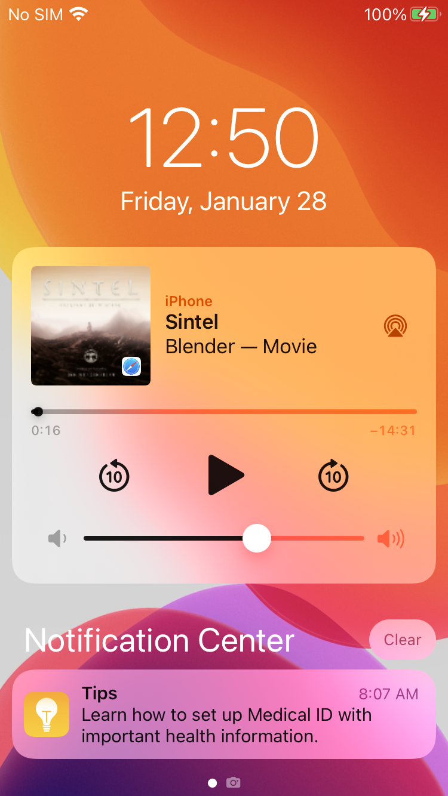
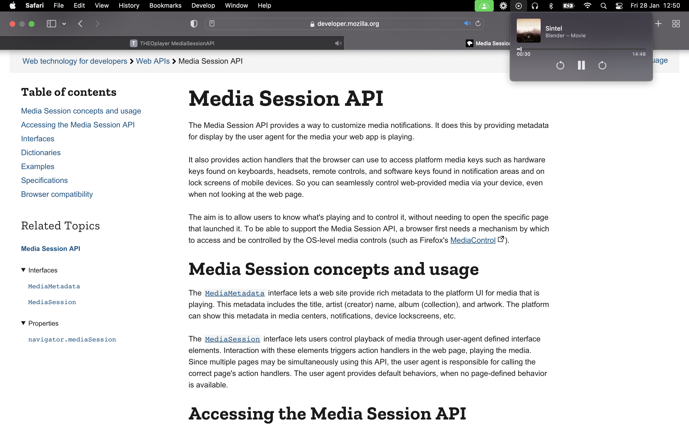

# How to use the Media Session API

Developers who implement the Media Session API give viewers the option to control and monitor media playback outside their web page.
The first screenshot below demonstrates how a viewer can play/resume/seek a video through their iOS home screen,
and the second screenshot below demonstrates the same level of control on a macOS.





The Media Session API is available on most modern desktop and mobile browsers as documented at [https://developer.mozilla.org/en-US/docs/Web/API/Media_Session_API](https://developer.mozilla.org/en-US/docs/Web/API/Media_Session_API).
The W3C working draft of the Media Session standard is available at [https://www.w3.org/TR/mediasession/](https://www.w3.org/TR/mediasession/).

# How to implement the Media Session API in THEOplayer

We recommend developers to implement the Media Session API on top of the THEOplayer API in order to ensure the deepest level of control.
A simple example is available below:

First, define the metadata for your MediaSession: [see documentation here](https://developer.mozilla.org/en-US/docs/Web/API/MediaSession/metadata).

```javascript
const mediaSessionMetadata = {
  title: 'Sintel',
  artist: 'Blender',
  album: 'Movie',
  artwork: [
    {
      src: 'https://storage.googleapis.com/media-session/sintel/artwork-96.png',
      sizes: '96x96',
      type: 'image/png',
    },
    {
      src: 'https://storage.googleapis.com/media-session/sintel/artwork-128.png',
      sizes: '128x128',
      type: 'image/png',
    },
    {
      src: 'https://storage.googleapis.com/media-session/sintel/artwork-192.png',
      sizes: '192x192',
      type: 'image/png',
    },
    {
      src: 'https://storage.googleapis.com/media-session/sintel/artwork-256.png',
      sizes: '256x256',
      type: 'image/png',
    },
    {
      src: 'https://storage.googleapis.com/media-session/sintel/artwork-384.png',
      sizes: '384x384',
      type: 'image/png',
    },
    {
      src: 'https://storage.googleapis.com/media-session/sintel/artwork-512.png',
      sizes: '512x512',
      type: 'image/png',
    },
  ],
};
```

Then define a helper function that sets the metadata and attaches all EventListeners to the player.
The action handlers inside this function can be customized depending on your needs.

```javascript
function addMediaSessionEventListeners(player) {
  const mediaSession = navigator.mediaSession;
  if (mediaSession === undefined) {
    return;
  }
  mediaSession.setActionHandler('play', () => player.play());
  mediaSession.setActionHandler('pause', () => player.pause());
  mediaSession.setActionHandler('seekto', (details) => {
    if (isNaN(player.duration)) {
      return;
    }
    player.currentTime = details.seekTime;
  });
  mediaSession.setActionHandler('seekbackward', function (details) {
    if (isNaN(player.duration)) {
      return;
    }
    player.currentTime = Math.max(player.currentTime - (details.seekOffset ?? 10), 0);
  });
  mediaSession.setActionHandler('seekforward', function (details) {
    if (isNaN(player.duration)) {
      return;
    }
    player.currentTime = Math.min(player.currentTime + (details.seekOffset ?? 10), player.duration);
  });
  var updateMediaSession = function () {
    if (isNaN(player.duration)) {
      return;
    }
    mediaSession.playbackState = player.paused ? 'paused' : 'playing';
    const seekableLength = player.seekable.length;
    if (seekableLength === 0) {
      return;
    }
    mediaSession.setPositionState({
      duration: Math.max(player.seekable.end(seekableLength - 1), player.currentTime),
      playbackRate: player.playbackRate,
      position: player.currentTime,
    });
  };
  var onFirstPlaying = function () {
    player.removeEventListener(['play', 'playing'], onFirstPlaying);
    // Set MediaSession metadata
    if (mediaSessionMetadata !== undefined) {
      mediaSession.metadata = new MediaMetadata(mediaSessionMetadata);
    }
    // Start monitoring player to update MediaSession
    player.addEventListener(['play', 'pause', 'durationchange', 'timeupdate', 'ratechange'], updateMediaSession);
  };
  var onSourceChange = function () {
    // Remove event listeners
    player.removeEventListener(['play', 'playing'], onFirstPlaying);
    player.removeEventListener(['play', 'pause', 'durationchange', 'timeupdate', 'ratechange'], updateMediaSession);
    // Reset MediaSession
    mediaSession.metadata = undefined;
    mediaSession.playbackState = 'none';
    // Wait for next source playback
    player.addEventListener(['play', 'playing'], onFirstPlaying);
  };
  player.addEventListener('sourcechange', onSourceChange);
}
```

Finally, call the helper and set the source on your player that corresponds with the metadata:

```javascript
addMediaSessionEventListeners(player);

player.source = {
  sources: [
    {
      src: 'https://cdn.theoplayer.com/video/sintel/nosubs.m3u8',
    },
  ],
};
```

# SharePlay

Implementing the Media Session API is part of implementing [Apple's SharePlay feature](https://developer.apple.com/shareplay/) on Safari.
[Contact us](https://www.theoplayer.com/contact) if you're interested in building SharePlay experiences.
