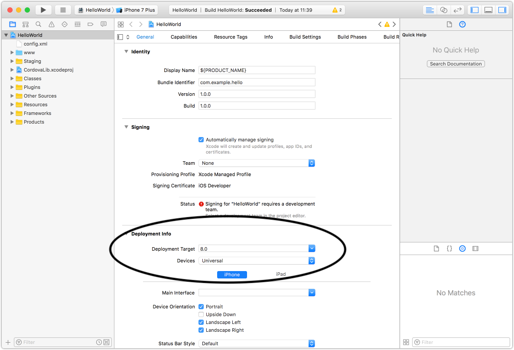

# Migrating to THEOplayer iOS/tvOS SDK 8.x

This article will guide your through updating from THEOplayer iOS/tvOS SDK version 8 (from version 7),
and the changes needed in your code.

## Update THEOplayer

Update THEOplayer iOS/tvOS SDK to version 8 in your Podfile:

```ruby
target 'MyApp' do
  pod 'THEOplayerSDK-core', '~> 8'
end
```

If you're using one of [our connectors](/theoplayer/connectors/ios/),
make sure to update them to the latest version too to ensure proper support for THEOplayer version 8.

## Update deployment target to 13.0 or higher

In version 8, the minimum supported version of our iOS/tvOS SDK is raised from 12.0 to 13.0.
This decision was based on metrics provided by [Apple's iOS usage measures by devices that transacted on the App
Store](https://developer.apple.com/support/app-store/), which shows low number of usage of iOS 12.

In your Xcode project settings, make sure the "Deployment target" is set to 13.0 or higher.



## Objective-C support is deprecated

Starting with version 8, support for Objective-C is deprecated for all THEOplayer APIs.
Existing APIs will still continue to work until the next major release, but additional support for new APIs will discontinue.

When it was introduced, the goal of the Objective-C APIs was to provide bindings to bridge our native SDK to React Native.
Over time, that became unneeded as React Native became capable to interact directly with Swift APIs.

Please contact us for support in case your codebase relies on the Objective-C APIs.

## API changes to THEOplayerSDK

Two methods on the `THEOplayer` API have been replaced with setter properties: `setPreload` and `setPlaybackRate`.
The following code snippets elaborate more on the changes.

Before 8.0:

```swift
import THEOplayerSDK

let theoplayer: THEOplayer = .init()
theoplayer.setPreload(.auto)
theoplayer.source = ...
theoplayer.setPlaybackRate(2)
```

After 8.0:

```swift
import THEOplayerSDK

let theoplayer: THEOplayer = .init()
theoplayer.preload = .auto
theoplayer.source = ...
theoplayer.playbackRate = 2
```

In the configuration side of the APIs, the initializer of `THEOplayerConfiguration` has been replaced with a builder approach with `THEOplayerConfigurationBuilder`. The same change is made also to `PiPConfiguration` with `PiPConfigurationBuilder`.

Before 8.0:

```swift
import THEOplayerSDK

let pipConfig: PiPConfiguration = .init(canStartPictureInPictureAutomaticallyFromInline: true)
let playerConfig: THEOplayerConfiguration = .init(pip: pipConfig)
let theoplayer: THEOplayer = .init(configuration: playerConfig)
```

After 8.0:

```swift
import THEOplayerSDK

let pipConfigBuilder: PiPConfigurationBuilder = .init()
pipConfigBuilder.canStartPictureInPictureAutomaticallyFromInline = true

let playerConfigBuilder: THEOplayerConfigurationBuilder = .init()
playerConfigBuilder.pip = pipConfigBuilder.build()

let theoplayer: THEOplayer = .init(configuration: playerConfigBuilder.build())
```

Last but not least, `AdsConfiguration` is removed, and so are `GoogleDAIAdsConfiguration/GoogleDAIAdsConfigurationBuilder` and `GoogleIMAAdsConfiguration/GoogleIMAConfigurationBuilder`.
The following code snippet will demonstrate how to configure the IMA configuration:

```swift
import THEOplayerSDK
import THEOplayerGoogleIMAIntegration
import GoogleInteractiveMediaAds

let theoplayer: THEOplayer = .init()

let imaSettings: IMASettings = .init()
imaSettings.enableBackgroundPlayback = true
imaSettings.language = "es"

let imaIntegration: GoogleImaIntegration = GoogleIMAIntegrationFactory.createIntegration(on: theoplayer, with: imaSettings)

let renderingSettings: IMAAdsRenderingSettings = .init()
renderingSettings.uiElements = []
imaIntegration.renderingSettings = renderingSettings

theoplayer.addIntegration(imaIntegration)
```
