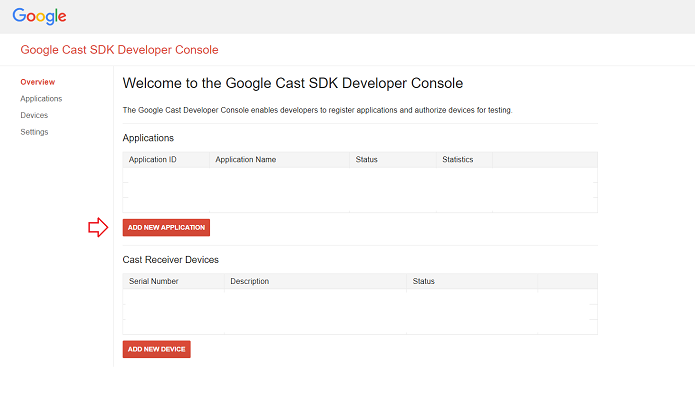
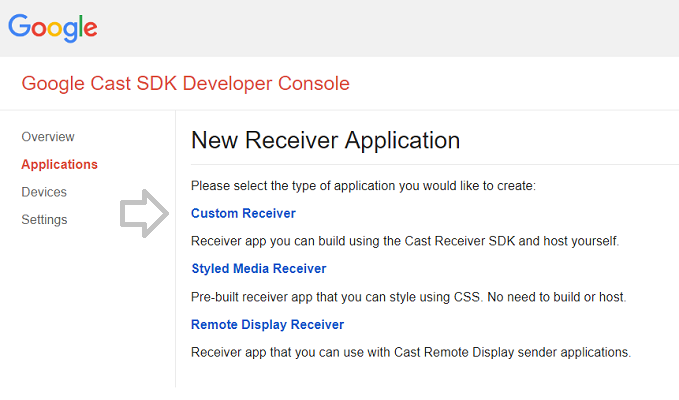
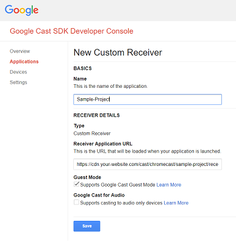

# Getting started on Chromecast

This how-to guide describes how to set up a Chromecast Receiver application using the Dolby OptiView Player SDK.

:::info

This guide is intended for developing a Chromecast Receiver application with Google Cast SDK v2. Since Google Cast SDK v2 is deprecated by Google, we highly recommend developing your Chromecast SDK with CAF instead of v2. You can find the THEOplayer Cast Receiver Reference app [here](https://github.com/THEOplayer/samples-google-cast-v3-receiver).

:::

## Prerequisite:

You need to build a THEOplayer Chromecast Receiver SDK from THEOportal.

## Set up a web project

A Chromecast Receiver application is a web project. Create a sample project, add a `_receiver_` folder, and create an index.html file in this folder with the following skeleton code.

## Integrate the Google Cast Receiver SDK

By including the Google Cast Receiver SDK, you have access to the Receiver API. The THEOplayer Receiver SDK leverages this API.

```html
<!doctype html>
<html lang="en">
  <head>
    <meta charset="UTF-8" />
    <title>THEOplayer Chromecast Receiver Sample Application</title>
    <script src="//www.gstatic.com/cast/sdk/libs/receiver/2.0.0/cast_receiver.js"></script>
  </head>
  <body></body>
</html>
```

## Integrate the THEOplayer Chromecast Receiver SDK

By including the THEOplayer Chromecast Receiver SDK, you have access to the THEOplayer Receiver SDK. This SDK consists of a JavaScript library (consisting of four files) and a CSS file. Create a _release_ folder, and put the 5 files belonging to the THEOplayer Chromecast Receiver SDK in this folder.

```html
<!doctype html>
<html lang="en">
  <head>
    <meta charset="UTF-8" />
    <title>THEOplayer Chromecast Receiver Sample Application</title>
    <script src="//www.gstatic.com/cast/sdk/libs/receiver/2.0.0/cast_receiver.js"></script>
    <script src="../release/THEOplayer-cast-receiver.js"></script>
    <link rel="stylesheet" type="text/css" href="../release/ui.css" />
  </head>
  <body></body>
</html>
```

## Set up THEOplayer instance

Setting up a THEOplayer instance in a Chromecast Receiver application is similar to our Web SDK. More information on setting up the THEOplayer Web SDK can be found at [Getting Started on Web](../01-web/00-getting-started.mdx).

You need to add a DOM-element which will contain the user interface of THEOplayer, and you need to initialize the THEOplayer instance through JavaScript code.

```html
<!doctype html>
<html lang="en">
  <head>
    <meta charset="UTF-8" />
    <title>THEOplayer Chromecast Receiver Sample Application</title>
    <script src="//www.gstatic.com/cast/sdk/libs/receiver/2.0.0/cast_receiver.js"></script>
    <script src="../release/THEOplayer-cast-receiver.js"></script>
    <link rel="stylesheet" type="text/css" href="path/to/theoplayer/ui.css" />
  </head>
  <body>
    <div id="my-player"></div>
    <script>
      var player = new THEOplayer.Player(document.getElementById('my-player'), {
        libraryLocation: 'path/to/theoplayer/',
        license: 'your-license-here',
      });
    </script>
  </body>
</html>
```

## Optional: alter default UI

The CSS snippet added to the code-block below have the following effect:

1.  `.THEO-cast-receiver-player .THEO-cast-receiver-logo`: Change the default splash image when your receiver app is loading. This default splash image will show a THEOplayer-branded image, but you might want to replace it with a different image.
2.  `.THEO-cast-receiver-player .THEO-cast-receiver-watermark`: Change the default watermark logo which is shown when pausing (or buffering). This default watermark logo will show a THEOplayer-branded image, but you might want to replace it with a different image.

In each of the examples, be sure to set the image source correctly, by replacing the '...'.

Note that you can also use the easy UI skinning colors to modify the UI as described in [http://demo.theoplayer.com/ui-skinning](http://demo.theoplayer.com/ui-skinning). You can reuse the CSS you use in the THEOplayer Web SDK in your Chromecast receiver as well!

```html
<!doctype html>
<html lang="en">
  <head>
    <meta charset="UTF-8" />
    <title>THEOplayer Chromecast Receiver Sample Application</title>
    <script src="//www.gstatic.com/cast/sdk/libs/receiver/2.0.0/cast_receiver.js"></script>
    <script src="../release/THEOplayer-cast-receiver.js"></script>
    <link rel="stylesheet" type="text/css" href="../release/ui.css" />
    <style>
      .THEO-cast-receiver-player .THEO-cast-receiver-logo {
        position: static;
        margin: 0 auto;
        width: 100%;
        height: 100%;
        background:
          url('...') no-repeat,
          no-repeat center;
        background-size: cover;
      }

      .THEO-cast-receiver-player .THEO-cast-receiver-watermark {
        width: 124px;
        height: 65px;
        background-image: url('...');
      }
    </style>
  </head>
  <body>
    <div id="my-player"></div>
    <script>
      var player = new THEOplayer.Player(document.getElementById('my-player'), {
        libraryLocation: '../release/',
      });
    </script>
  </body>
</html>
```

## Publish the application

Before you can deploy your application, you should upload your web project to an HTTPS location. (e.g. [https://cdn.your-website.com/cast/chromecast/sample-project/)](https://cdn.your-website.com/cast/chromecast/sample-project/)) Ensure that your folder structure respects the aforementioned structure.

## Deploy the application

This has to be done through the [Google Cast SDK Developer Console](https://developers.google.com/cast/docs/registration)

Your Chromecast Receiver sample application is now in a state where it can be deployed as a real application. If you have a Google Cast SDK Developer Console, you can log in to [https://cast.google.com/u/1/publish/#/overview](https://cast.google.com/u/1/publish/#/overview).







You have to go through the following steps:

1.  Click "ADD NEW APPLICATION".
2.  Select "Customer Receiver".
3.  Enter information and refer to the HTTPS location of your web project.
4.  Press start and wait.

## Test it

Once your application is published, you can start casting from your THEOplayer Web SDK, iOS SDK or Android SDK. You need to set the correct [appID](pathname:///theoplayer/v8/api-reference/web/interfaces/CastConfiguration.html), enable Chromecast and press the Chromecast icon. Additionally, you can start casting through the [Cast API](pathname:///theoplayer/v8/api-reference/web/interfaces/GlobalCast.html).

## Related articles

- [Pass subtitle selection on to Chromecast](../../../how-to-guides/03-cast/01-chromecast/05-pass-subtitle-section-on-to-chromecast.md)
- [How to configure a different stream to Chromecast](../../../how-to-guides/03-cast/01-chromecast/03-how-to-configure-to-a-different-stream.md)
- [Chromecast on my webplayer does not work any longer despite no change in my implementation](../../../faq/54-chromecast-on-weblayer-does-not-longer-work.md)
- [Connecting from custom Sender applications](../../../how-to-guides/03-cast/01-chromecast/01-connecting-from-custom-sender-applications.md)
