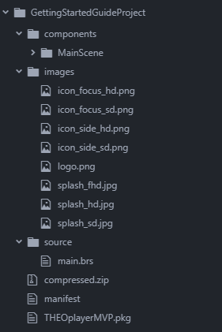
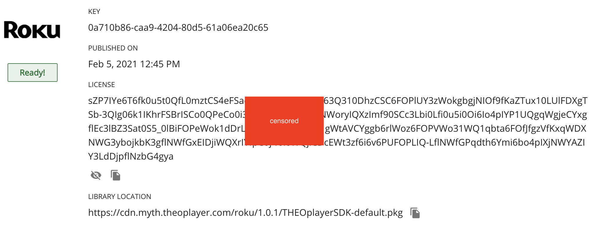
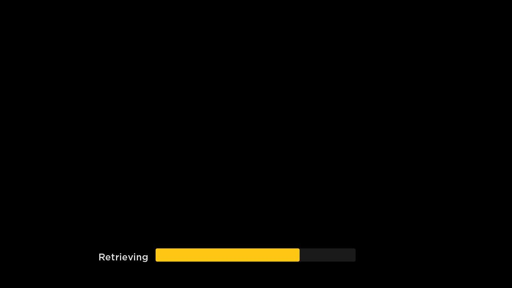

# Getting Started on Roku

This getting started guide gets you familiar with Roku and the THEOplayer Roku SDK.
Upon completion of this guide, you'll have integrated the THEOplayer SDK in Roku's Hello World! sample project, configured a video, and used an event listener.

If you're looking for our Roku API reference, you can find them [here](../../../api-reference/roku.md).

Consider using the [quickstart guide](#quickstart) if you're looking for a recap because you already went through this article.

## Introduction

The THEOplayer Roku SDK is designed specifically for the Roku platform.
It is a custom video component allowing your channel to embed the video player easily.

### Purpose

This guide is created to help you get started with including the THEOplayer Roku SDK inside a Roku channel.
This article will show you how to include, load, and create an instance of the THEOplayer Roku SDK.
It will also explain how to play a video, and how you can add an event listener.

### Prerequisites

To start this guide you need the following items:

1. A ROKU account ([read more about ROKU account](https://support.roku.com/en-gb/article/115004382968)) linked with a ROKU device ([see how to activate and link a ROKU device](https://support.roku.com/en-gb/article/235180868)).

2. A Roku device with development mode activated ([read more about how to enable roku developer mode](https://blog.roku.com/developer/developer-setup-guide)). It is worth mentioning that you need to enroll for a developer program in order to activate the development mode on a ROKU device ([you can enroll for a developer program here](https://developer.roku.com/enrollment/standard)).

3. A television/screen which supports an HDMI input.

4. Development workstation with an IDE and a web browser (Firefox, Chrome, Safari etc.).

5. Make sure that the ROKU device and workstation are on the same local network (you should be able to ping the Roku device from your workstation).

6. An internet connection.

7. A Roku development environment which is needed to create a sample Roku channel and sideload it to a Roku device ([How to setup a Roku development environment](https://developer.roku.com/en-gb/docs/developer-program/getting-started/developer-setup.md)).

## System requirements

Roku keeps all devices up-to-date by issuing automatic updates. We aim to support all the up to date Roku devices. At the moment the newest Roku OS version is 14.1 (Mar 2025).

## Certification changes

There are certification updates that may affect THEOplayer and channels using THEOplayer. Updates regarding certification are announced two times a year. Every update is announced 6 months before the date of implementation.

After announcing changes, we may need to update the THEOplayer Roku SDK to fulfill these new certification criteria.

## Support Roku OS

Our main focus is to support the two latest versions of Roku OS. Support for older versions might be limited.

# Building your own channel using the THEOplayer SDK

In this section, we will go through the process of creating a Roku channel and using the THEOplayer Roku SDK.

## Starting point

First of all, we need to create a Roku channel. You can either [create a new Roku project in eclipse](https://www.youtube.com/watch?v=suQ0qxFs0jw) or [VS Code](https://rokucommunity.github.io/vscode-brightscript-language/index.html) or start from the [Roku “Hello world” channel example](https://github.com/rokudev/hello-world) (Here is some [extra documentation](https://developer.roku.com/en-gb/docs/developer-program/getting-started/hello-world.md) about the “hello world” example).

When you have created a Roku channel, you can copy the THEOplayer Roku SDK ("THEOplayerSDK.pkg") into the directory of your project. You can download the most recent THEOplayer SDK from [https://portal.theoplayer.com](https://portal.theoplayer.com).

## Project structure:



1. **Components**: Contains all your components ( ".brs" and ".xml" files ). This folder should contain all UI and logic elements.

2. **"Images"**: The folder that contains channel artworks like splash screens, icons, logos etc.

3. **"Source"**: Typically only contains the "Main.brs" file. Roku starts running the channel from this file.

4. **"Manifest"**: This file should contain all the necessary information about the channel, like name, version, URI to splash screen etc. ([read more about the manifest file](https://developer.roku.com/en-gb/docs/developer-program/getting-started/architecture/channel-manifest.md))

5. **"THEOplayer.pkg"**: This is the packaged THEOplayer SDK. This package does not have to be here if you wish to load the THEOplayer SDK via HTTPS. In this case you have to pass the link to the packaged THEOplayer SDK instead of the relative path while loading the component library.

### Include THEOplayer SDK

To include the THEOplayer SDK into the channel, follow these steps:

1. Load the THEOplayer SDK as a component library.

   To do this we have to add the following line into the `helloworld.xml` file, between the `<childen>` tags.

   ```xml
   <ComponentLibrary id="THEOsdk" uri="pkg:/THEOplayer.pkg"/>
   ```

   It is worth mentioning that the "URI" field can also be an HTTPS link to the THEOplayer package. (In Our case, we will add it to the: "pkg:\components\MainScene\MainScene.xml" file.)

2. Add the THEOplayerContainer group.

   We will need this group to append THEOplayer into our channel.
   In our case, we will add it to the `helloworld.xml` file, next to the `<ComponentLibrary>` node.

   ```xml
   <Group id="THEOplayerContainer"></Group>
   ```

3. Wait until THEOplayer SDK is loaded.

   We just want to be sure that THEOplayer is loaded correctly.
   We add the following code to our BrightScript `<script>`.

   ```brightscript
   function init()
     m.THEOsdk = m.top.findNode("THEOsdk")
     m.THEOsdk.observeField("loadStatus", "THEOsdkLoaded")
   end function

   function THEOsdkLoaded()
     ' this is the moment when THEOplayer is fully included on your channel
   end function
   ```

   It is worth mentioning that "m" works like the "this" keyword from other languages. "m" keyword points to the current component local namespace. So if you want to have access to variables across different functions inside the same component, use "m" to do so.

After these 3 steps, your `helloworld.xml` should resemble the following snippet:

```xml
<?xml version="1.0" encoding="utf-8" ?>
<component name="HelloWorld" extends="Scene">
  <children>
    <ComponentLibrary id="THEOsdk" uri="pkg:/THEOplayer.pkg"/>
    <Group id="THEOplayerContainer"></Group>
  </children>
<script type="text/brightscript" >
<![CDATA[
  function init()
    m.THEOsdk = m.top.findNode("THEOsdk")
    m.THEOsdk.observeField("loadStatus", "THEOsdkLoaded")
  end function

  function THEOsdkLoaded()
    ' this is moment when theo player is fully included to Your channel
  end function
]]>
</script>
</component>
```

When you deploy this app to your local Roku device, it should still be an empty, gray channel.

### Create an instance of the THEOplayer SDK using BrightScript

In this simple example we will create an instance inside the `THEOsdkLoaded` function, but remember that once the component library is loaded, you can use it across the whole channel.

There is also no need to load this component again. (In our case we will add it to the "pkg:\components\MainScene\MainScene.brs" file.)

```brightscript
function THEOsdkLoaded()
  m.THEOplayer = CreateObject("RoSGNode","THEOsdk:THEOplayer")
  m.playerContainer = m.top.findNode("THEOPlayerContainer")
  m.playerContainer.appendChild(m.THEOplayer)
end function
```

When you deploy your project to your local Roku device, the channel should now be a plain black background.
(It's now black because it's an empty video player container.)

Make sure your files resemble this:

- pkg:/source/main.brs:

  ```brightscript
  sub Main()
      print "in showChannelSGScreen"
      'Indicate this is a Roku SceneGraph application'
      screen = CreateObject("roSGScreen")
      m.port = CreateObject("roMessagePort")
      screen.setMessagePort(m.port)

      'Create a scene and load /components/helloworld.xml'
      scene = screen.CreateScene("HelloWorld")
      screen.show()

      while(true)
          msg = wait(0, m.port)
          msgType = type(msg)
          if msgType = "roSGScreenEvent"
              if msg.isScreenClosed() then return
          end if
      end while
  end sub
  ```

- pkg:/manifest file:

  ```brightscript
  ##   Channel Details
  title=Hello World
  major_version=1
  minor_version=0
  build_version=00001

  ##   Channel Assets
  ###  Main Menu Icons / Channel Poster Artwork
  #### Image sizes are FHD: 540x405px | HD: 290x218px | SD: 214x144px
  mm_icon_focus_fhd=pkg:/images/channel-poster_fhd.png
  mm_icon_focus_hd=pkg:/images/channel-poster_hd.png
  mm_icon_focus_sd=pkg:/images/channel-poster_sd.png

  ###  Splash Screen + Loading Screen Artwork
  #### Image sizes are FHD: 1920x1080px | HD: 1280x720px | SD: 720x480px
  splash_screen_fhd=pkg:/images/splash-screen_fhd.jpg
  splash_screen_hd=pkg:/images/splash-screen_hd.jpg
  splash_screen_sd=pkg:/images/splash-screen_sd.jpg

  splash_color=#000000
  splash_min_time=1
  ```

- pkg:/components/helloworld.xml:

  ```xml
  <?xml version="1.0" encoding="utf-8" ?>
  <component name="HelloWorld" extends="Scene">
    <children>
      <ComponentLibrary id="THEOsdk" uri="pkg:/THEOplayerSDK.pkg"/>
      <Group id="THEOplayerContainer"></Group>
    </children>
  <script type="text/brightscript" >
  <![CDATA[
    function Init()
      m.THEOsdk = m.top.findNode("THEOsdk")
      m.THEOsdk.observeField("loadStatus", "THEOsdkLoaded")
    end function

    function THEOsdkLoaded()
      m.THEOplayer = CreateObject("RoSGNode","THEOsdk:THEOplayer")
      m.playerContainer = m.top.findNode("THEOplayerContainer")
      m.playerContainer.appendChild(m.THEOplayer)
    end function
  ]]>
  </script>
  </component>
  ```

Great! You have included the THEOplayer SDK into your channel now! If you run this channel, you will only see a black screen because we did not set any source and we did not start the playback. Follow the next sections to start video playback.

### Create an instance of the THEOplayer SDK using XML

There is an alternative way to include the THEOplayer SDK. You can include the component library using only XML.
In this approach, you want to make sure that the component library is fully loaded before including the component into the scene graph.

An example of this approach is demonstrated through our [basic-playback-app project on Github](https://github.com/THEOplayer/samples-roku-sdk/tree/master/basic-playback-app).
In this project, `MainScene.xml` loads the SDK, and the instance is created through (for example) `<THEOsdk:THEOplayer id="VideoPlayerChromefull" controls="true" />` in `ChromefullView.xml`.

### Configure license

You need to configure your THEOplayer Roku SDK license value through the following snippet:

```brightscript
m.THEOplayer.configuration = {
  "license": "your-license"
}
```

Add these 3 lines after `m.playerContainer.appendChild(m.THEOplayer)`.

Note that you have to replace `your-license` with your actual license value as specified on the [THEOplayer Development Portal](https://portal.theoplayer.com/) for your THEOplayer Roku SDK.



### Video playback example

To play videos using the THEOplayer SDK, we need to take a few steps:

1. Include the THEOplayer SDK and create an instance of it. (described in above section)

2. Set a player source. To accomplish this we will edit the `THEOsdkLoaded` function. (Added later in the "Using the THEOplayer SDK" section.)

   ```brightscript
   function THEOsdkLoaded()
     m.THEOplayer = CreateObject("RoSGNode","THEOsdk:THEOplayer")
     m.playerContainer = m.top.findNode("THEOplayerContainer")
     m.playerContainer.appendChild(m.THEOplayer)
     m.THEOplayer.configuration = {
       "license": "your-license"
     }
     m.THEOplayer.source = {
       "sources": [
         {
           "src": "http://cdn.theoplayer.com/video/star_wars_episode_vii-the_force_awakens_official_comic-con_2015_reel_(2015)/index.m3u8",
           "type": "application/x-mpegURL"
         }
       ]
     }
   end function
   ```

3. Set focus to the THEOplayer SDK to make sure that remote controls will work properly.

   ```brightscript
   function THEOsdkLoaded()
     m.THEOplayer = CreateObject("RoSGNode","THEOsdk:THEOplayer")
     m.playerContainer = m.top.findNode("THEOplayerContainer")
     m.playerContainer.appendChild(m.THEOplayer)
     m.THEOplayer.configuration = {
       "license": "your-license"
     }
     m.THEOplayer.source = {
       "sources": [
         {
           "src": "http://cdn.theoplayer.com/video/star_wars_episode_vii-the_force_awakens_official_comic-con_2015_reel_(2015)/index.m3u8",
           "type": "application/x-mpegURL"
         }
       ]
     }
     m.THEOplayer.setFocus(true)
   end function
   ```

4. Play a video with the "play" method.
   ```brightscript
   function THEOsdkLoaded()
     m.THEOplayer = CreateObject("RoSGNode","THEOsdk:THEOplayer")
     m.playerContainer = m.top.findNode("THEOplayerContainer")
     m.playerContainer.appendChild(m.THEOplayer)
     m.THEOplayer.configuration = {
       "license": "your-license"
     }
     m.THEOplayer.source = {
       "sources": [
         {
           "src": "http://cdn.theoplayer.com/video/star_wars_episode_vii-the_force_awakens_official_comic-con_2015_reel_(2015)/index.m3u8",
           "type": "application/x-mpegURL"
         }
       ]
     }
     m.THEOplayer.setFocus(true)
     m.THEOplayer.callFunc("play")
   end function
   ```

After these 4 steps, your `helloworld.xml` file should resemble the following snippet:

```xml
<?xml version="1.0" encoding="utf-8" ?>
<component name="HelloWorld" extends="Scene">
  <children>
    <ComponentLibrary id="THEOsdk" uri="pkg:/THEOplayerSDK.pkg"/>
    <Group id="THEOplayerContainer"></Group>
  </children>
<script type="text/brightscript" >
<![CDATA[
  function Init()
    m.THEOsdk = m.top.findNode("THEOsdk")
    m.THEOsdk.observeField("loadStatus", "THEOsdkLoaded")
  end function

  function THEOsdkLoaded()
    m.THEOplayer = CreateObject("RoSGNode","THEOsdk:THEOplayer")
    m.playerContainer = m.top.findNode("THEOplayerContainer")
    m.playerContainer.appendChild(m.THEOplayer)
    m.THEOplayer.configuration = {
      "license": "your-license"
    }
    m.THEOplayer.source = {
      "sources": [
        {
          "src": "https://cdn.theoplayer.com/video/star_wars_episode_vii-the_force_awakens_official_comic-con_2015_reel_(2015)/index.m3u8",
          "type": "application/x-mpegURL"
        }
      ]
    }
    m.THEOplayer.setFocus(true)
    m.THEOplayer.callFunc("play")
  end function
]]>
</script>
</component>
```

Deploying this app should result in the start-up of your configured video, as demonstrated by the screenshot below.



### Add a player event listener

Adding an event listener in the Roku THEOplayer SDK is straightforward. All you have to do is follow these steps:

1. Create Callback function

   This code will be executed when the event will be propagated. (In this example we will add the function to the `helloworld.xml` file.)

   ```brightscript
   function onPlaying(params)
     print("I am playing")
     print(params)
   end function
   ```

2. Add the callback function to the component interface. (In this example we will edit the `helloworld.xml` file.)

   ```xml
   <?xml version="1.0" encoding="utf-8" ?>
   <component name="HelloWorld" extends="Scene">
     <interface>
       <function name="onPlaying"/>
     </interface>
     <children>
       <ComponentLibrary id="THEOsdk" uri="pkg:/THEOplayerSDK.pkg"/>
       <Group id="THEOplayerContainer"></Group>
     </children>
   </component>
   ```

3. Set a listener and call the `addEventListener` method. (In this example we will edit the `helloworld.xml` file, and add a line inside the `THEOsdkLoaded` function.)
   ```brightscript
   m.THEOplayer.callFunc("addEventListener", "playing", m.top, "onPlaying")
   ```
4. Now You will be able to see the following output in the debug console. ([How to use the debug console in Roku.](https://developer.roku.com/en-gb/videos/courses/rsg/debugging.md))
   ```brightscript
   I am playing
   <Component: roAssociativeArray> =
   {
       currentTime: 0
       date: "2020-09-08T11:06:09Z"
       type: "playing"
   }
   ```
5. Check your code and make sure `pkg:/components/helloworld.xml` resembles the following snippet:

   ```xml
   <?xml version="1.0" encoding="utf-8" ?>
   <component name="HelloWorld" extends="Scene">
     <interface>
       <function name="onPlaying"/>
     </interface>
     <children>
       <ComponentLibrary id="THEOsdk" uri="pkg:/THEOplayerSDK.pkg"/>
       <Group id="THEOplayerContainer"></Group>
     </children>
   <script type="text/brightscript">
   <![CDATA[
     function Init()
       m.THEOsdk = m.top.findNode("THEOsdk")
       m.THEOsdk.observeField("loadStatus", "THEOsdkLoaded")
     end function

     function THEOsdkLoaded()
       m.THEOplayer = CreateObject("RoSGNode","THEOsdk:THEOplayer")
       m.playerContainer = m.top.findNode("THEOplayerContainer")
       m.playerContainer.appendChild(m.THEOplayer)
       m.THEOplayer.configuration = {
         "license": "your-license"
       }
       m.THEOplayer.source = {
         "sources": [
           {
             "src": "https://cdn.theoplayer.com/video/star_wars_episode_vii-the_force_awakens_official_comic-con_2015_reel_(2015)/index.m3u8",
             "type": "application/x-mpegURL"
           }
         ]
       }
       m.THEOplayer.setFocus(true)
       m.THEOplayer.callFunc("addEventListener", "playing", m.top, "onPlaying")
       m.THEOplayer.callFunc("play")
     end function

     function onPlaying(params)
       print("I am playing")
       print(params)
     end function

   ]]>
   </script>
   </component>
   ```

### Remove a player event listener

In order to remove an event listener, call the line below:

```brightscript
 m.THEOplayer.callFunc("removeEventListener", "playing", m.top, "onPlaying")
```

You can put this line anywhere you want.
Just make sure that `m.THEOplayer` is used in the proper context. For example, in `pkg:/components/helloworld.xml` you can do something like this:

```xml
<?xml version="1.0" encoding="utf-8" ?>
<component name="HelloWorld" extends="Scene">
  <interface>
    <function name="onPlaying"/>
  </interface>
  <children>
    <ComponentLibrary id="THEOsdk" uri="pkg:/THEOplayerSDK.pkg"/>
    <Group id="THEOplayerContainer"></Group>
  </children>
<script type="text/brightscript">
<![CDATA[
  function Init()
    m.THEOsdk = m.top.findNode("THEOsdk")
    m.THEOsdk.observeField("loadStatus", "THEOsdkLoaded")
  end function

  function THEOsdkLoaded()
    m.THEOplayer = CreateObject("RoSGNode","THEOsdk:THEOplayer")
    m.playerContainer = m.top.findNode("THEOplayerContainer")
    m.playerContainer.appendChild(m.THEOplayer)
    m.THEOplayer.configuration = {
      "license": "your-license"
    }
    m.THEOplayer.source = {
      "sources": [
        {
          "src": "https://cdn.theoplayer.com/video/star_wars_episode_vii-the_force_awakens_official_comic-con_2015_reel_(2015)/index.m3u8",
          "type": "application/x-mpegURL"
        }
      ]
    }
    m.THEOplayer.setFocus(true)
    m.THEOplayer.callFunc("addEventListener", "playing", m.top, "onPlaying")
    m.THEOplayer.callFunc("play")
  end function

  function onPlaying(params)
    print("I am playing")
    print(params)
    m.THEOplayer.callFunc("removeEventListener", "playing", m.top, "onPlaying")
  end function

]]>
</script>
</component>
```

In this example, the `onPlaying` callback will be executed only once,
because we have called `removeEventListener` inside of the `onPlaying` function.

### Quickstart

Use this section if you are already familiar with setting up the THEOplayer Roku SDK.

1. Build a THEOplayer Roku SDK at [https://portal.theoplayer.com](https://portal.theoplayer.com).
2. Setup Roku's [`hello-world` sample project](https://github.com/rokudev/hello-world).
3. Add (and rename) your THEOplayer Roku SDK to the `hello-world` project.
4. Replace the code in `source/components/helloworld.xml` with [this gist](https://gist.github.com/thijsl/203b37bbe426dac5635467e0575e3107).
5. Update the value of `license` in your updated `source/components/helloworld.xml` with your actual license value according to [https://portal.theoplayer.com](https://portal.theoplayer.com).
6. Confirm playback by deploying this project to your local Roku device.

The following video playlist demonstrates these six steps.

<iframe
  src="https://cdn.theoplayer.com/demos/iframe/theoplayer.html?autoplay=false&muted=false&preload=none&src=https://cdn.theoplayer.com/video/getting-started/roku-sdk/quickstart/playlist.m3u8"
  title="Embedded THEOplayer"
  frameBorder="0"
  scrolling="no"
  width="100%"
  style={{ width: '100%', aspectRatio: '16/10' }}
  allow="accelerometer; autoplay; encrypted-media; fullscreen; gyroscope; picture-in-picture"
  allowFullScreen
></iframe>

## Next steps

Consider the following actions to improve your knowledge on the THEOplayer Roku SDK:

- Clone (or download) our sample Roku applications at [https://github.com/THEOplayer/samples-roku-sdk](https://github.com/THEOplayer/samples-roku-sdk). These applications provide an alternative perspective on using THEOplayer in Roku.
- Go through the [how-to guides](../../../how-to-guides/index.mdx).
  We try to provide the "Roku implementation" in as many articles as we can. (e.g. ["How to programmatically enable or disable text tracks"](../../../how-to-guides/10-texttrack/03-how-to-programmatically-disable-text-tracks.md))
